# 写作技巧：如何搭建文章的框架结构？


最近读了张鑫旭大佬的掘金小册《技术写作指南》，学到了很多写作技巧，其中感触最深的就是“技巧：如何搭建文章的框架结构”这一小节，这篇文章就来分享一下。

&lt;!--more--&gt;

## 方法论的作用

所谓方法论，通俗点讲就是套路，虽然限制了天才的火花，但是保证了合格的下限。

这个不难理解，拿武侠举例，每个门派都有剑招或者拳法，招式都是固定的，这个固定的招式就可以看成是方法论，而武功的最高境界是无招胜有招，讲求见招拆招，是不希望有固定的套路的。

但是，这些固定的招数你又不能不学，因为天才总是少数，而学习固定的招式，至少可以保证门派弟子比路人强一截。

学习如何说话，学习如何写作也是类似的，对于那些天生会说话，天生会写作的人而言，方法论反而是个桎梏，会限制他们的发挥。

但是对于原本不是这块料的人而言，方法论可以让你迅速进入学习的正轨，保证了实践结果不至于太差。

张鑫旭大佬结合自己的写作经验，总结出了一套核心思想，并抽象出了若干写作方法论。

## 核心思想

文章书写的核心思想无非这两个：

1. 文字前后连贯；

2. 内容重点突出。

这些核心思想和人类的认知特点正好是相匹配的。

...

## 具体的写作套路

这里按照文章类型的不同讲下可以拿来套用的写作路数。

正所谓一图胜千言，每一种写作结构都做了示意图。

### 1. 技术科普

技术科普是人人都可以创作的一种文章类型，这类文章适合新人阅读，受众广泛。

这类文章结构可以如下图这般搭建：

```mermaid
graph LR
  A[&#34;作用是什么？
  &lt;small&gt;&lt;b&gt;（亮点前置）&lt;/b&gt;&lt;/small&gt;&#34;]
  B((&#34;效果演示
  &lt;small&gt;(如果有)&lt;/small&gt;&#34;))
  C[&#34;语法和参数&#34;]
  D[&#34;具体使用说明
  &lt;small&gt;&lt;b&gt;（主要篇幅）&lt;/b&gt;&lt;/small&gt;&#34;]
  E{&#34;案例&#34;}
  F[&#34;细节知识（包括兼容性）&#34;]
  G[&#34;点评总结
  &lt;small&gt;&lt;b&gt;（稀缺内容）&lt;/b&gt;&lt;/small&gt;&#34;]
  A---B---C---D---F---G
  D-.-&gt;E
  
```

很多在线文档也是按照这个结构撰写的。

### 2. 原理剖析

原理剖析类的文章对于创作者加深对当前技术的理解很有帮助，虽然受众不一定广泛，但是对于自身的学习却很有帮助。

通常，这类文章可以遵循由表及里，层层深入的架构策略，方便他人的学习与理解。

```mermaid
graph LR
  A[现象描述]
  B((&#34;想象演示
  &lt;small&gt;（视频或图片）&lt;/small&gt;&#34;))
  C[解释说明]
  D[基本概念]
  E[浅层原因]
  F[&#34;更深入解释
  &lt;small&gt;&lt;b&gt;（体现专业深度）&lt;/b&gt;&lt;/small&gt;&#34;]
  G[&#34;启示与拓展
  &lt;small&gt;&lt;b&gt;（稀缺内容）&lt;/b&gt;&lt;/small&gt;&#34;]
  D-.-&gt;C
  A---B---C---F---G
  E-.-&gt;C
```



### 3. 功能实现

我们所有的互联网产品都是通过一个又一个的功能实现的，比方说“鼠标经过按钮变色”就属于一个功能，点击按钮复制内容也属于功能。

所有这些功能的实现都可以创作成文章，而这些文章会成为搜索引擎流量来源大户。

因为很多开发者在实现某一个功能的时候，都习惯先去找找有没有现成的代码可以直接拿来使用。

这就要求我们在文章中一定要放代码，最后配上演示页面，然后为了吸引用户继续阅读，通常会把实现好的效果放在最前面，即上面提到的亮点前置。

所以，可以尝试使用下图所示的文章结构：

```mermaid
graph LR
A[功能或效果说明]
B((效果演示))
C[在线 demo]
D[视频或截图]
E[实现思路]
F[&#34;实现代码
&lt;small&gt;&lt;b&gt;（读者最关心）&lt;/b&gt;&lt;/small&gt;&#34;]
G[实现原理]
H[总结与拓展]
C-.-&gt;B
E-. 你也可以在这个位置 .-&gt;G
A---B---E---F---G---H
D-.-&gt;B
```



### 4. 使用教程

每个人对教程的理解不一样，在我的写作认知中，教程专指针对小白的那种奶妈式的教学文章，会非常详细与具体，会有大量的配图与案例，生怕对方走错一步就不知道接下来该怎么办。

这类文章其实按部就班呈现就可以了：

```mermaid
graph LR
  A[&#34;背景说明
  &lt;small&gt;（如果有）&lt;/small&gt;&#34;]
  B[&#34;步骤1/操作1
  &lt;small&gt;（注意事项或示意图）&lt;/small&gt;&#34;]
  C[&#34;步骤2/操作2
  &lt;small&gt;（注意事项或示意图）&lt;/small&gt;&#34;]
  D[&#34;步骤3/操作3
  &lt;small&gt;（注意事项或示意图）&lt;/small&gt;&#34;]
  E[其他说明]
  A---B---C---D-- ... ---E
```



### 5. 问题解决

如果问题解决的过程是写给公司内部的人（尤其是领导）看的，或者说写作的目的是炫一把自己解决问题的能力，则自己的**思考过程**一定要重点阐述。

如果你写作的目的很单纯，就是希望帮助外面遇到同样问题的人，那就可以多讲讲问题产生的原因，以及如何解决即可，别人对你的思考过程并不在意。

下面这个文章结构示意图是按照内部创作的背景设计的，强调个人在整个过程中的能动性。

```mermaid
graph LR
  A[&#34;背景描述
  &lt;small&gt;（如果有）&lt;/small&gt;&#34;]
  B[问题描述]
  C((&#34;问题演示
  &lt;small&gt;（视频或图片）&lt;/small&gt;&#34;))
  D[&#34;我的思考
 再次思考
 ...&#34;]
  E[&#34;初次尝试
 再次尝试
 ...&#34;]
  F{结果}
  G[结语]
  A---B---C---D==&gt;E==&gt;F-- YES --&gt;G
  F== NO ==&gt;D

```

如果你是对外创作，则可以根据侧重点不同，微调写作结构。

### 6. 项目总结

项目总结一定是对内的，即使我们在外网看到一些大公司团队发的项目总结类的文章，也是内销转出口。

这类文章一般看起来都很高大上，但读完一阵空虚，啥也没学到。

这是正常且理所当然的，因为项目总结的目的本质上就是一种职场邀功炫技手段，而不是技术传道。

所以，这类文章的难点不在于结构设计，而是如何通过不会让人反感的朴实无华的语言透露出项目牛逼、项目人员牛逼的信息。

```mermaid
graph LR
 A[项目背景]
 B[取得的成绩]
 C((漂亮数据\n或最终效果))
 E[贡献]
 F[困难与解决]
 G[成长]
 H[主体可以是个人一可以是团队]
 I[总结]
 J[感谢]
  C-.-&gt;B
  A---B---D---I---J
  subgraph D[&#34;项目详情&lt;small&gt;（根据实际情况调整）&lt;/small&gt;&#34;]
   direction BT
    E &amp; F &amp; G---H
  end
```

### 7. 会议记录

国内每年都会有很多技术峰会，当然，这几年因为口罩原因，多以线上为主了。

然后各个城市还有不少免费的技术沙龙，各个技术社区也会有一些免费的线上活动，一些知名行业从业者也会不定期直播，因此，只要你有兴趣，都可以作为观众参与其中。

参加完了，是不是可以写篇文章记录下呢？

跟大家讲，这种文章不需要技术含量，但是访问量相当的高，因为人都是懒惰的，总希望以最低的成本收获最多的东西。

一看，嘿，这个不错，我只要花几分钟看一下，就能学到别人花好几个小时学到的东西，何乐而不为呢？哪怕什么都没学到，至少满足了自己的好奇心，怎么看都不亏。

而这类文章的内容结构也比较固定，就按照时间进行组织就好了，会议的按会议时间，直播的按直播时间。

```mermaid
graph LR
  A[&#34;会议简介
  &lt;small&gt;（时间、与会人等）&lt;/small&gt;&#34;]
  B((&#34;现场照片
  &lt;small&gt;（如果有）&lt;/small&gt;&#34;))
  C[&#34;过程1
  &lt;small&gt;点评（如果有）&lt;/small&gt;&#34;]
  D[&#34;过程2
  &lt;small&gt;点评（如果有）&lt;/small&gt;&#34;]
  E[&#34;过程3
  &lt;small&gt;点评（如果有）&lt;/small&gt;&#34;]
  F[自己的感受]
  A---B--&gt;C-- 时间 --&gt;D-- 顺序 --&gt;E-- ... ---F

```

### 8. 工具测评

这类文章也非常适合新手创作，大家应该也都见过，比方说某某框架初体验、A 框架和 B 框架我该使用哪个？

这类文章的核心价值就在于评测，你以一个过来人的身份，是否建议读者使用这个工具之类的。

但评测是否中肯可信，还需要一些证明，这些证明就可以通过展示使用过程和最终效果来完成。

下图是可以参考使用的一种框架结构：

```mermaid
graph LR
  A[&#34;故事背景
  &lt;small&gt;（为什么会使用此工具？）&lt;/small&gt;&#34;]
  B[使用过程全记录]
  C[&#34;使用感受
  &lt;small&gt;&lt;b&gt;（核心价值）&lt;/b&gt;&lt;/small&gt;&#34;]
  D[&#34;优点是？缺点是？&#34;]
  E[&#34;和同类工具对比如何？&#34;]
  F[&#34;对其未来发展的判断是？&#34;]
  G[最后的总结]
  H((视频或截图))
  A---B---C--&gt;D &amp; E &amp; F--&gt;G
  H-.-&gt;B
```

### 9. 技术人文

如果是技术人文，则情况就会变得复杂，因为技术人文所包含的写作范围非常广泛，例如软技能分享、心理困惑答疑、职业发展指导、行业发展看法等都属于技术人文的写作范畴，而不同的主题所需要的框架结构都是不一样的。

很多文章可以从其他类型的文章中找到可以借鉴的套路，这里，我就单纯地展示下观点类的技术文章的写作结构：

```mermaid
graph LR
  A[&#34;论点先行
  &lt;small&gt;（我认为…）&lt;/small&gt;&#34;]
  B[&#34;原因1
  &lt;small&gt;（案例佐证）&lt;/small&gt;&#34;]
  C[&#34;原因2
  &lt;small&gt;（案例佐证）&lt;/small&gt;&#34;]
  D[&#34;原因3
  &lt;small&gt;（案例佐证）&lt;/small&gt;&#34;]
  E[最后的总结]
  A---B---C---D-- ... ---E

```



### 10. 职场故事

职场故事通常都是当事人的真实经历，是比较好写的，按照时间线讲好每个时间段的故事即可，如果分享的是刚编的故事，也可以遵循这个套路：

```mermaid
graph LR
  A[背景故事]
  B[做了什么事情]
  C[发生了什么结果]
  D[当事人的感受]
  E[&#34;再后来……&#34;]
  A---B--&gt;C--&gt;D--&gt;E--&gt;B
```

当然，还有其他类型的技术文章，例如技术八卦、行业新闻等，我就不一一展示了，基本上都是有迹可循的。

## 没有固定的套路

回到本文一开始的那个观点，写作其实是没有固定的套路的，这就像武功招式一样，这一套剑法必中其要害，结果人家穿了软猬甲，刀枪不入，是不是需要变化和调整？

写作也是这样，现实世界总是多变的，理想的条件总是难以满足，所以，套路虽好用，但也要学会应变。比方说：

1. 不同的账号主体
2. 不同的阅读对象

同样类型的文章，如果发布的账号主体不同，则文章的结构也会有所不同，同样的主题，给同事看的和给同行看的文章结构也是大不相同。


---

> 作者: [Lruihao](https://github.com/Lruihao)  
> URL: https://lruihao.cn/posts/article-structure/  

