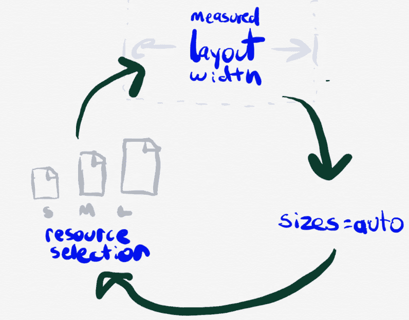
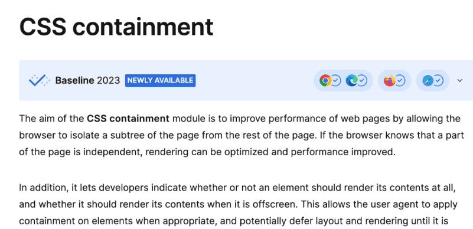
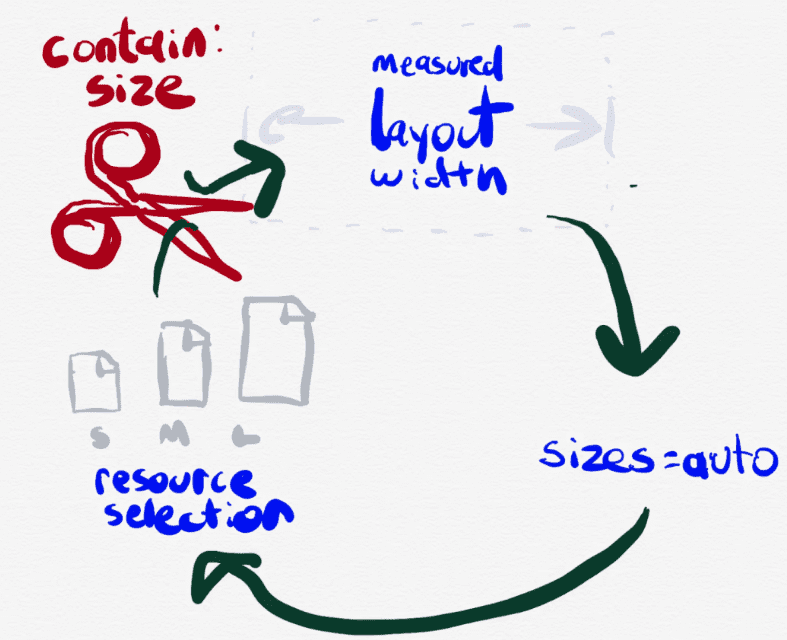

# 聊聊 Chrome 新增的 Sizes=&#34;auto&#34; 属性


聊聊 Chrome 新增的 sizes=&#34;auto&#34; 属性。

&lt;!--more--&gt;

## 前景

起因是网友给 FixIt 提了一个 issue [hugo-fixit/FixIt#411](https://github.com/hugo-fixit/FixIt/issues/411)，说图片比例异常，我一回想，最近没动过图片的代码，于是用 Safari 和 Edge 试了一下，发现没问题，那么基本可以确定是 Chrome 新版的问题了。

经查，从 Chrome (121.0.6167.85) 开始，给 img size=&#34;auto&#34; 加了一个默认样式，恰巧 FixIt 主题之前用到了 [lazysizes.js](https://github.com/aFarkas/lazysizes) 这个库来做图片懒加载，也用了 size=&#34;auto&#34; 这个属性，于是就导致图片宽高比异常了。

解决办法：既然 FixIt 并没有再使用 lazysizes.js 来做图片懒加载，那么就直接去掉 size=&#34;auto&#34; 这个属性就好了。

好，问题解决了，那么就来看看这个 size=&#34;auto&#34; 到底是什么。

## 简介

在网页开发中，我们通常会遇到需要对网页上的元素，尤其是图片进行布局和尺寸调整的情况。在 HTML 中，我们可以利用一些内置的属性来帮助我们完成这项工作，而 sizes 就是其中之一。sizes 属性定义了用于描述其中 `&lt;img&gt;`、`&lt;source&gt;` 元素 display size，以及 `&lt;link&gt;` 元素 viewport 的 source 大小。换句话说，它是一种设定网页元素尺寸的机制。

编写、阅读和维护响应式图片的 sizes 属性是最繁琐的部分；对于懒加载的图片，auto-sizes 是对平台的一个很好的补充。据统计，目前已有十分之一的 sizes 属性正在使用 auto，但是是通过 lazysizes.js（一个用于支持图片懒加载的库）。

## 详解

sizes 支持了 &#34;auto&#34; 值，那么情况就会变得稍微有些复杂。所谓的 &#34;auto&#34; 模式，实际上是一种让浏览器自动设定图片尺寸的模式。在这种模式下，浏览器会试图选择最合适的尺寸来显示图片，以获得最佳的用户体验。它的应用场景主要是在网站设计和开发过程中，需要灵活设定元素尺寸，尤其是图片的尺寸，以便于在不同设备和浏览器环境下，都能呈现出良好的布局和视觉效果。

根据 [HTML 规范 4.8.4.2.2 Sizes attributes](https://html.spec.whatwg.org/#sizes-attributes) 的提示：

{{&lt; admonition note &gt;}}
此外，强烈建议使用 `width` 和 `height` 属性或使用 CSS 来指定尺寸。如果没有指定尺寸，图像可能会以 300x150 尺寸渲染，因为在渲染部分 sizes==&#34;auto&#34; 中有所暗示。contain-intrinsic-size: 300px 150px
{{&lt; /admonition &gt;}}

Chrome 中打开调试台，可以看到默认样式：

```css
img:has([sizes=&#34;auto&#34; i], [sizes^=&#34;auto,&#34; i]) {
  contain: size !important;
  contain-intrinsic-size: 300px 150px;
}
```

这段 CSS 代码使用了属性选择器来选择 `img` 元素，具体的选择规则如下：

1. `[sizes=&#34;auto&#34; i]`：选择具有 `sizes` 属性且其值为 `auto`（不区分大小写）的 `img` 元素。
2. `[sizes^=&#34;auto,&#34; i]`：选择具有 `sizes` 属性且以 `auto,` 开头（不区分大小写）的 `img` 元素。

对于匹配上述选择规则的 `img` 元素，应用以下样式：

- `contain: size !important;`：将元素的内容缩放以适合其容器的大小，并禁止其他样式表覆盖此规则（`!important` 用于提升优先级）。
- `contain-intrinsic-size: 300px 150px;`：指定元素的内在尺寸为宽度 300 像素和高度 150 像素。这可以影响到元素在执行缩放时的最终尺寸。

顺便说一下，CSS 中的伪类 `:has` 被称为“父选择器”，但目前并没有广泛支持，因此这个选择器可能无法在所有浏览器中正常工作。另外，`i` 标记表示进行不区分大小写的匹配。

响应式图像自然尺寸的设定可能会让人意想不到的复杂，但实际上：

1. 有许多方式可以让已加载资源的自然尺寸影响其对应的 `&lt;img&gt;` 的布局尺寸。
2. 每当 `&lt;img&gt;` 标签的布局尺寸发生变化，sizes=&#34;auto&#34; 的值就会进行更新，这可能会触发新的资源加载。
3. 一旦加载新的资源，这个资源就会有新的自然尺寸，这可能会影响 `&lt;img&gt;` 的布局尺寸，导致 sizes=&#34;auto&#34; 的值更新，然后可能会触发又一次的资源加载；新加载的资源会有新的自然尺寸，这样以此类推...等等。



关于 sizes=&#34;auto&#34; 的规范讨论其实主要就是：那些能通过这种方式让 srcset 中的每一个资源依次被加载的极端情况。

Simon Pieters，撰写了 auto-sizes 规范的人，曾经巧妙并勇敢地尝试定义可能触发循环依赖的所有情况，同时也采用了一些无法让作者察觉或是感到奇怪的解决方式来避开这些问题。但是，当真正落实到实现的时候，这些权宜之计并没有站住脚。最后，大家都认为唯一的解决方法是做出一个明确的切割：规定加载资源的自然尺寸绝对不能影响其所对应的 `&lt;img&gt;` 的布局，这一点在涉及到 sizes=&#34;auto&#34; 时尤为重要。



幸运的是，我们有一个相对较新的特性，它就是“尺寸包含”（size containment），专门用来解决这个问题。



所以，现在 Chrome 的 UA stylesheet 中的内容就变成了上面那段 CSS 代码的样子。

对于为什么选择 300×150，是因为这就是 `&lt;video&gt;` 和 `&lt;canvas&gt;` 标签所采取的方式；所有这些元素都会使用这种相对小一些但又不为零的默认尺寸，目的在于鼓励你优化你的布局。

## 参考链接

- [HTML 规范 4.8.4.2.2 Sizes attributes](https://html.spec.whatwg.org/#sizes-attributes)
- [whatwg/html#9448](https://github.com/whatwg/html/issues/9448)
- [Chromium#41495139](https://issues.chromium.org/issues/41495139)


---

> 作者: [Lruihao](https://github.com/Lruihao)  
> URL: https://lruihao.cn/posts/auto-sizes/  

