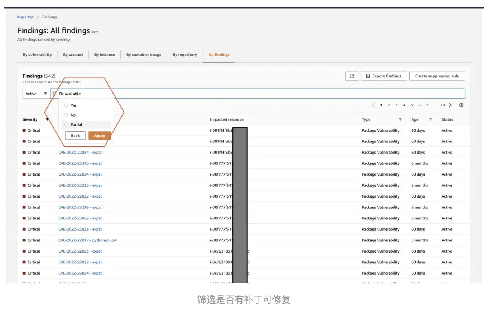
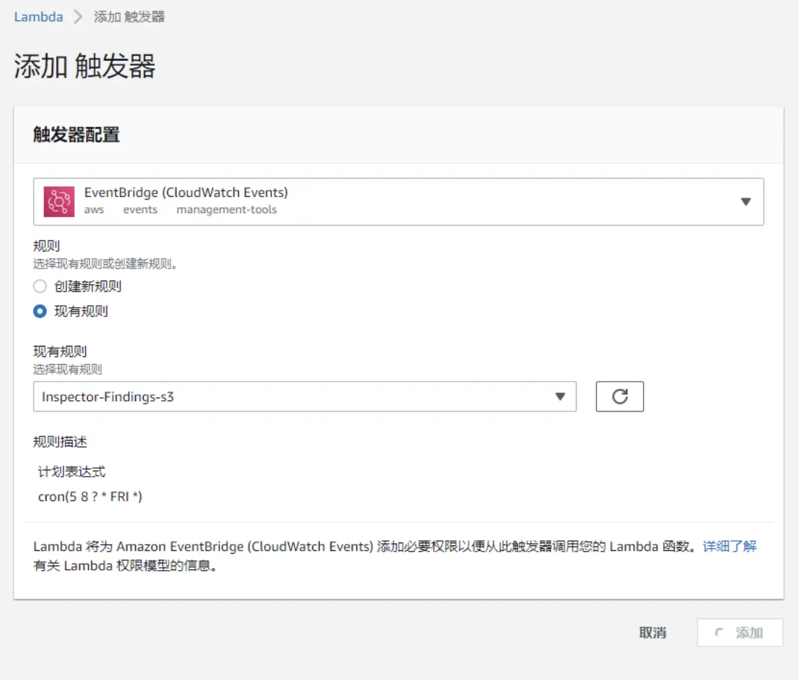
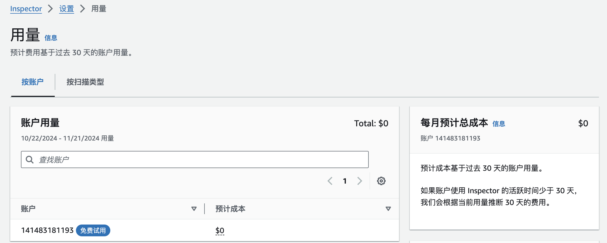

# Amazon 如何让服务器享受着持续集群安全？

&gt; [!question]&#43; 在这个网络信息化时代，你真的注重安全性吗？
&gt; 常常担心服务器遭受黑客攻击，服务器集群防御措施难以统一化管理？
&gt;
&gt; 难以确定修复的优先级？不知道该先修复哪个漏洞？

你是否也有过诸如此类的困扰？不要慌，同学们，在亚马逊云科技中，有一个契合的服务工具能帮助到你，它就是 Amazon Inspector。

&lt;!--more--&gt;

## 了解 Amazon Inspector

Amazon Inspector 可以自动发现工作负载，例如 Amazon EC2 实例、容器和 Lambda 函数，并扫描它们是否存在软件漏洞和意外的网络暴露，是一项自动化持续漏洞扫描服务，用于在 Amazon ECR 中以及持续集成和持续交付（CI/CD）工具内评测 Amazon Elastic Compute Cloud（EC2）实例、AWS Lambda 函数和容器镜像以提高基础设施工作负载的安全性和合规性。

## 它能做些什么？

- 在开发周期的早期阶段纳入安全性，并集中管理所有受监控资源的软件物料清单 (SBOM) 导出。
- 近乎实时地检测亚马逊 ECR 和持续集成与持续交付 (CI/CD) 工具中的 Amazon EC2、AWS Lambda 函数和容器映像等 AWS 工作负载中的软件漏洞和意外网络暴露。
- 使用 Amazon Inspector 风险评分来确定修复的优先级，缩短平均修复时间 (MTTR)。
- 无缝扫描 EC2 实例，在基于代理和无代理的扫描之间切换。
- 通过 Amazon Inspector 扫描支持 NIST CSF、PCI DSS 和其他法规的合规性要求和最佳实践。

以上只是 Amazon Inspector 一些最基本的能力，还有一些更优秀的功能，甚至让许多网安从业人员感到心动和震惊：

- 利用超过 50 个漏洞情报来源，自动发现漏洞、加快漏洞路由并缩短 MTTR。
- 使用当前的常见漏洞和暴露（CVE）信息和网络可访问性来创建情境风险评分，以确定易受攻击资源的优先级并加以解决。

    

- 在开发人员工具中嵌入漏洞扫描，并导出合并 SBOM 以获取监测资源。
- **AWS Lambda 标准扫描**：持续评测每个已部署的 Lambda 函数是否存在软件包漏洞。每月总成本基于每月扫描的 Lambda 函数的平均数量。价格根据一个月内 Lambda 函数的 Amazon Inspector 覆盖小时总数（从函数被 Amazon Inspector 发现到函数被删除或从扫描中排除的小时数）按比例分配。
- 扫描后报告中有严重性评判标准（在你的 Amazon EC2 实例中存在已识别的新 CVE，该 CVE 只能远程使用。如果 Amazon Inspector 持续网络可达性扫描还发现无法通过网络访问该实例，Amazon Inspector 就会发现漏洞的利用性太低。因此，Amazon Inspector 将扫描结果与 CVE 相关联，以向下调整风险评分，更准确地反映 CVE 对该特定实例的影响。）：

    

## 开始使用 Amazon Inspector

### 注册亚马逊云科技账户 {#register-aws}

要使用 Amazon Inspector，你需要一个亚马逊云科技账户，如果你没有账户，系统会提示你在注册 Amazon Inspector 时创建一个。在你使用 Amazon Inspector 之前，系统不会向你收取费用。

打开 [亚马逊云科技账号注册地址][trial-url]，点击右上角创建亚马逊云科技账户。

1. 填写邮件地址和账号名称（支持使用国内的邮箱）\
   
2. 验证邮件\
   
3. 输入密码\
   
4. 联系人信息\
   
5. 付款信息\
   接受所有主要信用卡和借记卡（包括 Visa、MasterCard 和 银联信用卡等）\
   
   
6. 验证手机号（支持中国地区国内手机号）\
   
7. 选择支持计划\
   
8. 完成注册\
   
9. 登录亚马逊云科技控制台，[登录地址](https://console.aws.amazon.com/console/home?trk=56af0bad-f604-4f80-8f1a-f8a8b0d20118&amp;sc_channel=sm&amp;campaign=blog1352)，选择根用户输入电子邮件地址，点击下一步会让输入密码，输入密码后就可以完成登录了。

### 激活 Amazon Inspector

我们注册之后，在激活页面对产品进行激活使用。

### 设定哪些 ESC 需要扫描

在 Scanning configuration 界面中，第一个选项为扫描类型（基础、增强）并且可以添加以标签为索引的服务器 ESC。

### 补丁筛选

在 Findings 界面中，我们可以看到 CVE 漏洞编号以及每个漏洞对应的时间和安全性质，在图中对活动状态进行筛选。

### 扫描结果分析统计

在结果页面中，可以按不同类型参数进行筛选，并且还可以额外添加筛选条件，点击实例即可查看该实例对漏洞信息。

### 定时使用 Lambda 函数生成安全报告

在 Lambda 界面中，可以添加新规则或修改现有规则，添加计划安全任务并生成报告。

### 创建新的 CIS 扫描

## 费用相关

首先，它支持 15 天**免费**试用，你只需按实际使用量付费，没有最低费用，也没有预先承诺。

&gt; **注意**：每个帐户可一次性免费使用 **25** 次映像评测。

## 使用心得

经过使用 Amazon Inspector 服务，我有以下几点心得体会：

- 会一键式入门、集中控制和操作可见性简化了操作，自动重新扫描实例，验证没有引入新的漏洞，这些都是自动化，让我们省不少事情。
- 会发现我们所有的工作负载，持续扫描它们，在其控制台中整合优先发现列表，并通过近乎即时通知新的严重漏洞来缩短我们的平均修复时间。
- 该服务发现我们所有的工作负载，使用来自多个漏洞通知源的数据持续扫描它们，在其控制台中整合优先发现列表，并让我们专注于漏洞修复，而不是管理多个发现工具和配置。

安全是重中之重之事，实时预警与加强管控，有效安全防护与定期安全检查。

立即访问[免费试用页面][trial-url]，开始你的亚马逊云科技云服务安全之旅吧！

&lt;!-- link reference definition --&gt;
[trial-url]: https://aws.amazon.com/cn/free/?trk=56af0bad-f604-4f80-8f1a-f8a8b0d20118&amp;sc_channel=sm&amp;campaign=blog1352

---

> 作者: [Lruihao](https://github.com/Lruihao)  
> URL: https://lruihao.cn/posts/aws-inspector/  

