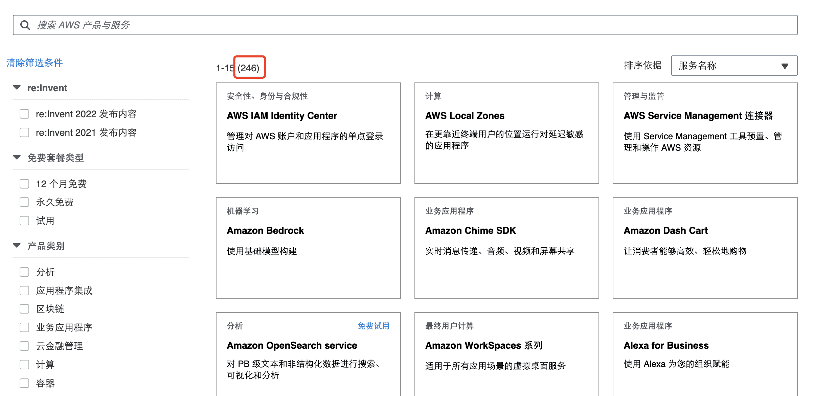
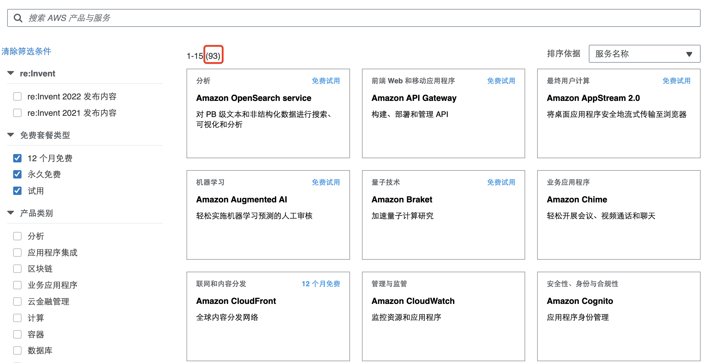
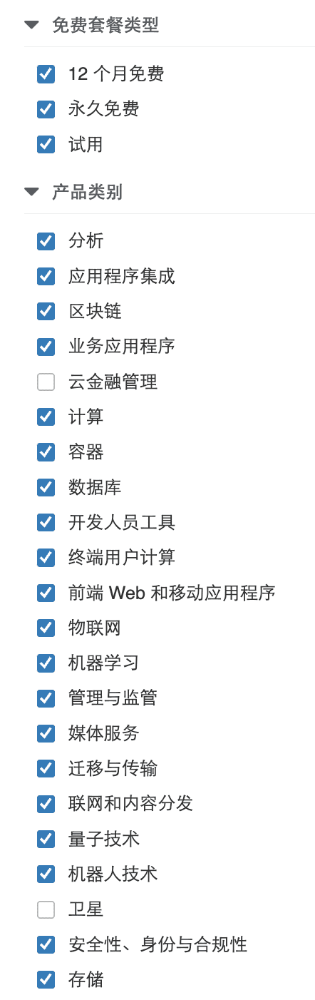

# 探索 AWS 云上一站式解决方案免费使用

在如今云计算蓬勃发展的时代，创新成长型企业正积极寻求一站式的云上解决方案，以提高效率、降低成本并实现快速发展。AWS（亚马逊云科技）作为全球领先的云服务提供商，为创新成长型企业提供一站式云上解决方案，助力创新成长型企业在不同发展阶段实现低成本上云，实现快速发展。本文将探索一下 AWS 云上一站式解决方案的免费使用。

<!--more-->

## 简介

- AWS 官网地址：[企业云上一站式解决方案_创新成长企业加速中心 - AWS 云服务](https://aws.amazon.com/cn/campaigns/smb-cloud-one-stop-solution-paid-search/?sc_channel=seo&sc_campaign=blog1104)

目前已经给出 11 种使用场景和解决方案，分别是：

- [亚马逊云科技 Stable Diffusion WebUI 一键部署方案](https://aws.amazon.com/cn/campaigns/smb-cloud-one-stop-solution-paid-search/watch-the-video-zhaoyunxi/?sc_channel=seo&sc_campaign=blog1104)
- [基于智能搜索的大语言模型增强方案](https://aws.amazon.com/cn/campaigns/smb-cloud-one-stop-solution-paid-search/watch-the-video-xiongjunfeng/?sc_channel=seo&sc_campaign=blog1104)
- [Stable Diffusion 亚马逊云科技 插件解决方案](https://aws.amazon.com/cn/campaigns/smb-cloud-one-stop-solution-paid-search/watch-the-video-lisiyuan/?sc_channel=seo&sc_campaign=blog1104)
- [玩转免费试用 - 全球领先云服务的那些羊毛](https://aws.amazon.com/cn/campaigns/smb-cloud-one-stop-solution-paid-search/watch-the-video-hanxiaoyong/?sc_channel=seo&sc_campaign=blog1104)
- [快速搭建容量高达 35GB 的免费个人网盘](https://aws.amazon.com/cn/campaigns/smb-cloud-one-stop-solution-paid-search/watch-the-video-wangbeichen/?sc_channel=seo&sc_campaign=blog1104)
- [呼叫中心也免费？没错！](https://aws.amazon.com/cn/campaigns/smb-cloud-one-stop-solution-paid-search/watch-the-video-wangjinglai/?sc_channel=seo&sc_campaign=blog1104)
- [使用 Amazon Lightsail 构建 WordPress 网站](https://aws.amazon.com/cn/campaigns/smb-cloud-one-stop-solution-paid-search/watch-the-video-suzhe/?sc_channel=seo&sc_campaign=blog1104)
- [零代码一键部署多语言视频字幕解决方案](https://aws.amazon.com/cn/campaigns/smb-cloud-one-stop-solution-paid-search/watch-the-video-lilong/?sc_channel=seo&sc_campaign=blog1104)
- [Serverless 轻松搭建多人在线游戏小程序](https://aws.amazon.com/cn/campaigns/smb-cloud-one-stop-solution-paid-search/watch-the-video-xuwei/?sc_channel=seo&sc_campaign=blog1104)
- [通知必达 - 无服务器通知方案](https://aws.amazon.com/cn/campaigns/smb-cloud-one-stop-solution-paid-search/watch-the-video-hewenan/?sc_channel=seo&sc_campaign=blog1104)
- [轻松使用开箱即用的 AI 功能 - AI Solution Kit](https://aws.amazon.com/cn/campaigns/smb-cloud-one-stop-solution-paid-search/watch-the-video-luhaoyu/?sc_channel=seo&sc_campaign=blog1104)

从以上列表标题就能看出，不仅含括了近些年比较火的“生成式 AI”相关一站式解决方案，还有一些比较常见的“网盘”、“呼叫中心”、“WordPress 网站”等等。

## 玩转免费试用

视频讲解详细链接：[玩转免费试用 - 全球领先云服务的那些羊毛](https://aws.amazon.com/cn/campaigns/smb-cloud-one-stop-solution-paid-search/watch-the-video-hanxiaoyong/?sc_channel=seo&sc_campaign=blog1104)

这个标题是最吸引人的，毕竟很多人都本着有羊毛必薅的心理。

这个视频主要讲解了 AWS 的免费试用。很多公司都是从小到大到独角兽这样的成长，最初的时候学习自研，搭建一个系统其实可以从很多的一些免费的云服务开始，或者对于一些个人或者学生，如果想找工作，想试用云计算，也可以免费申请 AWS 的账号来使用。

### 免费云服务种类

从 AWS 官网的数据来看，截止 2023 年 11 月 18 日，亚马逊云科技已经提供了 246 种云服务：

当然并不是所有的都是免费的，但是有免费的服务占比很大，其中免费的服务有 93 种。

免费额度也很宽限，不同云服务的免费额度不一样，比如亚马逊云服务器，有免费一年的，云电话有免费接打电话 90 分钟，短信免费试用 2 个月等。

另外也有永久免费的服务，这一块应该是大家最感兴趣的，比如 Lambda 服务，如果一个月调用不超过一百万次的话，这是永久免费的，对于初创企业内部服务或者学习个人来说，这个额度是足够的。再有就是，SES 邮件服务，每个月外发次数可用 62000 次，对于小型服务运营，这个也是远远足够的了。

免费的服务还有很多，涵盖广泛的产品种类：计算、数据库、存储、容器、机器学习等等。

### 免费云服务可以做什么

从上图可以基本可以看出涵盖面还是很广的，如果大家有什么新的 ideas 或者说想去尝试某种服务的话，综合运用以上服务，是完全可以零成本实现的。

我们还可以做很多事情，比如：

- 学习亚马逊云科技的产品
- 尝试新的产品
- 验证你的创意方案

不仅仅是学习，你可以利用它搭建出一些比较高级实用的工具，比如个人网站、个人网盘：

- [使用 Amazon Lightsail 构建 WordPress 网站](https://aws.amazon.com/cn/campaigns/smb-cloud-one-stop-solution-paid-search/watch-the-video-suzhe/?sc_channel=seo&sc_campaign=blog1104)
- [快速搭建容量高达 35GB 的免费个人网盘](https://aws.amazon.com/cn/campaigns/smb-cloud-one-stop-solution-paid-search/watch-the-video-wangbeichen/?sc_channel=seo&sc_campaign=blog1104)

甚至轻松搭建多人在线的”大炮打蚊子“的小游戏、轻松使用开箱即用的 AI 功能、零代码为视频生成多语言字幕，亦或是建造一个免费的呼叫中心：

- [Serverless 轻松搭建多人在线游戏小程序](https://aws.amazon.com/cn/campaigns/smb-cloud-one-stop-solution-paid-search/watch-the-video-xuwei/?sc_channel=seo&sc_campaign=blog1104)
- [轻松使用开箱即用的 AI 功能 - AI Solution Kit](https://aws.amazon.com/cn/campaigns/smb-cloud-one-stop-solution-paid-search/watch-the-video-luhaoyu/?sc_channel=seo&sc_campaign=blog1104)
- [呼叫中心也免费？没错！](https://aws.amazon.com/cn/campaigns/smb-cloud-one-stop-solution-paid-search/watch-the-video-wangjinglai/?sc_channel=seo&sc_campaign=blog1104)

另外还有其他更多的免费一站式云服务方案也都很不错，这里不一一例举了。

对于初创企业或者有兴趣的这方面工作，但是苦于没有资源尝试的朋友们可以前往 [官网](https://aws.amazon.com/cn/campaigns/smb-cloud-one-stop-solution-paid-search/?sc_channel=seo&sc_campaign=blog1104) 观看视频详细讲解了解更多详细信息。

---

> 作者: [Lruihao](https://github.com/Lruihao)  
> URL: https://lruihao.cn/posts/aws-solution/  

