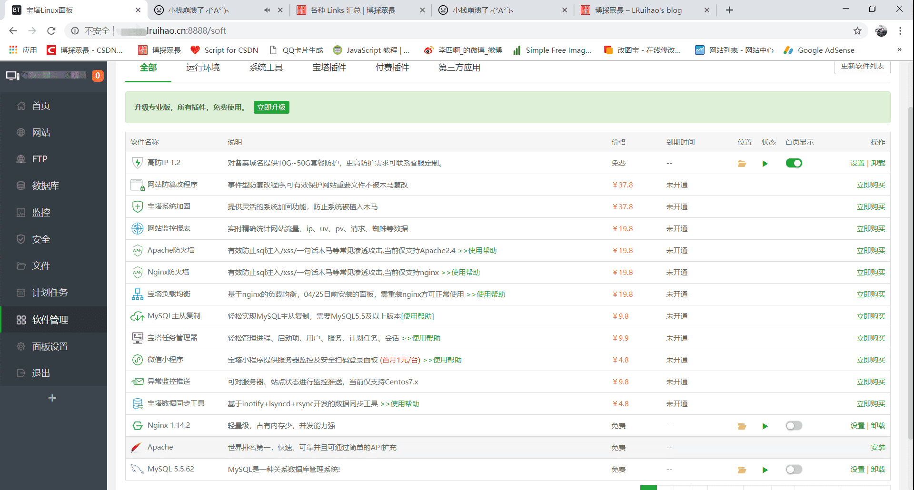

# 宝塔面板安装


极速方便的一键配置与管理，免除繁琐的命令行操作，通过 Web 面板一键即可操作实现。可选择安装 lamp 或者 lnmp 环境，可创建及管理网站，可创建及管理数据库，可创建及管理 FTP 等等。[宝塔官网介绍](https://www.bt.cn/?invite_code=MV9sYXJnZHI=)
<!--more-->
## 系统要求
> 操作系统：全新系统（支持 CentOS、Ubuntu、Debian、Fedora、Deepin)，  
确保是干净的操作系统，没有安装过其它环境带的 Apache/Nginx/php/MySQL  
宝塔 Linux6.0 版本是基于 centos7 开发的，强烈建议使用 centos7.x 系统  
内存要求：内存要求最低 512MB，推荐 768MB 以上，纯面板约占系统 60MB 内存  

## 安装方法
官方号称 2 分钟装好面板，一键管理服务器。  
> 使用 SSH 连接工具，如宝塔远程桌面助手连接到您的 Linux 服务器后，挂载磁盘，根据系统执行相应命令开始安装（大约 2 分钟完成面板安装）：

```Shell Centos 安装脚本
yum install -y wget && wget -O install.sh http://download.bt.cn/install/install_6.0.sh && sh install.sh
```
```Shell Ubuntu/Deepin 安装脚本
wget -O install.sh http://download.bt.cn/install/install-ubuntu_6.0.sh && sudo bash install.sh
```
```Shell Debian 安装脚本
wget -O install.sh http://download.bt.cn/install/install-ubuntu_6.0.sh && bash install.sh
```
```Shell Fedora 安装脚本
wget -O install.sh http://download.bt.cn/install/install_6.0.sh && bash install.sh
```


## 搭建 ftp 和云盘服务器

可以很傻瓜式的搭建自己的云盘，和平时用的比较多的 ftp 服务器。搭建静态网站也可以用 ftp 来上传文件。

---

> 作者: [Lruihao](https://github.com/Lruihao)  
> URL: https://lruihao.cn/posts/bt/  

