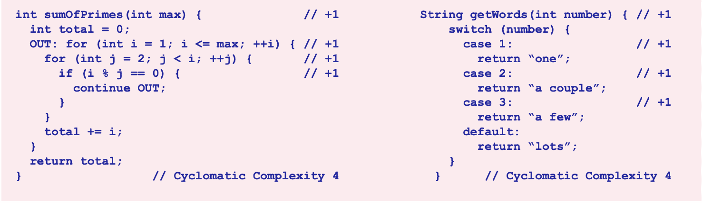
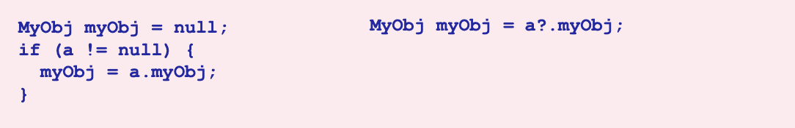
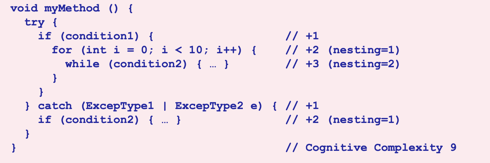
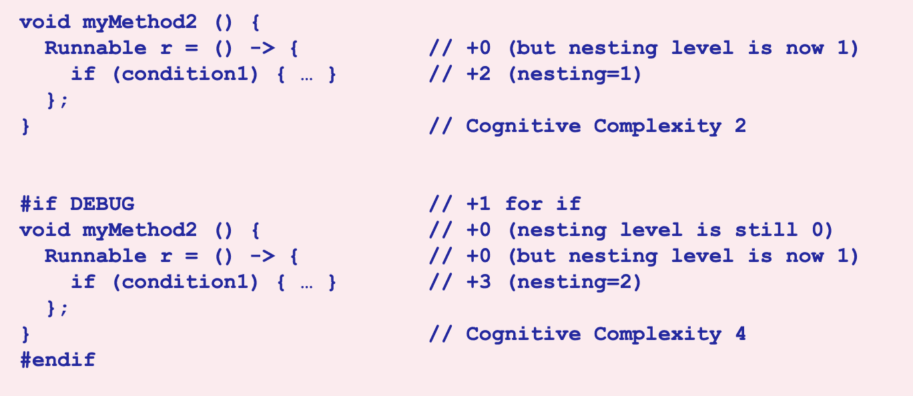
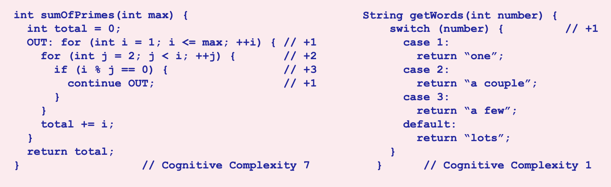
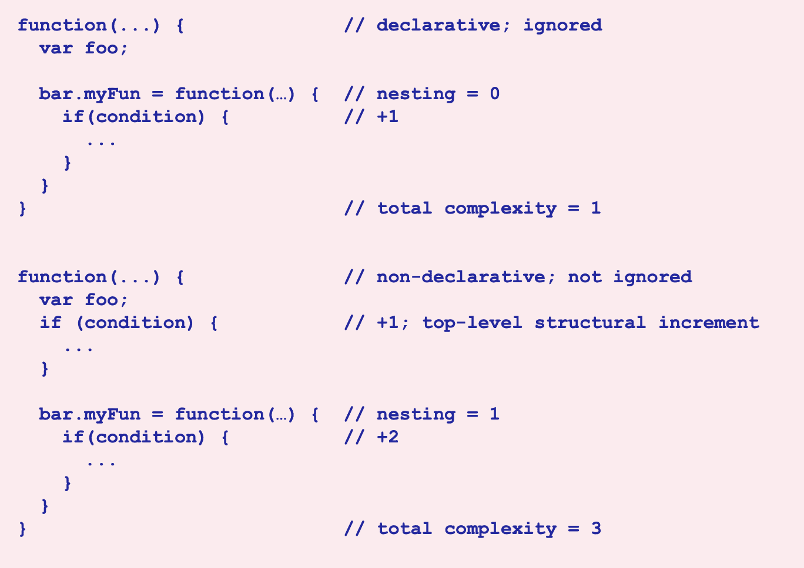
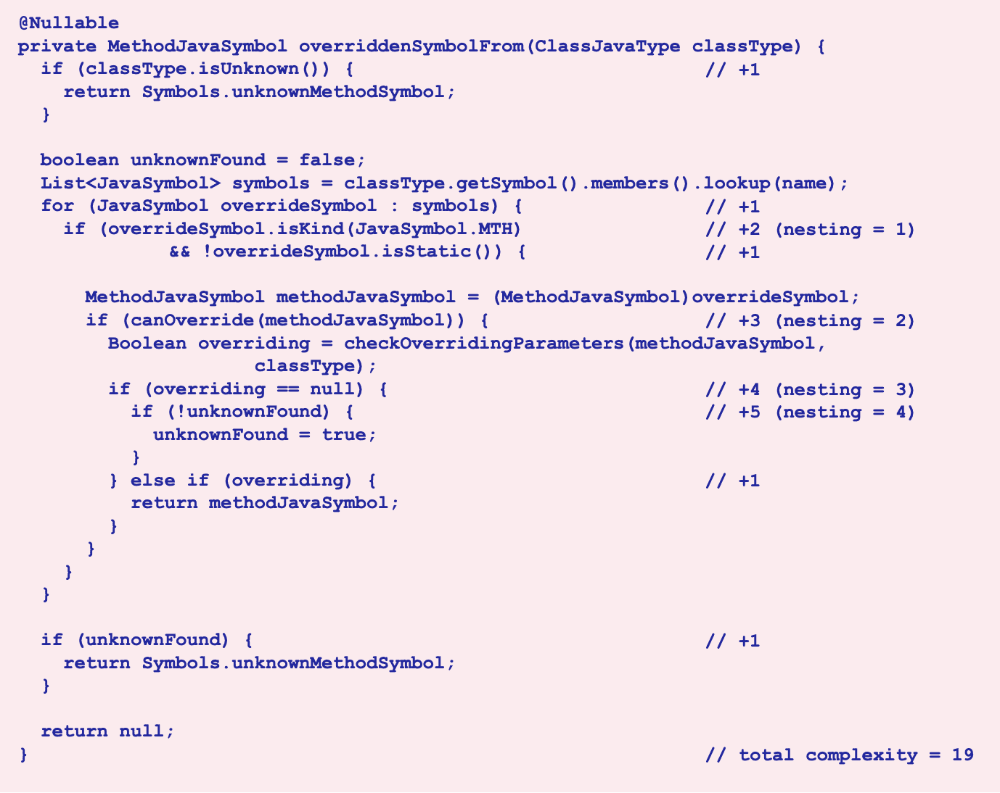
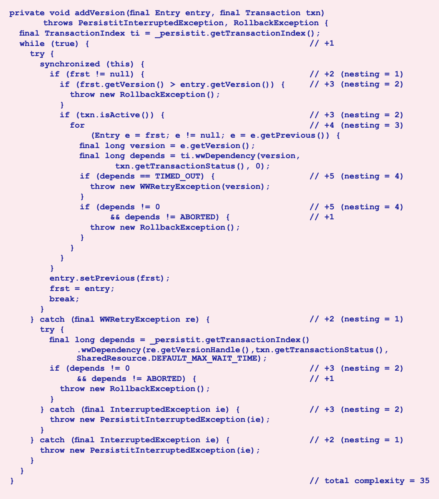
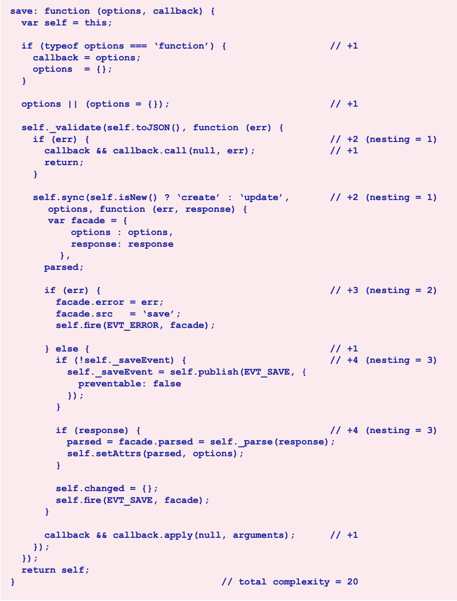

# 认知复杂度（Cognitive Complexity）


## 摘要

循环复杂度（Cyclomatic Complexity）最初被制定为衡量模块控制流的“可测试性和可维护性”的一种度量标准。虽然它在衡量前者方面表现出色，但其底层的数学模型在产生衡量后者的值方面不尽如人意。本文介绍了一种新的度量标准，它摒弃了使用数学模型评估代码的做法，以弥补循环复杂度的不足之处，并产生更准确地反映方法、类和应用程序的相对难度的度量标准。

### 术语说明

虽然认知复杂度（Cognitive Complexity）是一种语言中立的度量标准，同样适用于文件和类，以及方法、过程、函数等等，但为了方便起见，本文中使用面向对象的术语“类”和“方法”。

---

<!--more-->

## 引言

循环复杂度（Cyclomatic Complexity）是一种用于衡量代码中控制流的度量标准，它最初是由 Thomas J. McCabe 在 1976 年提出的。[^1] 该度量标准的目的是衡量代码的“可测试性和可维护性”。虽然它在衡量前者方面表现出色，但其底层的数学模型在产生衡量后者的值方面不尽如人意。本文介绍了一种新的度量标准，它摒弃了使用数学模型评估代码的做法，以弥补循环复杂度的不足之处，并产生更准确地反映方法、类和应用程序的相对难度的度量标准。

与此同时，循环复杂度已经不再全面。它于 1976 年在 Fortran 环境中制定，不包括像 `try/catch` 和 `lambda` 这样的现代语言结构。

最后，由于每个方法的最小循环复杂度分数为 1，我们无法知道具有高聚合循环复杂度的任何给定类是一个大型、易于维护的域类，还是一个具有复杂控制流的小型类。除了类级别之外，广泛认可的观点是应用程序的循环复杂度得分与其代码行数总和相关。换句话说，循环复杂度在方法级别以上几乎没有用处。

为了解决这些问题，认知复杂度（Cognitive Complexity）已经被制定出来，以解决现代语言结构的问题，并产生在类和应用程序级别上有意义的值。更重要的是，它摒弃了基于数学模型评估代码的做法，以便能够提供与程序员对理解流程所需的心智或认知努力的直觉相符的控制流评估。

## 问题示例

从一个示例开始讨论认知复杂度可以帮助理解它的应用对象。下面的两个方法具有相同的循环复杂度，但在可理解性方面却存在明显的差异。



循环复杂度的数学模型给予这两个方法相同的权重，然而直观上很明显，sumOfPrimes 方法的控制流比 getWords 方法更难理解。这就是为什么认知复杂度放弃了使用数学模型评估控制流的做法，而采用了一组简单的规则，将程序员的直觉转化为数字。

## 基本准则和方法

根据三个基本规则来评估认知复杂度得分：

1. 忽略允许多个语句可读性缩写成一个的结构
2. 每次中断代码的线性流程时增加一个（加一）
3. 嵌套时进行增量计算

此外，复杂度得分由四种不同类型的增量组成：
: A. 嵌套（Nesting）— 对嵌套控制流结构进行评估
: B. 结构（Structural）— 对受嵌套增量影响并增加嵌套计数的控制流结构进行评估
: C. 基础（Fundamental）— 对不受嵌套增量影响的语句进行评估
: D. 混合（Hybrid）— 对不受嵌套增量影响的控制流结构进行评估

虽然在数学上，增量的类型没有影响，每个增量都会将最终得分增加一点，但对被计数的特征类别进行区分可以更容易地理解嵌套增量适用和不适用的地方。

这些规则及其背后的原则在以下章节中进一步详细介绍。

## 忽略简写

在制定认知复杂度的过程中，一个指导原则是它应该激励良好的编码实践。也就是说，它应该忽略或减少使代码更易读的特性。

方法的结构本身就是一个很好的例子。将代码分解为方法可以将多个语句压缩为一个具有描述性名称的调用，即“简写（shorthand）”。因此，认知复杂度不会针对方法进行增量计算。

认知复杂度还忽略许多编程语言中常见的空合并运算符，因为它们允许将多行代码缩减为一行。例如，下面两个代码示例执行相同的操作：



左侧版本的含义需要一些时间来理解，而一旦理解了空合并语法，右侧版本就立即清晰明了。因此，认知复杂度忽略了空合并运算符。

## 中断线性流程

在制定认知复杂度的过程中，另一个指导原则是打破代码从上到下、从左到右的正常线性流程的结构会使维护者在理解代码时需要付出更多的努力。为了认可这种额外的努力，认知复杂度对以下结构进行结构增量评估：

- 循环结构：`for`、`while`、`do while`、...
- 条件判断：三元运算符、`if`、`#if`、`#ifdef`、...

它对混合增量进行评估：

- `else if`、`elif`、`else`、...

对于这些结构，不会评估嵌套增量，因为在阅读条件语句时已经承担了心理成本。

这些增量目标对于那些习惯于圈复杂度的人来说可能会很熟悉。此外，认知复杂度还会增加以下方面的复杂度：

### 捕获（Catches）

`catch` 语句与 `if` 语句一样，代表了控制流程中的一种分支。因此，每个 `catch` 子句都会对认知复杂度进行结构增量评估。请注意，无论捕获了多少种异常类型，每个 `catch` 子句只会给认知复杂度得分增加一个点。`try` 和 `finally` 块则完全被忽略。

### 开关（Switches）

一个 `switch` 语句及其所有的 `case` 合并会导致一个单独的结构增量。

在圈复杂度中，`switch` 语句被视为类似于 `if-else` `if` 链的模拟。也就是说，`switch` 语句中的每个 `case` 都会导致增量，因为它在控制流的数学模型中引起了一个分支。

但是从维护者的角度来看，一个 `switch` 语句，它将一个变量与一组明确命名的字面值进行比较，比一个 `if-else` `if` 链容易理解得多，因为后者可能进行任意数量的比较，使用任意数量的变量和值。

简而言之，必须仔细阅读 `if-else` `if` 链，而 `switch` 语句通常可以一目了然地理解。

### 逻辑运算符序列（Sequences of logical operators）

出于类似的原因，认知复杂度不会对每个二进制逻辑运算符进行增量计算。相反，它对每个二进制逻辑运算符序列进行基本增量评估。例如，考虑以下几对示例：

```js
a && b
a && b && c && d

a || b
a || b || c || d
```

理解每对示例中的第二行并不比理解第一行困难太多。然而，对于理解下面两行的努力确实存在明显的差异：

```js
a && b && c && d
a || b && c || d
```

因为混合运算符的布尔表达式变得更难理解，所以认知复杂度会对每个新的相同运算符序列进行增量计算。例如：

```js
if (a                   // +1 for `if`
  && b && c             // +1
  || d || e             // +1
  && f)                 // +1

if (a                   // +1 for `if`
  &&                    // +1
  !(b && c))            // +1
```

虽然相对于圈复杂度，认知复杂度对相同的运算符提供了一种“折扣”，但它会对所有的二元布尔运算符序列进行增量计算，例如变量赋值、方法调用和返回语句中的序列。

### 递归（Recursion）

与圈复杂度不同，认知复杂度对递归循环中的每个方法（无论是直接递归还是间接递归）都会增加一个基本增量。

这个决定有两个动机。首先，递归代表了一种“元循环（meta-loop）”，而认知复杂度对循环进行增量计算。其次，认知复杂度旨在估计理解方法控制流的相对难度，即使对一些经验丰富的程序员来说，递归也很难理解。

### 跳转到标签（Jumps to labels）

使用 `goto` 语句会给认知复杂度增加一个基本增量，同样的，使用带有标签的 `break` 或 `continue` 语句以及其他多级跳转（如某些语言中的带有数字的 `break` 或 `continue` 语句）也会增加增量。但是，因为提前返回通常可以使代码更清晰，其他跳转或提前退出不会增加增量。

## 嵌套流程中的增量

直观上很明显，一系列线性的五个 `if` 和 `for` 结构比相同的五个结构连续嵌套更容易理解，而不管每个系列中的执行路径数量如何。因为这样的嵌套增加了理解代码的心理需求，认知复杂度对其进行了嵌套增量的评估。

具体来说，每当一个导致结构增量或混合增量的结构嵌套在另一个这样的结构内部时，每个嵌套级别都会增加一个嵌套增量。例如，在下面的示例中，对于方法本身或 `try` 语句，都没有嵌套增量，因为这两个结构都不会导致结构增量或混合增量：



然而，`if`、`for`、`while`和`catch`结构都会受到结构增量和嵌套增量的影响。
此外，顶层方法会被忽略，并且 `lambda` 表达式、嵌套方法和类似特性不会导致结构增量，但当这些方法嵌套在其他类似方法的结构内部时，会增加嵌套级别：



## 影响

认知复杂度的主要目标是计算方法分数，以更准确地反映方法的相对可理解性，并且其次目标是处理现代语言结构并生成在方法级别以上有价值的度量标准。可以证明，处理现代语言结构的目标已经实现。下面将对另外两个目标进行详细讨论。

### 直观地“正确”的复杂性分数

这次讨论始于一对具有相等圈复杂度但明显不同可理解性的方法。现在是重新审视这些方法并计算它们的认知复杂度分数的时候了。



认知复杂度算法给出了这两个方法明显不同的分数，这些分数更能反映它们相对可理解性的差异。

### 高于方法级别的有价值的指标

此外，由于认知复杂度不会针对方法结构增加增量，聚合的数值变得有用起来。现在，通过比较它们的度量值，你可以轻松区分一个包含大量简单的 `getter` 和 `setter` 的领域类和一个包含复杂控制流的类。因此，认知复杂度成为衡量类和应用程序相对可理解性的工具。

## 结论

编写和维护代码是人类过程，它们的输出必须符合数学模型，但它们本身并不适合数学模型。这就是为什么数学模型不足以评估它们所需努力的原因。

认知复杂度打破了使用数学模型评估软件可维护性的做法。它起源于圈复杂度所设定的先例，但使用人类判断来评估应该如何计算结构，并决定整体模型应该加入什么内容。结果，它产生了方法复杂度分数，相对于以前的模型，程序员认为这些分数更公平地评估了可理解性。

此外，因为认知复杂度对于一个方法没有“进入成本”的要求，它不仅在方法级别产生了这些更公平的相对评估，还在类和应用程序级别上产生了相应的评估。

## 参考文献

本文翻译自 G. Ann Campbell 的文章“{Cognitive Complexity} a new way of measuring understandability”[^2]，原文发表于 2023 年 8 月 29 日，版本号为 1.7。

[^1]: Thomas J. McCabe, "A Complexity Measure", IEEE Transactions on Software Engineering, Vol. SE-2, No. 4, December 1976
[^2]: G. Ann Campbell, "[Cognitive Complexity - a new way of measuring understandability](https://www.sonarsource.com/docs/CognitiveComplexity.pdf)", [Sonar](https://www.sonarsource.com/), 29 August 2023, Version 1.7

## 附录 A：补偿用法

认知复杂度被设计为一种与语言无关的度量标准，但不可忽视的是不同的编程语言提供了不同的特性。例如，COBOL 中没有 `else if` 结构，而 JavaScript 直到最近也缺乏类似的结构。不幸的是，这些缺陷并不能阻止开发人员需要这些结构或者试图用手头的工具构建类似的结构。在这种情况下，严格遵守认知复杂度规则会导致不成比例的高分。

因此，为了不惩罚一种语言相对于另一种语言的使用，对于语言的缺陷，即在考虑的语言中普遍使用并且在大多数现代语言中都是期望的结构，但在该语言中缺失的结构（例如 COBOL 缺少的 `else if`），可以进行例外处理。

另一方面，当一种语言创新引入一个特性时，例如 Java 7 可以一次捕获多个异常类型，其他语言中缺乏这种创新不应被视为缺陷，因此不应有例外。

这意味着如果一次捕获多个异常类型成为一种常见预期的语言特性，那么对于不提供该功能的语言中的“额外”`catch` 子句可能会添加例外。这种可能性并没有排除，但对于是否添加这样的未来例外的评估应该以保守为原则。换句话说，新的例外应该慢慢引入。

另一方面，如果 COBOL 标准的未来版本添加了"else if"结构，应尽快放弃 COBOL 的"else ... if"例外（如下所述）。

到目前为止，已经确定了三个例外情况：

### COBOL: Missing `else if`

对于缺乏 `else if` 结构的 COBOL 语言，一个 `else` 子句中如果只包含一个 `if` 语句，则不会增加嵌套惩罚。此外，`else` 本身不会增加复杂度。也就是说，如果 `else` 后面紧跟着 `if` 语句，尽管从语法上讲它并不是 `else if`，但在计算复杂度时会视作 `else if`。

例如：

```COBOL
IF condition1        // +1 structure, +0 for nesting
  ...
ELSE
  IF condition2      // +1 structure, +0 for nesting
    ...
  ELSE
    IF condition3    // +1 structure, +0 for nesting
      statement1
      IF condition4  // +1 structure, +1 for nesting
        ...
      END-IF
    END-IF
  ENDIF
ENDIF.
```

### JavaScript: Missing class structures

尽管 ECMAScript 6 规范最近为 JavaScript 添加了类的功能，但这个特性尚未被广泛采用。实际上，许多流行的框架要求继续使用一种补偿习惯用法：使用外部函数作为替代，创建一种命名空间或伪类。为了不对 JavaScript 用户进行惩罚，当外部函数仅用作声明机制时（即它们只包含顶级的声明），它们将被忽略。

然而，如果一个函数位于顶级（即不嵌套在子函数内部），并且包含需要进行结构增加的语句，那么说明它不仅仅是纯粹的声明使用。因此，这类函数应该接受标准处理。

例如：



### Python: Decorators

Python 的装饰器习惯用法允许在不修改函数本身的情况下向现有函数添加额外的行为。这是通过在装饰器中使用嵌套函数来实现的，嵌套函数提供了额外的行为。

为了不对使用其语言的 Python 开发人员进行惩罚，已经添加了一个例外。然而，已经试图对例外进行明确定义。具体来说，要符合例外的条件，一个函数只能包含一个嵌套函数和一个 `return` 语句。

例如：


## 附录 B：规范

本节的目的是对增加认知复杂度的结构和情况进行简明列举，但需考虑 **附录 A** 中列出的例外情况。这旨在提供一个全面的列表，但并非穷尽所有编程语言。也就是说，如果某种语言对关键字有非典型的拼写，例如用 `elif` 表示 `else if`，那么在此处的省略并不意味着在规范中忽略该结构。

### B1. 增量（Increments）

对于以下每个结构，都会增加复杂度的计数：

- `if`、`else if`、`else` 条件语句和三元运算符
- `switch`
- `for`、`foreach`
- `while`、`do while`
- `catch`
- `goto LABEL`、`break LABEL`、`continue LABEL`、`break NUMBER`、`continue NUMBER`
- 连续的二元逻辑运算符
- 递归循环中的每个方法

### B2. 嵌套级别（Nesting level）

以下结构会增加嵌套层级的计数：

- `if`、`else if`、`else` 条件语句和三元运算符
- `switch`
- `for`、`foreach`
- `while`、`do while`
- `catch`
- 嵌套方法和类似方法的结构，如 `lambda` 表达式。

### B3. 嵌套增量（Nesting increments）

以下结构将根据其在 B2 结构内的嵌套深度而增加相应的嵌套层级计数：

- `if` 条件语句和三元运算符
- `switch`
- `for`、`foreach`
- `while`、`do while`
- `catch`

## 附录 C：示例

> **Note**
> 译者注：在各大 IDE 中可以安装 SonarLint 插件，以便在编码过程中实时检查代码质量，[详见](https://www.sonarsource.com/products/sonarlint/?gads_campaign=SL-Class02-Brand&gads_ad_group=SonarLint&gads_keyword=sonarlint&gclid=CjwKCAjwyY6pBhA9EiwAMzmfwba_MRBC_UXg_im757z_Om_T6Jfd_vt_gVuNL-Wxh9S0HVKKqK7nRhoCl5UQAvD_BwE
)

来自 SonarJava 分析器中的 `org.sonar.java.resolve.JavaSymbol.java`：



来自 sonar-persistit 中的 `com.persistit.TimelyResource.java`：



来自 SonarQube 中的 `org.sonar.api.utils.WildcardPattern.java`：

来自 YUI 中的 `model.js`：




---

> 作者:   
> URL: https://lruihao.cn/posts/cognitive-complexity/  

