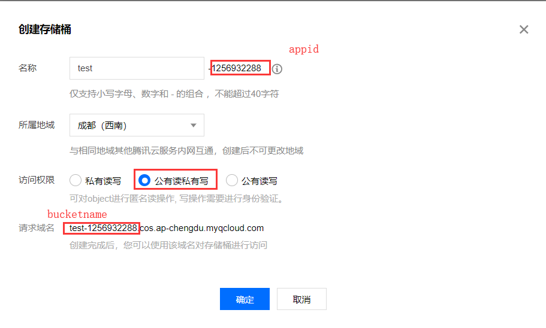
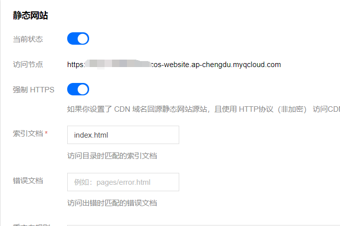
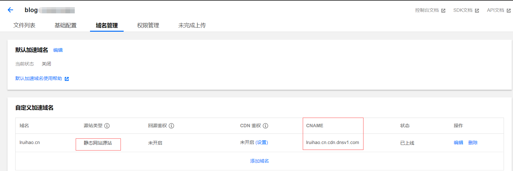
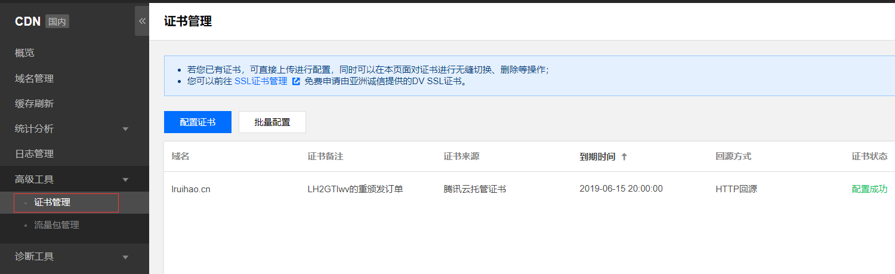
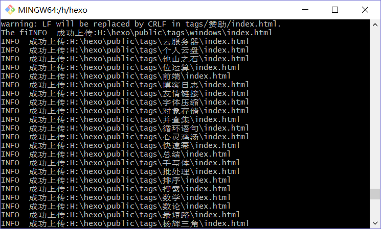

# 利用腾讯云对象存储 COS 桶托管 Hexo 博客


> 本以为 coding pages 与腾讯云合作后会更好，没想到正是这种初期 bug 不断，速度也是非常慢。比 gitee, 甚至 github 都要慢很多了。所以决定放弃 coding 了，本想挂到云服务器上，但是这个云服务器只续费了半年，可能不会再续费，前几天看到用腾讯云的 cos 桶 xml 制作动态相册的文章，知道了对象存储这个玩意，腾讯云 COS 提供免费 50G 的存储空间，还有 CDN 加速服务，我觉得是个不错的选择，部署后发现速度还挺好。  
> 适用于 hexo, hugo 等静态博客的部署。

<!--more-->

## 创建存储桶

打开腾讯云控制台--云产品--存储--对象存储，然后创建存储桶。  


## 开启静态网站设置

在基础配置打开静态网站（关掉强制 https)  


## 绑定域名



SSL 设置  


## 域名解析，添加记录

去 dns 服务商添加域名解析记录 CNAME 指向上面的域名

## hexo 设置

- 安装插件

```
npm install hexo-deployer-cos --save
```

- 站点配置文件

```
deploy:
  type: cos
  bucket: yourBucketName #cos 桶名称
  appId: yourAppId #cos 桶名称后数字
  secretId: yourSecretId  #云 API 密钥
  secretKey: yourSecretKey #云 API 密钥
  region: yourRegion #所属地域
```

- 发布还是一样的

```
hexo clean
hexo g -d
```

结果类似于  


## CDN 刷新

每次更新博客内容完后，都要登陆腾讯云 CDN--缓存刷新，手动刷新一下 CDN。

用脚本在每次更新后刷新

- 安装

```
npm install qcloud-cdn-node-sdk --save
```

- 创建`qcloudcdn.js`放入`script`文件夹

```js
const qcloudSDK = require('qcloud-cdn-node-sdk');

qcloudSDK.config({
  secretId: '你的 ID',
  secretKey: '你的密钥'
});

qcloudSDK.request(
  'RefreshCdnDir',
  {
    'dirs.1': 'http://博客地址'
  },
  (res) => {
    console.log(res);
  }
);
```

## 自动 CDN 刷新配置（推荐）

1. 进入腾讯云，找到 函数计算 -> CDN 缓存刷新函数 -> 创建 CDN 缓存刷新函数
2. 修改 `index.js` 内容后重新部署

```js
'use strict';

const CosSdk = require('cos-nodejs-sdk-v5');
const CdnSdk = require('./common/CdnSdk');
const CdnRefreshTask = require('./common/CdnRefreshTask');
const { getParams, getObjectUrl, logger, getLogSummary } = require('./common/utils');

exports.main_handler = async (event, context, callback) => {
  /**
   * parse param from event and process.env
   */
  const { objects, cdnHosts, secretId, secretKey, token } = getParams(event);

  logger({
    title: 'param is parsed success, param as follow: ',
    data: { objects, cdnHosts, event }
  });
  /**
   * init cos instance
   */
  if (!secretId || !secretKey || !token) {
    throw new Error(`secretId, secretKey or token is missing`);
  }

  const cdnSdkInstance = new CdnSdk({ secretId, secretKey, token });
  const cosInstance = new CosSdk({
    SecretId: secretId,
    SecretKey: secretKey,
    XCosSecurityToken: token
  });

  const taskList = objects.map(({ bucket, region, key }) => {
    /* 变更内容-START */
    const purgeUrls = [];
    cdnHosts.forEach((host) => {
      const tempUrl = getObjectUrl({
        cosInstance,
        bucket,
        region,
        key,
        origin: `${/^(http\:\/\/|https\:\/\/)/.test(host) ? '' : 'https://'}${host}`
      });
      purgeUrls.push(tempUrl);
      // 如果以 /index.html 结尾，则增加目录首页/。
      // 例如 https://www.xxxx.com/index.html, 则增加 https://www.xxxx.com/。
      if (tempUrl.lastIndexOf('/index.html') == tempUrl.length - 11) {
        purgeUrls.push(tempUrl.substr(0, tempUrl.length - 10));
      }
    });
    return new CdnRefreshTask({
      cdnSdkInstance,
      urls: purgeUrls
    });
    /* 变更内容-END */
  });

  const taskResults = [];
  for (const task of taskList) {
    const results = await task.runPurgeTasks();
    taskResults.push(...results);
  }

  logger({
    title: 'cdn refresh full logs:',
    data: taskResults
  });

  const { status, messages } = getLogSummary(taskResults);

  logger({
    messages: messages.map((item) => item.replace(/\,\ /g, '\n'))
  });

  if (status === 'fail') {
    throw messages.join('; ');
  } else {
    return messages.join('; ');
  }
};
```


---

> 作者: [Lruihao](https://github.com/Lruihao)  
> URL: https://lruihao.cn/posts/cos-hexo/  

