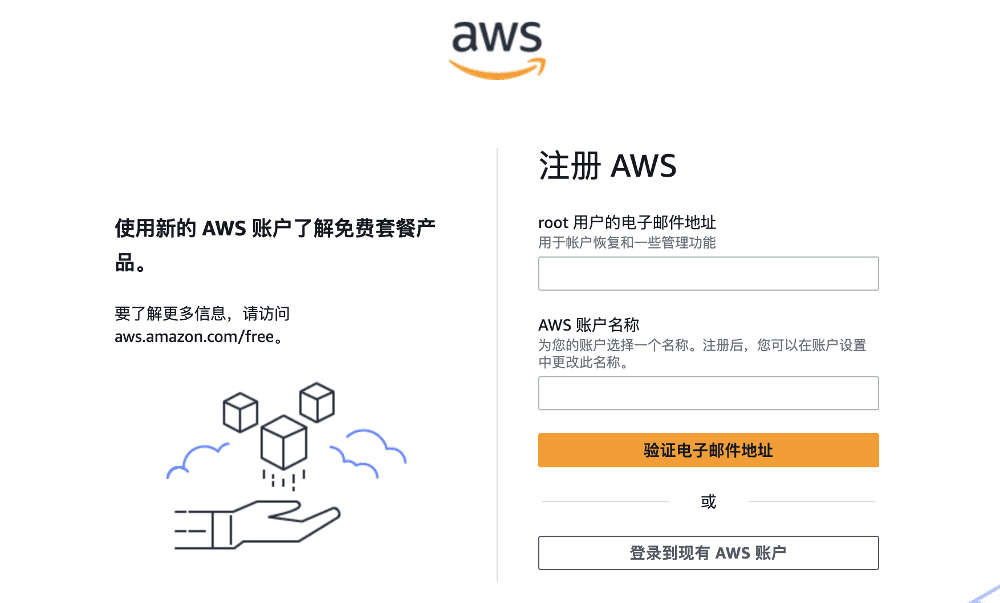
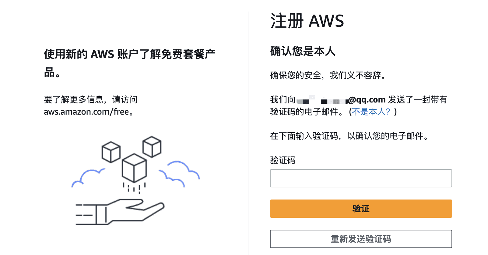
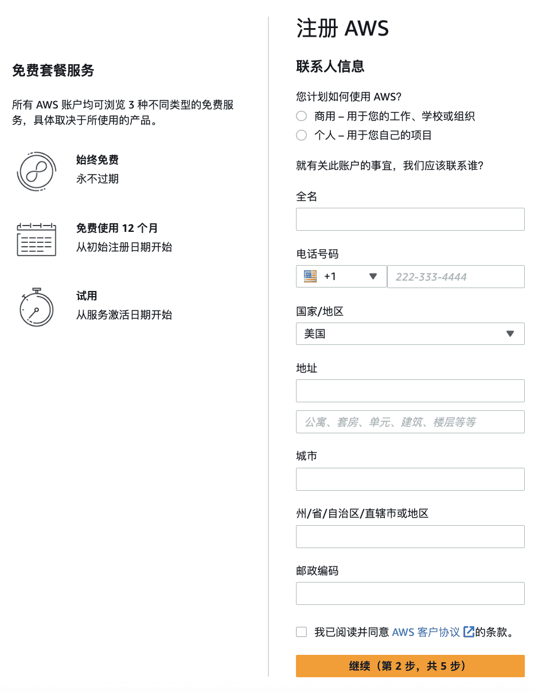
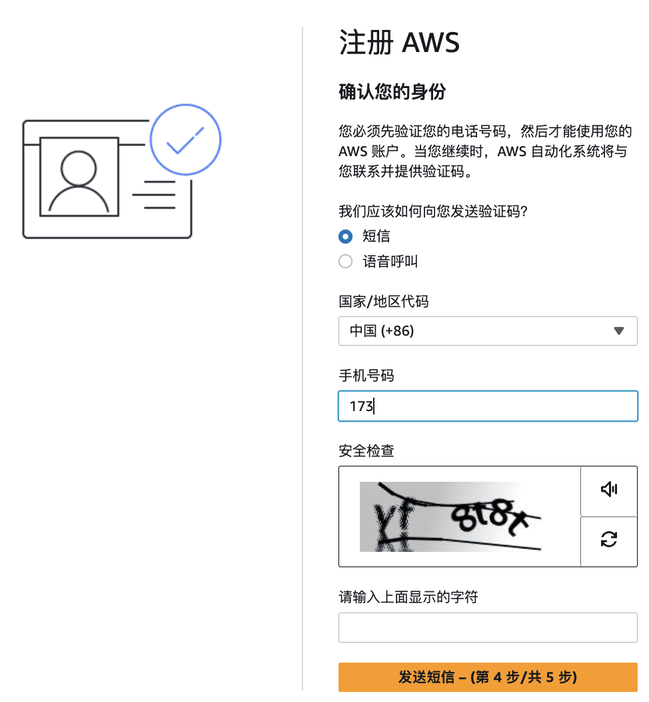
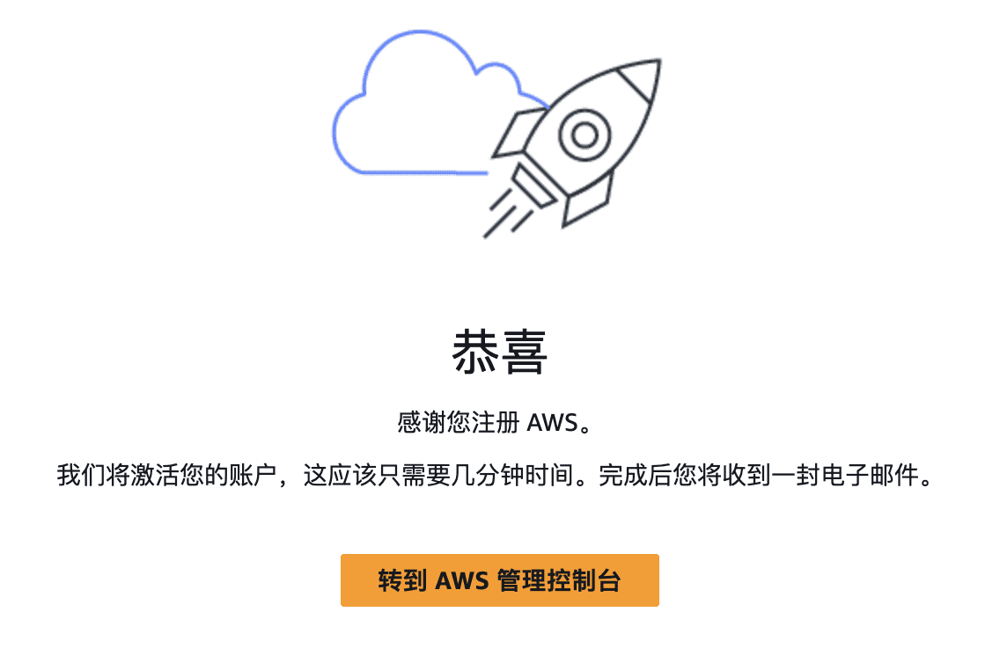
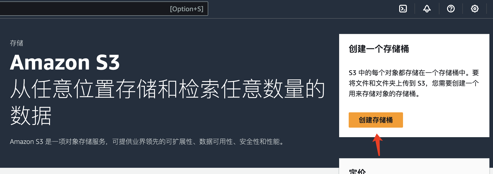
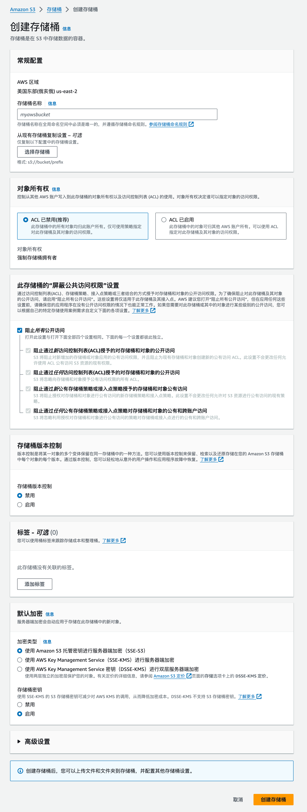
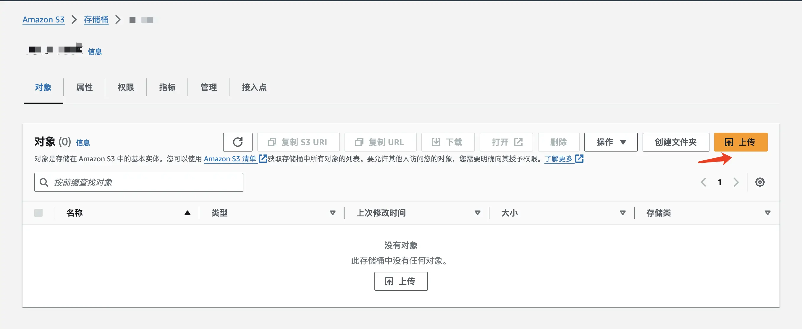
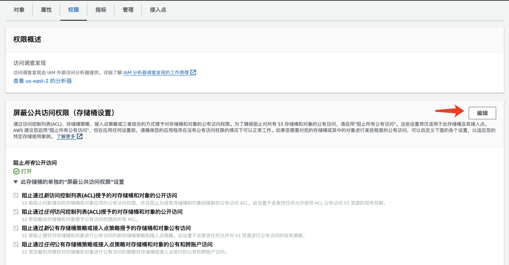
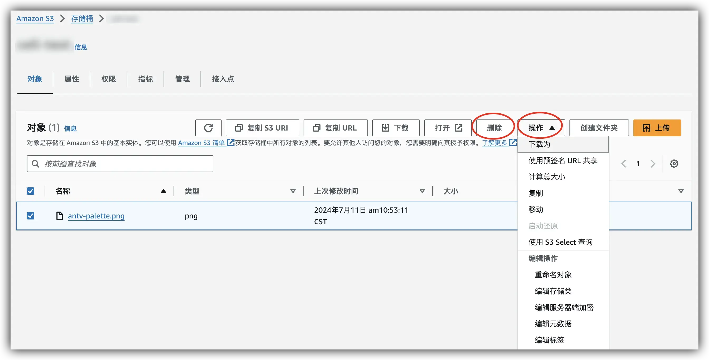

# 探索 Amazon S3 的无限存储潜力

在数字化时代，数据是企业最宝贵的资产之一。如何安全、高效地存储和访问这些数据，成为了许多企业面临的挑战。亚马逊云服务作为全球领先的云服务提供商，提供了一系列的解决方案来满足不同客户的需求。今天，我们将重点介绍亚马逊云科技的 Amazon S3（Simple Storage Service），一种简单、可扩展且持久的对象存储服务。

&lt;!--more--&gt;

## 了解 Amazon S3

Amazon Simple Storage Service (Amazon S3) 是一种对象存储服务，由亚马逊云科技提供行业领先的可扩展性、数据可用性、安全性和性能。你可以使用 Amazon S3 随时在任何位置存储和取回任何数量的数据。

## 免费试用优势

亚马逊云科技为新用户提供了免费试用套餐（12 个月内免费、永久免费等），包括 **Amazon S3** 在内的多种服务，这里 Amazon S3 时 12 个月内免费。用户可以在 [亚马逊云科技海外区域免费试用页面][trial-url] 了解更多详情，并开始免费体验。这不仅降低了用户的入门门槛，也让用户能够无负担地探索和学习亚马逊云科技的云服务。

## 开始使用 Amazon S3

### 注册亚马逊云科技账户 {#register-aws}

要使用 Amazon S3，你需要一个亚马逊云科技账户，如果你没有账户，系统会提示你在注册 Amazon S3 时创建一个。在你使用 Amazon S3 之前，系统不会向你收取费用。

打开 [亚马逊云科技账号注册地址][trial-url]，点击右上角创建亚马逊云科技账户。

1. 填写邮件地址和账号名称（支持使用国内的邮箱）\
   
2. 验证邮件\
   
3. 输入密码\
   
4. 联系人信息\
   
5. 付款信息\
   接受所有主要信用卡和借记卡（包括 Visa、MasterCard 和 银联信用卡等）\
   
   
6. 验证手机号（支持中国地区国内手机号）\
   
7. 选择支持计划\
   
8. 完成注册\
   
9. 登录亚马逊云科技控制台，[登录地址](https://console.aws.amazon.com/console/home?trk=56af0bad-f604-4f80-8f1a-f8a8b0d20118&amp;sc_channel=sm&amp;campaign=blog1352)，选择根用户输入电子邮件地址，点击下一步会让输入密码，输入密码后就可以完成登录了。

### 访问 Amazon S3 控制台

登录亚马逊云科技管理控制台，然后打开 [Amazon S3 控制台](https://console.aws.amazon.com/s3/?trk=56af0bad-f604-4f80-8f1a-f8a8b0d20118&amp;sc_channel=sm&amp;campaign=blog1352)。

### 创建存储桶

Amazon S3 中的每个对象都存储在存储桶中。你必须先创建一个 S3 存储桶，然后才能在 Amazon S3 中存储数据。

在 Amazon S3 控制台中，点击“创建存储桶”按钮。为你的存储桶命名，并选择一个合适的亚马逊云科技区域。完成设置后，点击“创建”。

### 上传文件

创建存储桶后，你可以开始上传文件。选择你的存储桶，点击“上传”，然后选择你想要上传的文件。你可以上传文本文件、图片、视频等任何类型的文件。

### 设置权限和访问控制

为了确保数据安全，你可以设置存储桶的权限和访问控制。在存储桶设置中，选择“权限”，然后根据需要配置访问权限。

### 管理数据

使用 Amazon S3 控制台，你可以轻松管理存储的数据。你可以查看文件列表、进行搜索、移动、复制或删除文件。

## 结语

Amazon S3 的灵活性和可靠性使其成为存储解决方案的理想选择。无论你是开发者、企业还是个人用户，都可以利用 S3 来满足你的存储需求。立即访问[免费试用页面][trial-url]，开始你的亚马逊云科技云服务之旅吧！

&lt;!-- link reference definition --&gt;
[trial-url]: https://aws.amazon.com/cn/free/?trk=56af0bad-f604-4f80-8f1a-f8a8b0d20118&amp;sc_channel=sm&amp;campaign=blog1352

---

> 作者: [Lruihao](https://github.com/Lruihao)  
> URL: https://lruihao.cn/posts/d1fc0c7/  

