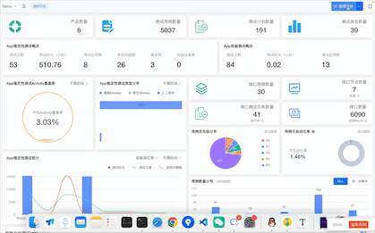

# 拖拽式仪表盘 - 模板使用


本文将通过一个简单的例子，介绍如何使用仪表盘模板。

<!--more-->

Talk is cheap. Show you the code.

## 代码

```vue
<!-- 首页 dashboard 页面布局 -->
<script>
import Dashboard, { registerComponents } from '@/components/Dashboard'

// 加载测试跟踪 widgets 目录下所有组件
const requireTrackingComponents = require.context('@/views/tracking/dashboard/widgets', true, /\.vue$/)
const trackingComponents = registerComponents(requireTrackingComponents)

// 加载接口测试 widgets 目录下所有组件
const requireInterfaceComponents = require.context('@/views/interface/dashboard/widgets', true, /\.vue$/)
const interfaceComponents = registerComponents(requireInterfaceComponents)

// 加载 WebUI 测试 widgets 目录下所有组件
const requireWebUIComponents = require.context('@/views/webui/dashboard/widgets', true, /\.vue$/)
const webuiComponents = registerComponents(requireWebUIComponents)

// 加载 App 测试 widgets 目录下所有组件
const requireAppComponents = require.context('@/views/app/dashboard/widgets', true, /\.vue$/)
const appComponents = registerComponents(requireAppComponents)

export default {
  name: 'HomeDashboard',
  extends: Dashboard,
  data() {
    return {
      // 设置默认布局
      defaultLayout: [
        { i: 1, component: 'TrackingCountsWidget', name: '总数统计', x: 0, y: 0, w: 6, h: 2, params: { type: 'product' }},
        { i: 2, component: 'TrackingCountsWidget', name: '总数统计', x: 6, y: 0, w: 6, h: 2, params: { type: 'case' }},
        { i: 3, component: 'TrackingCountsWidget', name: '总数统计', x: 12, y: 0, w: 6, h: 2, params: { type: 'testplan' }},
        { i: 4, component: 'TrackingCountsWidget', name: '总数统计', x: 18, y: 0, w: 6, h: 2, params: { type: 'report' }},
        { i: 5, component: 'InterfaceCountsWidget', name: '总数统计', x: 0, y: 2, w: 6, h: 2, params: { type: 'task' }},
        { i: 6, component: 'InterfaceCountsWidget', name: '总数统计', x: 6, y: 2, w: 6, h: 2, params: { type: 'api' }},
        { i: 7, component: 'InterfaceCountsWidget', name: '总数统计', x: 12, y: 2, w: 6, h: 2, params: { type: 'case' }},
        { i: 8, component: 'InterfaceCountsWidget', name: '总数统计', x: 18, y: 2, w: 6, h: 2, params: { type: 'device' }},
        { i: 9, component: 'MyTestplan', name: '我的测试计划', x: 0, y: 4, w: 12, h: 6, minW: 8, minH: 6, maxW: 24, maxH: 6, isResizable: true, params: { type: 'myAttend' }},
        { i: 10, component: 'MyInterfaceTask', name: '我创建的测试', x: 12, y: 4, w: 12, h: 6, minW: 12, minH: 6, maxW: 24, maxH: 6, isResizable: true },
      ],
    }
  },
  created() {
    // 加载组件列表
    this.addComponents('测试跟踪', trackingComponents)
    this.addComponents('接口测试', interfaceComponents)
    this.addComponents('WebUI 测试', webuiComponents)
    this.addComponents('App 测试', appComponents)

    // 设置权限
    this.hasEditPermission = this.checkPermission(['admin']) || !this.dashboard.isDefault
  },
}
</script>
```

## 效果




---

> 作者: [Lruihao](https://github.com/Lruihao)  
> URL: https://lruihao.cn/posts/dashborad-template-usage/  

