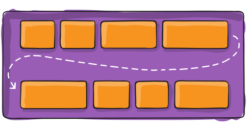
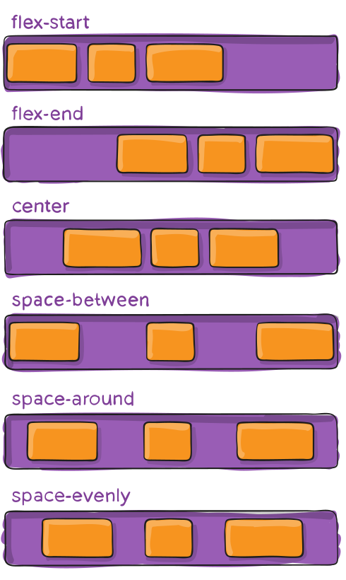
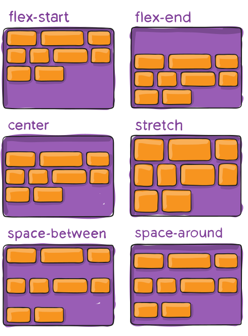
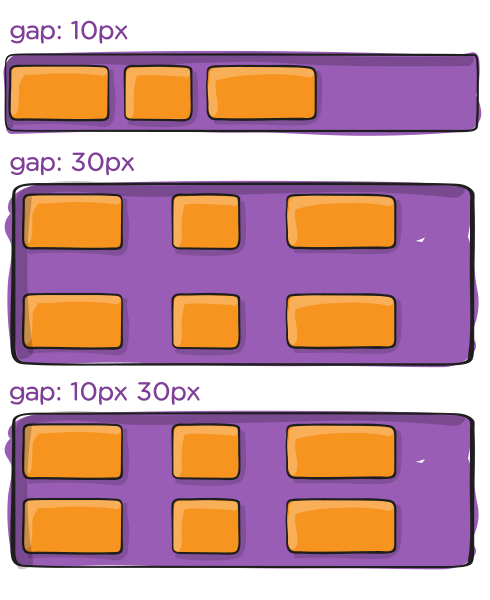
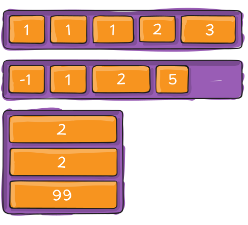

# CSS Flexbox 布局指南


本指南完整解释了弹性盒子（Flexible Box）的所有内容，重点介绍了父元素（弹性容器）和子元素（弹性项目）的所有不同可能属性。

&lt;!--more--&gt;

&gt; [!TIP]
&gt; 快速参考手册经常参考本指南？这里有一张你可以打印的高分辨率图像！==[免费下载](images/css-flexbox-poster.webp)==。

## 背景

Flex 布局（弹性盒子）模块（截至 2017 年 10 月为 [W3C 候选推荐](https://www.w3.org/TR/css-flexbox/)）旨在提供一种更有效的方法来布局、对齐和分配容器中项目之间的空间，即使它们的大小未知和/或动态（因此有“弹性（flex）”一词）。

Flex 布局的主要思想是赋予容器调整其项目宽度/高度（和顺序）的能力，以最佳填充可用空间（主要是适应各种显示设备和屏幕尺寸）。一个弹性容器会扩展项目以填充可用的空闲空间，或缩小它们以防止溢出。

最重要的是，Flex 布局是方向无关的，与常规布局（块布局是基于垂直的，而行内布局是基于水平的）相比。虽然这些布局在页面上工作良好，但它们缺乏灵活性（不带双关意味）来支持大型或复杂的应用程序（特别是在方向变化、调整大小、拉伸、收缩等方面）。

&gt; [!NOTE]
&gt; Flex 布局最适合应用程序的组件和小规模布局，而 [网格布局（Grid）](https://developer.mozilla.org/en-US/docs/Web/CSS/grid) 则用于更大规模的布局。

## 基础知识和术语

由于 flexbox 是一个整体模块，而不是单个属性，因此它涉及很多内容，包括其整个属性集。其中一些属性应设置在容器（父元素，称为“弹性容器”）上，而其他属性应设置在子元素（称为“弹性项目”）上。

如果“常规”布局基于块和内联流方向，则弹性布局基于“弹性流方向”。请看规范中的这张图，它解释了弹性布局背后的主要思想。


项目将按照主轴（main axis）或横轴（cross axis）进行布局。

- **弹性容器（flex container）**\
  包含弹性项目的父元素。
- **弹性项目（flex item）**\
  弹性容器的子元素。
- **主轴（main axis）**\
  弹性容器的主轴是弹性项目排列的主要轴。请注意，主轴不一定是水平的；这取决于属性 `flex-direction`（见下文）。
- **主轴起点（main-start） | 主轴终点（main-end）**\
  弹性项目从主轴起点开始排列，直到主轴终点。
- **主轴尺寸（main size）**\
  弹性项目的宽度或高度，取决于主轴的方向，是项目的主尺寸。弹性项目的主尺寸属性是主维度上的 `width` 或 `height` 属性。
- **横轴（cross axis）**\
  与主轴垂直的轴称为横轴。其方向取决于主轴的方向。
- **横轴起点（cross-start） | 横轴终点（cross-end）**\
  弹性行（flex line）填充项目并放置在容器中，从横轴起点开始，向横轴终点方向排列。
- **横轴尺寸（cross size）**\
  弹性项目的宽度或高度，取决于横轴的方向，是项目的横尺寸。横尺寸属性是横向维度上的 `width` 或 `height` 属性。

## 弹性布局属性

### 父元素（弹性容器）的属性


#### display

这定义了一个弹性容器；根据给定的值，可以是内联或块级。这为其所有直接子元素启用弹性上下文。

```css
.container {
  display: flex | inline-flex;
}
```

请注意，CSS 列对弹性容器没有影响。

#### flex-direction


这建立了主轴，从而定义了弹性项目在弹性容器中放置的方向。Flexbox 是一个单向布局概念（除了可选的换行）。将弹性项目主要视为在水平行或垂直列中布局。

```css
.container {
  flex-direction: row | row-reverse | column | column-reverse;
}
```

- `row`（默认）：在 `ltr` 中从左到右；在 `rtl` 中从右到左
- `row-reverse`：在 `ltr` 中从右到左；在 `rtl` 中从左到右
- `column`：与 `row` 相同，但从上到下
- `column-reverse`：与 `row-reverse` 相同，但从下到上

#### flex-wrap



默认情况下，所有弹性项目都将尝试适应一行。你可以更改此属性并允许项目根据需要换行。

```css
.container {
  flex-wrap: nowrap | wrap | wrap-reverse;
}
```

- `nowrap`（默认）：所有弹性项目都在一行上。
- `wrap`：弹性项目将换行到多行，从上到下。
- `wrap-reverse`：弹性项目将从下到上换行到多行。

#### flex-flow

这是 `flex-direction` 和 `flex-wrap` 属性的简写，它们共同定义了弹性容器的主轴和横轴。默认值是 `row nowrap`。

```css
.container {
  flex-flow: column wrap;
}
```

#### justify-content



这定义了沿主轴的对齐方式。它有助于分配当所有弹性项目在一行上都不可调整大小或可调整大小但已达到最大尺寸时剩余的额外空间。它还对项目溢出行时的对齐方式施加了一些控制。

```css
.container {
  justify-content: flex-start | flex-end | center | space-between | space-around | space-evenly | start | end | left | right ... &#43; safe | unsafe;
}
```

- `flex-start`（默认）：项目向弹性方向的起点对齐。
- `flex-end`：项目向弹性方向的终点对齐。
- `start`：项目向 `writing-mode` 方向的起点对齐。
- `end`：项目向 `writing-mode` 方向的终点对齐。
- `left`：项目向容器的左边缘对齐，除非这与 `flex-direction` 不符，则表现为 `start`。
- `right`：项目向容器的右边缘对齐，除非这与 `flex-direction` 不符，则表现为 `end`。
- `center`：项目在行中居中对齐
- `space-between`：项目在行中均匀分布；第一个项目在起始线，最后一个项目在终止线
- `space-around`：项目在行中均匀分布，周围有相等的空间。请注意，视觉上这些空间并不相等，因为所有项目在两侧都有相等的空间。第一个项目在容器边缘有一个单位的空间，但下一个项目之间有两个单位的空间，因为下一个项目有自己的间距。
- `space-evenly`：项目分布，使得任何两个项目之间的间距（以及到边缘的空间）相等。

请注意，这些值的浏览器支持是有差异的。例如，某些版本的 Edge 从未支持 `space-between`，而 start/end/left/right 尚未在 Chrome 中实现。MDN [有详细的图表](https://developer.mozilla.org/en-US/docs/Web/CSS/justify-content)。最安全的值是 `flex-start`、`flex-end` 和 `center`。

还有两个附加关键字可以与这些值配对：`safe` 和 `unsafe`。使用 `safe` 确保无论你如何进行这种类型的定位，都不会将元素推到屏幕外（例如，推到顶部）以至于内容无法滚动到（称为“数据丢失”）。

#### align-items


这定义了当前行上弹性项目沿横轴的默认布局行为。可以将其视为横轴（垂直于主轴）的 `justify-content` 版本。

```css
.container {
  align-items: stretch | flex-start | flex-end | center | baseline | first baseline | last baseline | start | end | self-start | self-end &#43; ... safe | unsafe;
}
```

- `stretch`（默认）：拉伸以填充容器（仍然遵守最小宽度/最大宽度）
- `flex-start` / `start` / `self-start`：项目放置在横轴的起点。这些之间的区别很微妙，主要是关于遵守 `flex-direction` 规则或 `writing-mode` 规则。
- `flex-end` / `end` / `self-end`：项目放置在横轴的终点。区别再次很微妙，主要是关于遵守 `flex-direction` 规则与 `writing-mode` 规则。
- `center`：项目在横轴上居中对齐
- `baseline`：项目对齐，使它们的基线对齐

`safe` 和 `unsafe` 修饰符关键字可以与所有这些关键字结合使用（尽管请注意[浏览器支持](https://developer.mozilla.org/en-US/docs/Web/CSS/align-items)），并帮助你防止对齐元素使内容变得不可访问。

#### align-content



这在横轴上有额外空间时对齐弹性容器的行，类似于 `justify-content` 在主轴上对齐单个项目。

&gt; [!WARNING]
&gt; 此属性仅在多行弹性容器上生效，其中 `flex-wrap` 设置为 `wrap` 或 `wrap-reverse`。单行弹性容器（即 `flex-wrap` 设置为其默认值 `no-wrap`）将不反映 `align-content`。

```css
.container {
  align-content: flex-start | flex-end | center | space-between | space-around | space-evenly | stretch | start | end | baseline | first baseline | last baseline &#43; ... safe | unsafe;
}
```

- `normal`（默认）：项目按默认位置打包，仿佛未设置任何值。
- `flex-start` / `start`：项目打包到容器的起点。（更多支持的）`flex-start` 遵守 `flex-direction`，而 `start` 遵守 `writing-mode` 方向。
- `flex-end` / `end`：项目打包到容器的终点。（更多支持的）`flex-end` 遵守 `flex-direction`，而 `end` 遵守 `writing-mode` 方向。
- `center`：项目在容器中居中对齐
- `space-between`：项目均匀分布；第一行在容器的起点，最后一行在终点
- `space-around`：项目均匀分布，每行周围有相等的空间
- `space-evenly`：项目均匀分布，周围有相等的空间
- `stretch`：行拉伸以占据剩余空间

`safe` 和 `unsafe` 修饰符关键字可以与所有这些关键字结合使用（尽管请注意[浏览器支持](https://developer.mozilla.org/en-US/docs/Web/CSS/align-items)），并帮助你防止对齐元素使内容变得不可访问。

#### gap, row-gap, column-gap



[`gap` 属性](https://css-tricks.com/almanac/properties/g/gap/)明确控制弹性项目之间的空间。它仅在项目之间应用间距，而不是在外边缘。

```css
.container {
  display: flex;
  ...
  gap: 10px;
  gap: 10px 20px; /* 行间距 列间距 */
  row-gap: 10px;
  column-gap: 20px;
}
```

这种行为可以被认为是最小的间隙，如果间隙更大（由于类似 `justify-content: space-between;` 的原因），则间隙仅在该空间变小的情况下生效。

它不仅适用于 flexbox，`gap` 也适用于网格和多列布局。

### 子元素（弹性项目）的属性


#### order



默认情况下，弹性项目按源顺序布局。但是，`order` 属性控制它们在弹性容器中出现的顺序。

```css
.item {
  order: 5; /* 默认值是 0 */
}
```

具有相同顺序的项目恢复为源顺序。

#### flex-grow


这定义了弹性项目在必要时增长的能力。它接受一个无单位的值，作为比例。它决定了弹性容器内可用空间的多少应该由该项目占据。

如果所有项目的 `flex-grow` 设置为 1，则容器中的剩余空间将平均分配给所有子元素。如果其中一个子元素的值为 2，则剩余空间将占据其他元素的两倍（或至少尝试这样做）。

```css
.item {
  flex-grow: 4; /* 默认值是 0 */
}
```

负数无效。

#### flex-shrink

这定义了弹性项目在必要时收缩的能力。

```css
.item {
  flex-shrink: 3; /* 默认值是 1 */
}
```

负数无效。

#### flex-basis

这定义了在分配剩余空间之前元素的默认大小。它可以是一个长度（例如 20%、5rem 等）或一个关键字。`auto` 关键字表示“查看我的宽度或高度属性”（这曾经由 `main-size` 关键字暂时完成，直到被弃用）。`content` 关键字表示“根据项目的内容调整大小”——这个关键字尚未得到很好的支持，因此很难测试，也很难知道它的兄弟 `max-content`、`min-content` 和 `fit-content` 的作用。

```css
.item {
  flex-basis:  | auto; /* 默认值是 auto */
}
```

如果设置为 `0`，则不考虑内容周围的额外空间。如果设置为 `auto`，则根据其 `flex-grow` 值分配额外空间。[请参见此图](images/rel-vs-abs-flex.svg)。

#### flex

这是 `flex-grow`、`flex-shrink` 和 `flex-basis` 的简写。第二个和第三个参数（`flex-shrink` 和 `flex-basis`）是可选的。默认值是 `0 1 auto`，但如果你使用单个数字值设置它，例如 `flex: 5;`，则会将 `flex-basis` 更改为 0%，因此它类似于设置 `flex-grow: 5; flex-shrink: 1; flex-basis: 0%;`。

```css
.item {
  flex: none | [ &lt;&#39;flex-grow&#39;&gt; &lt;&#39;flex-shrink&#39;&gt;? || &lt;&#39;flex-basis&#39;&gt; ]
}
```

**建议你使用此简写属性**，而不是单独设置各个属性。简写智能地设置其他值。

#### align-self


这允许覆盖单个弹性项目的默认对齐方式（或由 `align-items` 指定的对齐方式）。

请参阅 `align-items` 解释以了解可用值。

```css
.item {
  align-self: auto | flex-start | flex-end | center | baseline | stretch;
}
```

请注意，`floa`t、`clear` 和 `vertical-align` 对弹性项目没有影响。

## 为 Flexbox 添加前缀

我们可以使用 `Sass@mixin` 来帮助处理一些浏览器前缀问题。

```scss
@mixin flexbox() {
  display: -webkit-box;
  display: -moz-box;
  display: -ms-flexbox;
  display: -webkit-flex;
  display: flex;
}

@mixin flex($values) {
  -webkit-box-flex: $values;
  -moz-box-flex:  $values;
  -webkit-flex:  $values;
  -ms-flex:  $values;
  flex:  $values;
}

@mixin order($val) {
  -webkit-box-ordinal-group: $val;  
  -moz-box-ordinal-group: $val;     
  -ms-flex-order: $val;     
  -webkit-order: $val;  
  order: $val;
}

.wrapper {
  @include flexbox();
}

.item {
  @include flex(1 200px);
  @include order(2);
}
```

## 参考

本文内容翻译自 [Chris Coyier](https://css-tricks.com/author/chriscoyier/) 的 [A Complete Guide to Flexbox](https://css-tricks.com/snippets/css/a-guide-to-flexbox/)，感谢原作者的辛勤付出。

除此之外，你还可以通过一些小游戏来学习 Flexbox：

- [Flexbox Froggy](https://flexboxfroggy.com/) - 一个有趣的游戏，可以帮助你学习 Flexbox。
- [Flexbox Defense](http://www.flexboxdefense.com/) - 一个塔防游戏，可以帮助你学习 Flexbox。

## 题外话

这篇文章的翻译早就想做了，但是一直没有时间，拖了一年，今天终于抽出时间来完成了。


---

> 作者: [Lruihao](https://github.com/Lruihao)  
> URL: https://lruihao.cn/posts/flexbox/  

