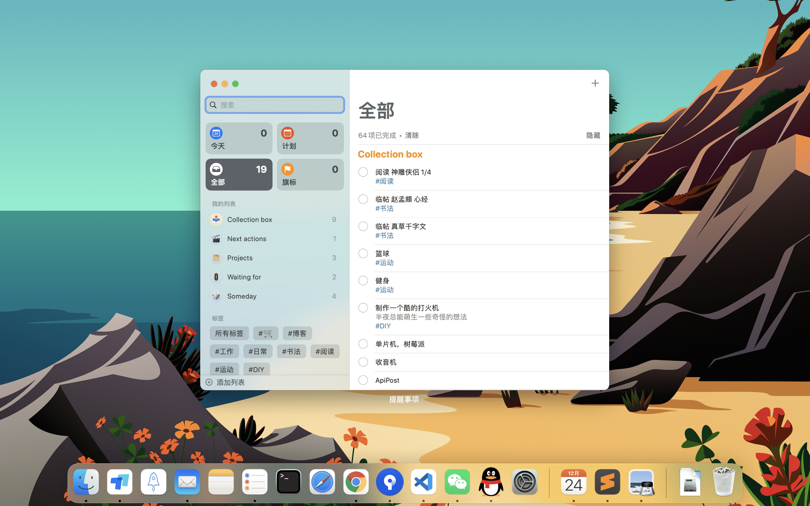

# Getting Things Done for ios App Reminders and Github issues


**Getting Things Done (GTD)** is a personal productivity system developed by David Allen and published in a book of the same name. GTD is described as a time management system. Allen states "there is an inverse relationship between things on your mind and those things getting done".

- [Reference](https://en.wikipedia.org/wiki/Getting_Things_Done)
- [#20](https://github.com/Lruihao/hugo-blog/issues/20)



<!--more-->

## 理解

简而言之原则就是：

1. 搜集 (Collections Box)
2. 处理
3. 组织
   - Next actions
   - Projects
   - Waiting for
   - Someday
4. 检查

## Apple Reminders app

按照以上原则就可以把 Apple 的提醒事项建 5 个大分类，  
日常各种想法收集到收集箱，  
空闲下来后再组织，分到不同时间点去做，  
然后就要自律地去执行处理，做完回顾检查是否都完成。  
还可以通过标签更加细分我们的 idea, 配合日历使用让生活学习更高效。

## Github

- 收集：选择 repository -> 建 issue
- 处理：解决并关闭 issue
- 组织：
  - Labels
  - Projects
  - Milestone

| Lable            | Description                                |
| :--------------- | :----------------------------------------- |
| bug              | Something isn't working                    |
| documentation    | Improvements or additions to documentation |
| duplicate        | e or pull request already exists           |
| enhancement      | New feature or request                     |
| good first issue | Good for newcomers                         |
| help wanted      | Extra attention is needed                  |
| invalid          | This doesn't seem right                    |
| priority         | Something to deal with first               |
| question         | Further information is requested           |
| study            | Self learning plan                         |
| wontfix          | This will not be worked on                 |

## 总结

之前在 Foxconn 工作，因为工作电脑、个人电脑、手机可以做到互不干扰，本来想的是把**工作、学习 (Free Code) 和 生活** 的计划完全分开。
但是换工作后用自己的电脑，工作和 Free Code 就有了交集，换 mac 后，由于苹果生态的原因，不可避免生活计划也加入其中，形成一个三者互相交错的 Venn 图，所以简单分一下：

- 工作、生活
  - 苹果生态：日历、提醒、备忘录（标签区分）
- 学习
  - Github (collection, backup), Blog (summarize)

---

> 作者:   
> URL: https://lruihao.cn/posts/gtd/  

