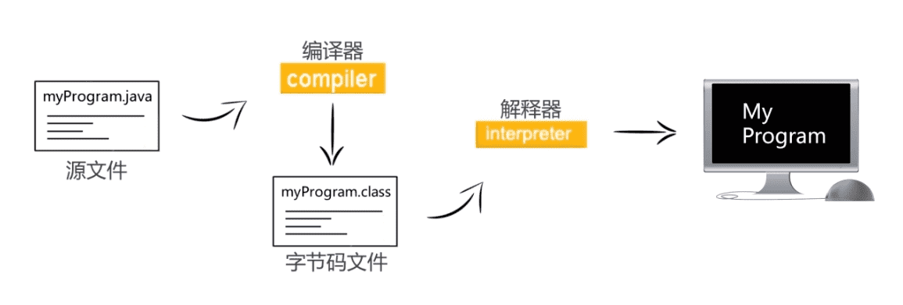
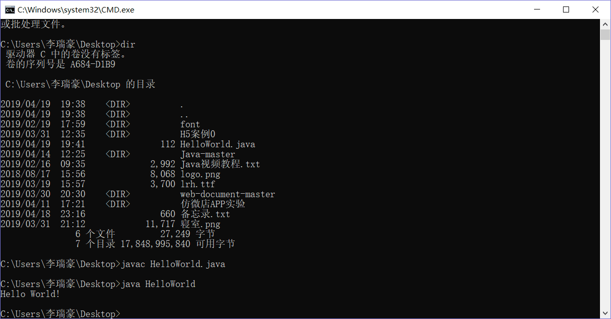

# 用记事本编写第一个 java 程序


> 之所以用记事本来写不是为了装 X 或者什么的。反而恰恰是返璞归真，因为在用 java 语言进行程序开发时，首先是以纯文本的方式编写所有的 java 源程序，并保存成以`.java`为后缀的文件；然后将这些源程序用`javac`编译成`.class`后缀名的字节代码文件；字节代码不是被本地处理器执行的代码，而是能够被 java 虚拟机（JVM）执行的代码。最后用 java 运行工具在 JVM 执行 java 应用程序。  
> 由于 JVM 可以运行在不同的操作系统上，因此同一个字节代码文件可以跨平台运行。

- javac
- java

<!--more-->



## 编写 java

用记事本编辑 java 文件，并且把后缀改成`.java`，文件名和类名要一样。

```java
public class HelloWorld{
  public static void main(String[] args){
    System.out.println("Hello World!");
  }
}
```

## 打开 cmd




---

> 作者: [Lruihao](https://github.com/Lruihao)  
> URL: https://lruihao.cn/posts/hellojava/  

