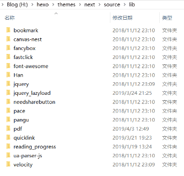
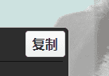
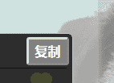

# hexo-theme-next @modified LRH


&lt;!-- markdownlint-disable-file --&gt;

{{&lt; admonition danger &gt;}}
&lt;span style=&#34;color: #d9534f;font-size: 1.2em;&#34;&gt;**如无必要，不再更新！（2019.09.13）**&lt;/span&gt;  
今晚我做出了一个慎重的决定，由于博主时间精力有限，需要更多的时间来工作和学习。所以我将**放弃对 next 的主题的自定义修改**，next 主题官方已经更新到了 7.0&#43;的版本，喜欢 next 主题风格的朋友可以在 github 更新。  
我这也算是上古版本了，版本差距实在过大，所以我也将放弃博客使用主题的更新。  
以下仍为当前博客使用主题，lib 资源已打包 github。
{{&lt; /admonition &gt;}}

&lt;!--more--&gt;

{{&lt; admonition success &#34;next&#34; &gt;}}
基于 [hexo-theme-next 6.0&#43;](https://github.com/theme-next/hexo-theme-next) 的 Pisces 模板做的 DIY 扩展性设计（部分兼容 next 其他几种模板）。主要是一些 custom style 还有一些第三方的 js。修改的地方太多也有点小乱就不提 PR 了。  
[modified](https://github.com/Lruihao/hexo-theme-next)&amp;emsp; 官方 Demo =&gt; &lt;https://theme-next.org&gt;  
记录一下折腾过程，以后备份恢复博客也好方便自己。本文之前的美化修改请见 [hexo 标签](/tags/hexo/)。  
**主题中若有遗漏第三方插件或应用的 key 及 id 值等请修改为自己对应的值**  
{{&lt; /admonition &gt;}}

主要的几个自定义文件

```xml 主要修改路径及文件
_config.swig                                 #主题配置文件 相关账户信息自己注册替换
\layout\custom\head.swig                     #在头部自定义加入标签
\layout\custom\google_adsense.swig           #谷歌广告模块，内有注释暂时弃用
\layout\_layout.swig                         #主布局
\layout\_macro\post.swig                     #文章布局
\layout\_macro\post-copyright.swig           #文章版权
\layout\_macro\siderbar.swig                 #侧栏模板
\layout\_third-party\copy-code.swig          #复制按钮
\layout\_partials\comments.swig              #评论主模板
\layout\_partials\footer.swig                #底部模板#该模块在 layout.swig 引入，用于在 body 自定义标签
\layout\_partials\footer_custom.swig         #footer 自定义文件
\layout\_third-party\custom.swig             #该模块在 layout.swig 引入用于在 body 自定义标签
\source\css\_custom\customs.styl             #主要用户自定义样式表
\source\fonts\                               #引入了一些我的手写体及外部字体
\scripts\qcloudcdn.js                        #腾讯云 cos 桶刷新缓存的脚本，不需要可删掉 [^1]
```

[^1](https://lruihao.cn/posts/cos-hexo.html#CDN%E5%88%B7%E6%96%B0)

## 初步安装

&gt; 安装整个改过的主题，然后下载相应的 lib 资源解压放入 source 文件夹

```bash
cd hexo
git clone https://github.com/Lruihao/hexo-theme-next themes/next
```

主题配置文件`_config.yml`, 选择主题

```text
theme: next
```

{{&lt; link href=&#34;http://github.com/Lruihao/hexo-theme-next/releases/tag/v6.9.1&#34; content=&#34;lib 下载&#34; card=true &gt;}}



## 更新内容

&gt; 更多自定义详见源码

### links 模板

&gt; 自定义友链模板，打开`hexo\themes\next\layout\`新建`links.swig`文件，写下以下内容后保存。

```swig



  {#
  #}{#

  #}{#
    #}{{ __(&#39;title.category&#39;) &#43; page_title_suffix }}{#
  #}{#
    #}{{ __(&#39;title.tag&#39;) &#43; page_title_suffix }}{#

  #}{#
  #}{{ __(&#39;title.photos&#39;) &#43; page_title_suffix }}{#

  #}{#
    #}{{ page.title &#43; page_title_suffix }}{#
  #}{#
#}

page-post-detail



  &lt;div id=&#34;posts&#34; class=&#34;posts-expand&#34;&gt;
    {##################}
    {#### PAGE BLOCK ###}
    {##################}
    &lt;div class=&#34;post-block page&#34;&gt;
      
      {#################}
      {#### PAGE BODY ###}
      {#################}

      &lt;script src=&#34;//at.alicdn.com/t/font_578712_g26jo2kbzd5qm2t9.js&#34;&gt;&lt;/script&gt;
      &lt;div class=&#34;post-body han-init-context rtl&#34;&gt;
        &lt;div class=&#34;links-list&#34;&gt;
          
            &lt;div class=&#34;card-box&#34; title=&#34;{{ link.info }}&#34;&gt;
              &lt;a href=&#34;{{ link.site }}&#34; target=&#34;_blank&#34;&gt;
                
                  &lt;img class=&#34;card-avatar&#34; data-original=&#34;{{ link.avatar }}&#34; alt=&#34;{{ link.nickname }}&#34;/&gt;
                
                  &lt;svg class=&#34;card-avatar&#34; aria-hidden=&#34;true&#34;&gt;
                    &lt;use xlink:href=&#34;#icon-{{svg&#43;1}}&#34;&gt;&lt;/use&gt;
                  &lt;/svg&gt;
                
                &lt;span title=&#34;{{ link.nickname }}&#34;&gt;@{{ link.nickname }}&lt;/span&gt;
              &lt;/a&gt;
            &lt;/div&gt;
          
        &lt;/div&gt;
        {{ page.content }}
      &lt;/div&gt;

      &lt;style&gt;
        /* @Author: lruihao.cn */
        .links-list {
          margin-top: 1rem;
          display: flex;
          flex-direction: row;
          justify-content: space-between;
          flex-wrap: wrap;
        }
        .card-box {
          width: 150px;
          height: 200px;
          font-size: 1rem;
          text-align: center;
          background: rgba(255,255,255,0.3);
          box-sizing: border-box;
          box-shadow: 3px 3px 5px #aaa;
          border-radius: 5px;
          transition-duration: 0.3s;
          margin-bottom: 1rem;
          display: flex;
          flex-direction: column;
        }
        .card-box:hover {
          background: #fff;
          transform: scale(1.03);
          box-shadow: 0 0 3px #aaa;
        }
        .card-box a {
          border:none;
        }
        .card-avatar {
          width: 100%!important;
          height: 150px!important;
          border-radius: 5px;
          margin: 0;
          padding: 0;
        }
        .card-box span{
          display: block;
          position: relative;
          bottom: 1rem;
          align-self: flex-end;
          color: #2bbc8a;
          font-weight: bold;
          max-width: 100%;
          overflow: hidden;
          white-space: nowrap;
          text-overflow: ellipsis;
          margin-top: 15px;
        }
        .card-box span:hover {
          color: #d480aa;
        }
      &lt;/style&gt;

      {#####################}
      {#### END PAGE BODY ###}
      {#####################}
    &lt;/div&gt;
    
    {######################}
    {#### END PAGE BLOCK ###}
    {######################}
  &lt;/div&gt;




  {{ sidebar_template.render(false) }}



  

```

- **若未使用懒加载请将模板中的`data-original`属性改为`src`**
- **若懒加载无法加载预览图请手动添加`src=&#34;/images/loading.gif&#34;`**
- **若 fancybox 显示 alt 内容请更换 fancybox2 或者将 alt 属值删除**

```
&lt;img class=&#34;card-avatar&#34; data-original=&#34;{{ link.avatar }}&#34; alt=&#34;{{ link.nickname }}&#34;/&gt;
```

然后`hexo n page links`新建一个页面文章配置写下如下内容：

```XMl
---
title: 友情链接
layout: links
---
```

然后在`links`页面文件夹下面新建文件夹`_data`，再在里面新建`links.yml`，内容如下

```xml links.yml
- nickname: 博採眾長
  avatar: http://lruihao.cn/images/avatar.png
  site: http://lruihao.cn
  info: 一个菜鸟的博客
- nickname:                 #友链名称
  avatar:                   #友链头像
  site:                     #友链地址
  info:                     #友链说明
```

### 备案信息自定义

```xml _config.yml
## -------------------------------------------------------------
## footer_custom Settings
## -------------------------------------------------------------
beian:
  enable: true
  gov: 湘公网安备 43030402000254 号
  recordcode: 43030402000254
  icp: 湘 ICP 备 18020535 号
```

### 文字抖动特效

```xml 使用方法
&lt;div class=&#34;shaky&#34;&gt;（づ●&#39;◡&#39;●) づ ❥内容区&lt;/div&gt;
```

&lt;div class=&#34;shaky&#34;&gt;（づ●&#39;◡&#39;●) づ ❥内容区&lt;/div&gt;

### 左下角微信公众号

```xml 替换为自己的二维码
\source\css\_custom\customs.styl
```

### 相关文章收纳

加入 H5 标签，实现可收纳功能，点击查看详情。

### Chat Services

&gt; 共 chatra,tidio,daovoice 三个选项，三选一

```swig _config.swig
## Chatra Support
## See: https://chatra.io
## Dashboard: https://app.chatra.io/settings/general
chatra:
  enable: false
  async: true
  id: ## visit Dashboard to get your ChatraID
  #embed: ## unfinished experimental feature for developers, See: https://chatra.io/help/api/#injectto

## Tidio Support
## See: https://www.tidiochat.com
## Dashboard: https://www.tidiochat.com/panel/dashboard
tidio:
  enable: false
  key: ## Public Key, get it from Dashboard, See: https://www.tidiochat.com/panel/settings/developer

#在线客服
daovoice: true
daovoice_app_id: xxxx   ## http://www.daovoice.io/
```

### pdf 和 Mermaid 解析模块

[pdf 传送门](https://lruihao.cn/posts/next-pdf/)

```swig config.swig
pdf:
  enable: false
  ## Default height
  height: 500px
  pdfobject:
    cdn: //cdn.jsdelivr.net/npm/pdfobject@2/pdfobject.min.js
    #cdn: //cdnjs.cloudflare.com/ajax/libs/pdfobject/2.1.1/pdfobject.min.js

## Mermaid tag
mermaid:
  enable: false
  ## Available themes: default | dark | forest | neutral
  theme: forest
  cdn: //cdn.jsdelivr.net/npm/mermaid@8/dist/mermaid.min.js
  #cdn: //cdnjs.cloudflare.com/ajax/libs/mermaid/8.0.0/mermaid.min.js
```

### 模仿 csdn 转发样式

```diff post.swig 主要修改
...
   &lt;a class=&#34;post-title-link&#34; href=&#34;{{ url_for(post.path) }}&#34; itemprop=&#34;url&#34;&gt;
&#43;    
&#43;      &lt;span class=&#34;repost&#34;&gt;转&lt;/span&gt;
&#43;    
     {{ post.title | default(__(&#39;post.untitled&#39;))}}
   &lt;/a&gt;
 
&#43;  
&#43;    &lt;span class=&#34;repost&#34;&gt;转&lt;/span&gt;
&#43;  
   {{- post.title -}}
...
```

```css css 样式
.repost {
  color: #5acc79;
  border: 1px solid #e7f4df;
  border-radius: 20px;
  padding: 2px 5px;
  font-size: 15px;
  font-weight: 500;
}
```

```xml post 使用
---
title: xxxx
repost: true
---
```

[预览](https://lruihao.cn/tags/他山之石/)

### 热度页面

&gt; 打开`hexo\themes\next\layout`新建 top.swig 文件，写下如下内容保存：

```swig



  {#
  #}{#

  #}{#
    #}{{ __(&#39;title.category&#39;) &#43; page_title_suffix }}{#
  #}{#
    #}{{ __(&#39;title.tag&#39;) &#43; page_title_suffix }}{#

  #}{#
  #}{{ __(&#39;title.photos&#39;) &#43; page_title_suffix }}{#

  #}{#
    #}{{ page.title &#43; page_title_suffix }}{#
  #}{#
#}

page-post-detail



  &lt;div id=&#34;posts&#34; class=&#34;posts-expand&#34;&gt;
    {##################}
    {#### PAGE BLOCK ###}
    {##################}
    &lt;div class=&#34;post-block page&#34;&gt;
      
      {#################}
      {#### PAGE BODY ###}
      {#################}

      &lt;div class=&#34;post-body han-init-context rtl&#34;&gt;
        {{ page.content }}
        &lt;div id=&#34;top&#34;&gt;&lt;/div&gt;
      &lt;/div&gt;

      &lt;style&gt;
        #top{
          display: flex;
          flex-direction: row;
          justify-content: space-between;
          flex-wrap: wrap;
          width: 100%;
          min-height: calc({{ page.limit }} * 20px);
        }
        #top div{
          width: 400px;
          height: 40px;
          max-width: 400px;
          overflow: hidden;
          white-space: nowrap;
          text-overflow: ellipsis;
        }
        #top a{
          color: #555;
          text-decoration: none;
          outline: 0;
          border-bottom: 1px solid #999;
          word-wrap: break-word;
        }
      &lt;/style&gt;
      &lt;script src=&#34;https://cdn1.lncld.net/static/js/av-core-mini-0.6.4.js&#34;&gt;&lt;/script&gt;
      &lt;script&gt;AV.initialize(&#34;{{ theme.valine.appid }}&#34;, &#34;{{ theme.valine.appkey }}&#34;);&lt;/script&gt;
      &lt;script type=&#34;text/javascript&#34;&gt;
        setTimeout(function(){
          var time=0
          var title=&#34;&#34;
          var url=&#34;&#34;
          var query = new AV.Query(&#39;Counter&#39;);
          query.notEqualTo(&#39;id&#39;,0);
          query.descending(&#39;time&#39;);
          query.limit({{ page.limit }}); //设置篇数
          query.find().then(function (todo) {
            for (var i=0;i&lt;{{ page.limit }};i&#43;&#43;){
              var result=todo[i].attributes;
              time=result.time;
              title=result.title;
              category=result.categories
              url=result.url;
              var content=&#34;&lt;div&gt;&#34;&#43;&#34;【文章热度：&#34;&#43;time&#43;&#34;℃】&#34;&#43;&#34;&lt;a href=&#39;&#34;&#43;&#34;{{ config.url }}&#34;&#43;&#34;&#34;&#43;url&#43;&#34;&#39;&gt;&#34;&#43;title&#43;&#34;&lt;/a&gt;&#34;&#43;&#34;&lt;/div&gt;&#34;;
              document.getElementById(&#34;top&#34;).innerHTML&#43;=content;
            }
          }, function (error) {
            console.log(&#34;error&#34;);
          });
        },1000)
      &lt;/script&gt;

      {#####################}
      {#### END PAGE BODY ###}
      {#####################}
    &lt;/div&gt;
    
    {######################}
    {#### END PAGE BLOCK ###}
    {######################}
  &lt;/div&gt;




  {{ sidebar_template.render(false) }}



  

```

其中第 36 行改成你自己的 leancloud 的 appid 和 appkey, 比如我的是在主题配置文件里面的 valine 配置下，所以我就写成`theme.valine.appid`。和我一样就不需要修改，其他自行配置。

然后`hexo n page top`新建一个页面文章配置写下如下内容，limit 表示显示篇数：

```XMl top.md
---
title: 热度
layout: top
limit: 20
---
```

### 复制按钮样式





&gt; 本来只想简单美化一下变成 night 样式的，后来写完发现 3dbtn 也挺喜欢的。

```java config 配置
codeblock:
  ## Manual define the border radius in codeblock
  ## Leave it empty for the default 1
  border_radius: 5
  ## Add copy button on codeblock
  copy_button:
    enable: true
    ## Show text copy result
    show_result: true
    ## Style: &#39;light,night,flat,3dbtn&#39; is currently available, leave it empty or light is default theme
    style: night
```


---

> 作者: [Lruihao](https://github.com/Lruihao)  
> URL: https://lruihao.cn/posts/hexo-theme-next/  

