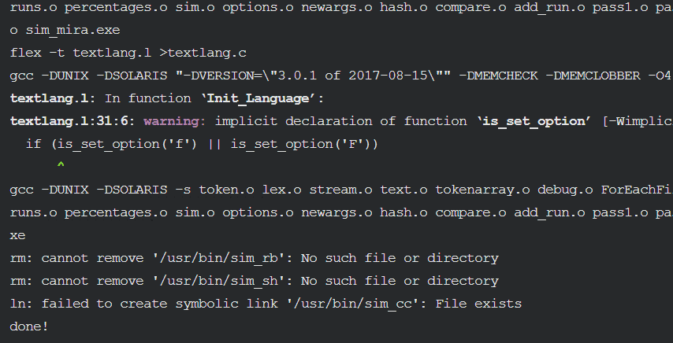
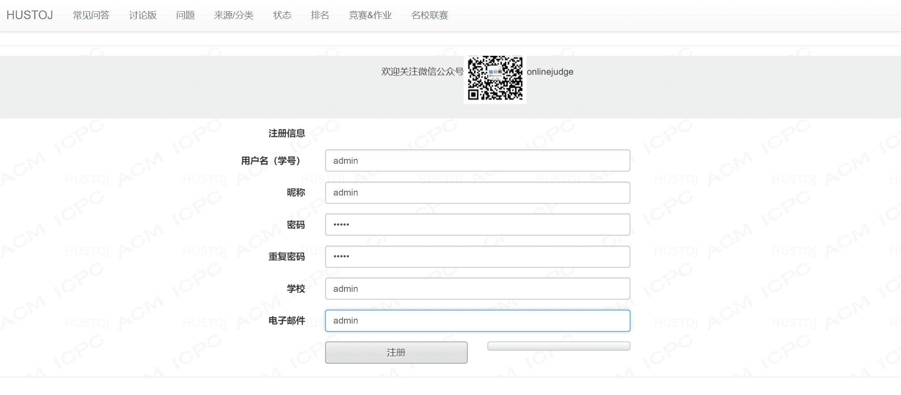
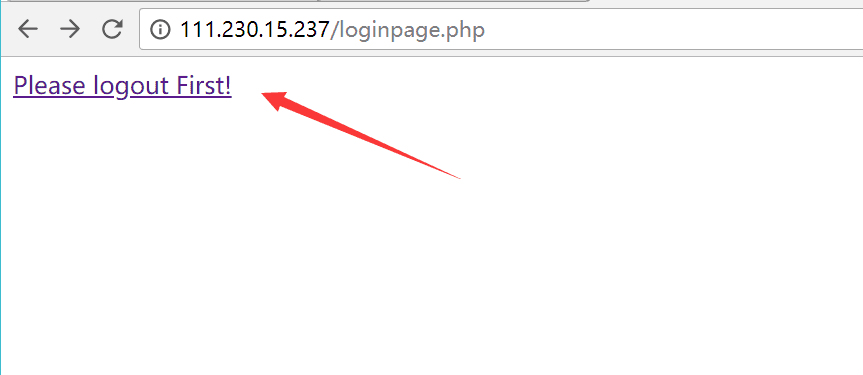
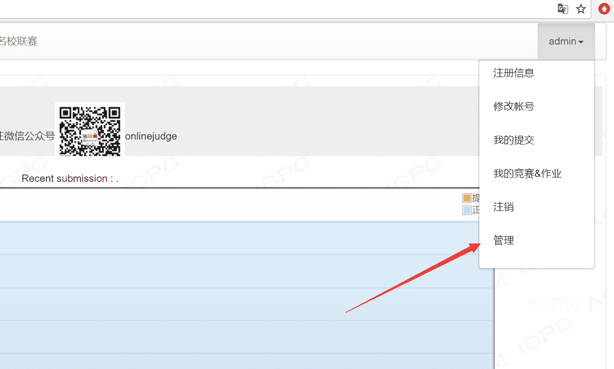

# HustOJ 基础搭建教程


> 目前 HustOj 在 GitHUb 地址是：<https://github.com/zhblue/hustoj>  
> **安装时注意 ubuntu 版本**，没条件的可以在自己 ubuntu 上尝试，或者虚拟机上（关注公众号回复`ubuntu16.04`获取 iso 镜像文件），也可以在云实验室的云服务器上做做实验。  
> 更多说明及 ACM/NOIP 题库下载见官网博客 [代码的那些事 | 程序员回忆录](http://www.hustoj.com/)

<!--more-->

## 快速安装 OJ

下载

```bash
wget https://raw.githubusercontent.com/zhblue/hustoj/master/trunk/install/install-ubuntu16+.sh
```

安装

```bash
sudo bash install-ubuntu16+.sh
```

等待中一路回车，当提示 done！则表示安装成功：


## 使用 HustOJ

打开网页/IP 地址  
注册 admin  
用 admin 作为用户名注册一个用户，将会自动成为管理员。  
  
注册成功，会提示：  
  
登录后台  
登录账号，并点击右上角的管理：  
  
添加测试题目  
在后台选择添加题目，添加成功：  
  
然后再提交代码测试判题机。

## 说明

安装后几个重要配置文件的位置

```
/home/judge/etc/judge.conf
/home/judge/src/web/include/db_info.inc.php
/etc/php5/fpm/php.ini 或 /etc/php7.0/fpm/php.ini
/etc/nginx/sites-enabled/default
```


---

> 作者:   
> URL: https://lruihao.cn/posts/hustoj/  

