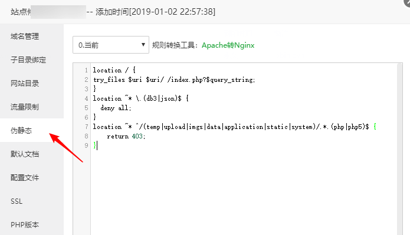
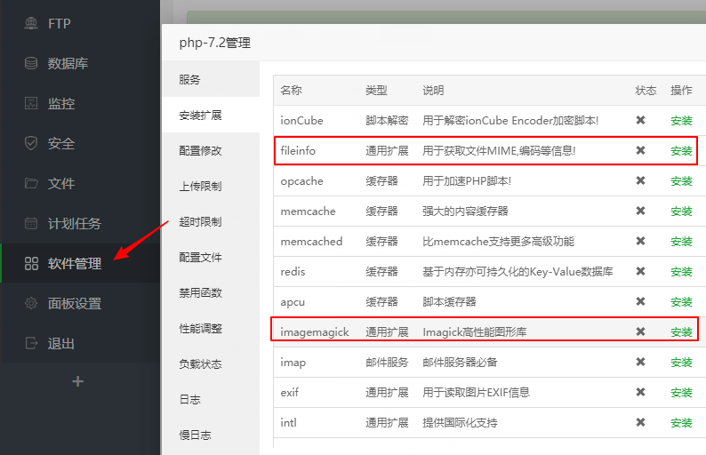
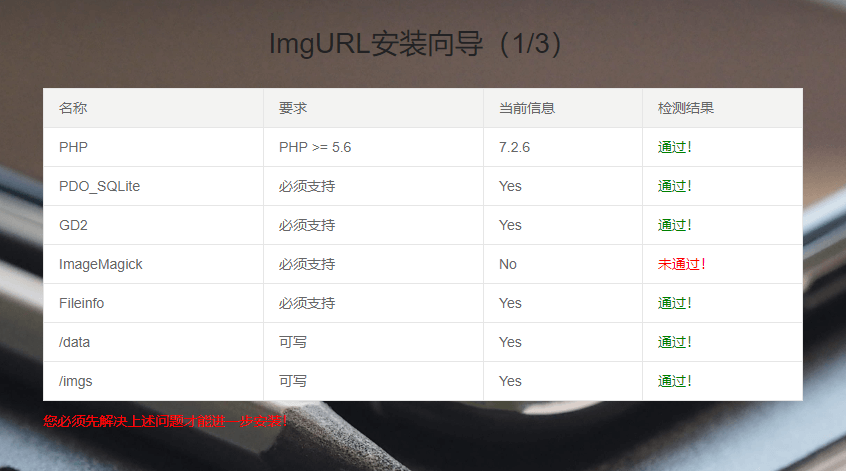
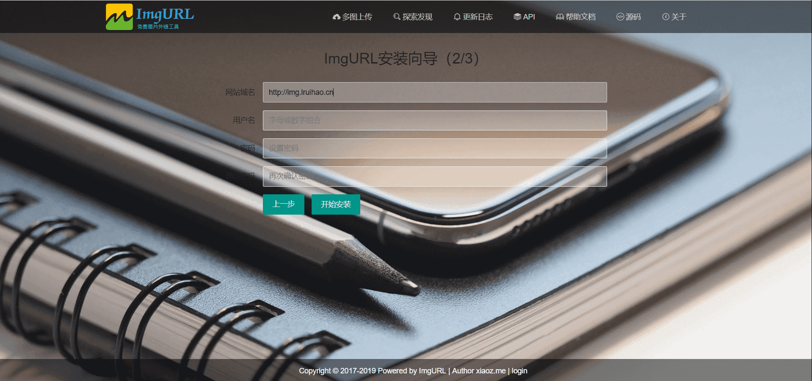

# 宝塔面板安装 ImgURL 图床


> ImgURL 是一个开源、免费的图床程序，ImgURL 2.x 之后对环境要求更高，尤其是 ImageMagick 组件的支持，很多朋友不清楚怎样安装这个组件，这篇文章分享宝塔面板安装 ImgURL 2.x 图床的过程（包括 ImgURL 2.x 需要的各种组件）
> [阅读原文](https://www.xiaoz.me/archives/12081)

<!--more-->

## 准备工作

1. 已经安装宝塔面板
2. 在宝塔后台创建一个站点
3. 下载 [ImgURL 2.x](https://github.com/helloxz/imgurl) 上传到站点根目录并解压

## 设置伪静态

如果你宝塔面板安装的 Apache 则不需要再设置伪静态，直接跳过这个步骤，如果使用的 Nginx 环境，请继续往下看。

找到对应的站点 - 点击后面设置按钮 - 伪静态 - 添加下面的伪静态规则

```php 伪静态规则
location / {
try_files $uri $uri/ /index.php?$query_string;
}
location ~* \.(db3|json)$ {
  deny all;
}
location ~* ^/(temp|upload|imgs|data|application|static|system)/.*.(php|php5)$ {
    return 403;
}
```



## 安装 fileinfo & imagemagick

在宝塔后台 - 软件管理 - 找到你站点对应的 PHP 版本 - 设置 PHP - 安装扩展 - 勾选`fileinfo`和`imagemagick`，如下截图。



## 安装 ImgURL 2.x

其它所需扩展宝塔默认已经支持，重点是安装`fileinfo`和`imagemagick`，扩展安装完毕后就可以访问你自己的域名安装 ImgURL 了，如果正常会看到 ImgURL 安装界面。

  


## 其它说明

- 如果安装遇到任何问题，请留言反馈或到 [3T 官方社区](https://ttt.sh/category/6/imgurl%E5%9B%BE%E5%BA%8A) 进行反馈
- ImgURL 更多使用说明请参考帮助文档：<https://dwz.ovh/imgurldoc>


---

> 作者:   
> URL: https://lruihao.cn/posts/imgurl/  

