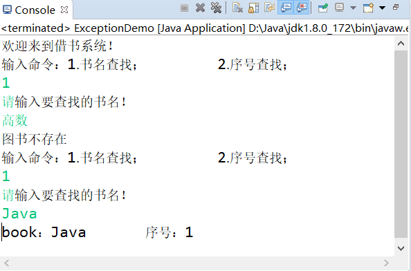

# 模拟借书系统（java 异常练习）


&lt;!--more--&gt;

## 实现代码

&gt; 这里的异常主要是`InputMismatchException`, 可以直接捕获该异常，我直接捕获了父类异常。

```java ExceptionDemo.java
package cn.lruihao.Exception;

import java.util.Scanner;

/**
 * @author 李瑞豪
 * 借书系统（异常练习）
 */

public class ExceptionDemo {
  private final Book[] books = {
    new Book(&#34;数据结构&#34;),
    new Book(&#34;Java&#34;),
    new Book(&#34;php&#34;),
    new Book(&#34;c&#34;)
  };

 public static void main(String[] args) {
  System.out.println(&#34;欢迎来到借书系统！&#34;);
  ExceptionDemo jieshu= new ExceptionDemo();
  jieshu.menu();
 }

 public void menu() {
  System.out.println(&#34;输入命令：1. 书名查找；\t2. 序号查找；&#34;);
   //初始化并捕获用户输入
  Scanner sc = new Scanner(System.in);
//  捕获异常
  try {
   int id =sc.nextInt();
   if(id==1||id==2) {
    inquire(id);
   }else {
    System.out.println(&#34;输入错误！请根据提示输入~~&#34;);//输入非 1，2 的数字情况
    menu();
   }
  }catch (Exception e) {//输入字符为非数字
   e.printStackTrace();
   System.out.println(&#34;输入错误，请输入数字命令~~&#34;);
   menu();
  }finally{
   sc.close();
  }
 }

 private void inquire(int id) {
  Scanner sc = new Scanner(System.in);

  if(id==1) {
   System.out.println(&#34;请输入要查找的书名！&#34;);
   String name=sc.nextLine();
   int num=FindName(name);
   if(num==0?false:true) {//验证书名是否存在 存在则打印
    System.out.println(&#34;book:&#34;&#43;name&#43;&#34;\t 序号：&#34;&#43;num);
    //menu();//回到访问起点 也可以去掉终止程序
   }else{
             System.out.println(&#34;图书不存在&#34;);
             menu();
         }
   sc.close();
  }else if(id == 2) {
   System.out.println(&#34;请输入您要查找的序号：&#34;);
   int id2=sc.nextInt();
   FindNum(id2);
   sc.close();
  }

 }

 private void FindNum(int num) {
  try {
   if(num&gt;=0&amp;&amp;num&lt;books.length) {
     System.out.println(books[num].getName());
     //menu();//回到访问起点 也可以去掉终止程序
   }else{
             System.out.println(&#34;图书不存在&#34;);
             menu();
         }
  }catch (Exception e) {
   e.printStackTrace();
   System.out.println(&#34;输入有误！~~&#34;);
  }

 }

 private int FindName(String name) {
  int num=0;
  for(Book i:books) {
   String name1=i.getName();
   if(name1.equals(name)) {
    return num;
   }
   num&#43;&#43;;
  }
  return 0;
 }
}
```

```java Book.java
package cn.lruihao.Exception;

public class Book {
 private String name;

 public String getName() {
  return name;
 }

 public void setName(String name) {
  this.name = name;
 }

 public Book(String name) {
  this.name = name;
 }

}
```

## 大致运行效果




---

> 作者: [Lruihao](https://github.com/Lruihao)  
> URL: https://lruihao.cn/posts/javaexception/  

