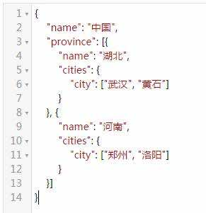
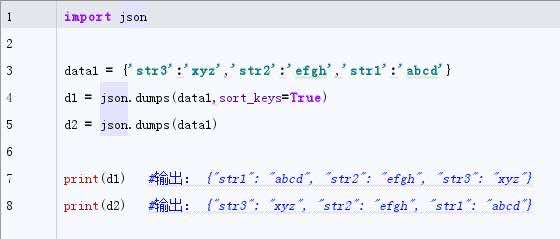
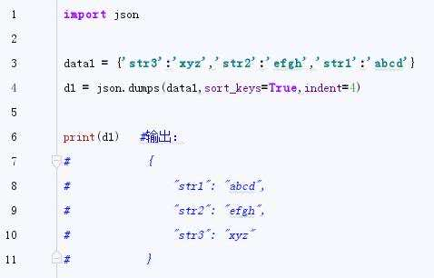
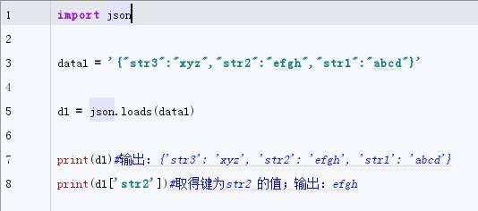
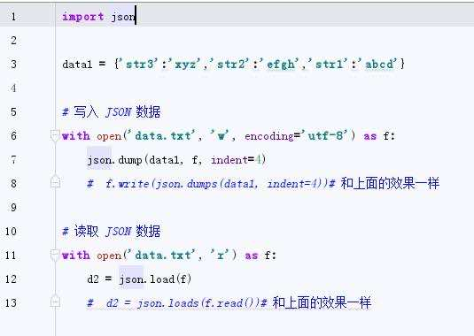

# Python 如何操作 Json？

&gt; Json（JavaScript Object Notation）它是一种轻量级的数据交换格式，具有数据格式简单，读写方便易懂等很多优点。许多主流的编程语言都在用它来进行前后端的数据传输，大大的简化了服务器和客户端的开发工作量。相对于 XML 来说，更加的轻量级，更方便解析，因此许多开发者都遵循 Json 格式来进行数据的传输和交换。今天我们详细介绍一下 Python 在 Json 的编解码方面的知识。

&lt;!--more--&gt;

## json 的数据格式

在 json 中，遵循“键值对”的这样一种方式，比如：“{&#34;name&#34;:&#34;tom&#34;}”, 就是一个 json 格式的数据，json 的格式归纳下来，一般有以下几点：

- 对象通过键值对表现；
- 键通过双引号包裹，后面跟冒号“:”，然后跟该键的值；
- 值可以是字符串、数字、数组等数据类型；
- 对象与对象之间用逗号隔开；
- “{}”用来表达对象；
- “[]”用来表达数组；

我们看一个略为复杂一点的例子：

上例则是一个典型的 json 格式的数据，强大的 Python 提供了一个“json”模块，可以方便的将各种零散的数据通过模块的内置函数编码形成一个 json 格式的数据，也可以将一个 json 格式的数据解码形成自己需要的数据，非常好用，下面我们就来介绍一下。

## json.dumps()

json 模块里的 dumps 函数是对数据进行编码，形成 json 格式的数据，我们看一下下面的例子：

通过输出的结果很容易看出，通过 dumps 方法使字典转换成为了 json 格式，虽然它们非常相似。其中，在 dumps 里的参数“sort_keys=True”，使得输出 json 后对 key 和 value 进行 0~9、a~ z 的顺序排序，如果不填，则按照无序排列。有时候，通过排序可以方便地比较 json 中的数据，因此，适当的排序是很有必要的。

此外，“Indent”参数表示缩进的意思，它可以使得输出的 Json 看起来更加整齐好看，可读性更强，例如：

下面列举一下 dumps（）的可填参数：

- skipkey：默认为 False，当 dict 对象里的数据不是 Python 的基本数据类型；（str,unicode,int,long,float,bool,None）时，当 skipkey 为 False，就会报错，如果 skipkey 为 True，则可以跳过这类 key；
- indent：如果填 0 或者不填，则按照一行进行打印，否则按照 indent 的数值显示前面的空格（正整数形式）；
- separators：分隔符，默认为“(&#39;,&#39;,&#39;:&#39;)”，它表示 key 之间用“,”隔开，key 和 value 之间用“:”隔开；
- encoding：编码格式，默认值是 UTF-8；
- sort_keys：对 key、value 进行排序，默认值是 False，即不排序；
- ensure_ascii：默认为 True，如果 dict 对象里含有 none-ASCII 的字符，则显示、uXX 的格式，如果为 False，则能正常显示出来；

## json.loads()

和 dumps 相反，loads 函数则是将 json 格式的数据解码，转换为 Python 字典，我们看一下下面的例子：

有时候，输出结果遇到中文的时候，会出现编码格式不一样的情况，显示出为 Unicode 的编码格式，使得不易读懂，解决办法是添加参数“encoding”参数，即上面的改写成这样：d1 = json.loads(data1,encoding=&#39;utf-8&#39;) 即可。

## json.dump() 和 json.load()

相对于上面所讲的 dumps 和 loads 来说，dump 和 load 函数的功能类似，只不过前者是用来处理字符串类型的，而后者是用于处理文件类型的，如下所示：

上例列举出了 json 的四个方法：dumps（）和 dump（）、loads（）和 load（）的简单使用方法，可见，Python 对于 json 的处理相当方便，不像 c&#43;&#43;那样（谁用谁知道）。

---

> 作者: [Lruihao](https://github.com/Lruihao)  
> URL: https://lruihao.cn/posts/jsoninfo/  
> 转载 URL: https://baijiahao.baidu.com/s?id=1608659655547720220&amp;wfr=spider&amp;for=pc
