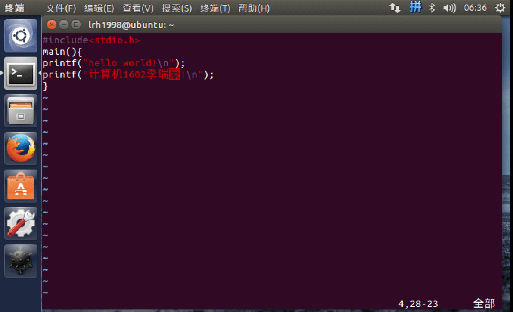

# linux 编程初体验


&gt; 在 Linux 上编译 c 语言文件。

### 打开 vim 编辑器

（没有就用 vi, 或者先安装 vim`sudo apt-get install vim`)

```bash
vim
```

### 编辑文件

打开文件编辑器之后编辑文件


首先按`Esc`再`:`进入末行命令  
再保存为 hello.c 文件后退出

```bash
: w hello.c
: q
```

打开目录看看生成的文件

```bash
ls
```

### 编译生成可执行文件并执行

```bash
gcc hello.c -o hello
./hello
```


若权限不够则加可执行权限`chmod &#43;x hello`


---

> 作者: [Lruihao](https://github.com/Lruihao)  
> URL: https://lruihao.cn/posts/linux-hello-c/  

