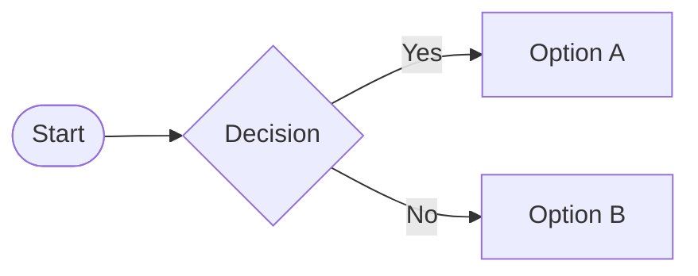

# 让 Mermaid 图表自动跟随系统深浅色


Mermaid 是目前最流行的「文本即图表」渲染库，但它对「系统深浅色自动切换」的支持一直暧昧不明。官方 Roadmap 里偶有提及，却始终没有一个简单、稳定、文档化的 API。  
不过社区里已有大量站点（mermaid.live、Obsidian、Notion-like 产品等）实现了丝滑的 Light/Dark 自适应。本文把目前能落地的三条路线一次性梳理出来，并给出最小可运行示例，方便你按需取用。

<!--more-->

## 背景：Mermaid 主题机制与痛点



Mermaid 在初始化时通过 `theme` 字段选定配色，例如：

```js
mermaid.initialize({ theme: 'dark' });
```

但这条配置 **只在首次渲染时生效**。当用户在操作系统层面切到 Light/Dark，或者网页本身提供手动开关时，Mermaid 并不会自动重绘。这就导致：

- 暗黑系统 + 浅色图表 ⇒ 刺眼  
- 浅色系统 + 暗黑图表 ⇒ 同样刺眼  

社区 Issue [#2644](https://github.com/mermaid-js/mermaid/issues/2644) 早在 2022 年就提出希望官方支持 `prefers-color-scheme`，但至今（2025-08）仍未合入主干。

顺便提一下，主题的切换一般都有两种主流方式：

1. 利用 `prefers-color-scheme` 感知系统级别主题变化，`matchMedia('(prefers-color-scheme: dark)')` 的 `change` 事件。
2. 通过 `dark` class 手动切换，这种方式通常会在 html/body 上设置一个 `class` 或者 `data-theme="dark"` 这样。

## 方案 1️⃣ Reinitialize

切换主题，重新 `initialize` + 重绘，这是目前来看大多数人的做法。

思路：

1. 备份原始的 Mermaid code
2. 设置 `startOnLoad: false` 避免 Mermaid 自动渲染，然后使用 `mermaid.initialize({ theme: theme })` + `mermaid.run()` 完成初始化。
3. 重新渲染时移除 `data-processed`，替换 `.mermaid` 的内容为原始 Mermaid code，使用 `mermaid.initialize({ theme: newTheme })` + `mermaid.run()` 重新渲染

这份做法在 Issue [#1945](https://github.com/mermaid-js/mermaid/issues/1945#issuecomment-1661264708) 里有完整代码，下面给出精简版：

优点是：

- 利用现有官方 API

缺点是：

- 每次切换都需要重新渲染，大图会闪一下
- 如果页面里图表很多，性能损耗不可忽视
- 还有异步处理带来的一系列问题

## 方案 2️⃣ CSS 滤镜

作为支持 `prefers-color-scheme` 和手动切换的一种简单的解决方案，可以使用 CSS 反转滤镜（`invert`、`hue-rotate` 等）来实现。

例如：

```css
[data-theme='dark'] .mermaid {
  filter: invert(0.88);
}

@media (prefers-color-scheme: dark) {
  :root:not([data-theme='light']) .mermaid {
    filter: invert(0.88);
  }
}
```

这条技巧是我在 Issue [#2644](https://github.com/mermaid-js/mermaid/issues/2644#issuecomment-2313201033) 中看到的。

优点是：

- 一行 CSS，无 JS
- 不重新渲染，零延迟

缺点是：

- 只是「反色」，并非官方暗黑主题
- 对于红色、绿色等语义色会完全失真
- 如果背景不是纯黑纯白，观感会很奇怪

由于太过简单，效果也很粗糙，适合做 Demo 或内部工具，不建议面向终端用户。

## 方案 3️⃣ 配置热替换

mermaid.live 站点能在用户切主题时瞬间完成切换，且颜色完全与官方暗黑主题对齐。从源码（未公开）和 DevTools 推测，它大概做了三件事：

1. 自己维护一份 `themeCSS` 字符串（而非仅用名字 `'dark'`）
2. 在 `prefers-color-scheme` 变化时，直接把新的 CSS 注入到 `<svg>` 里的 `<style>` 节点
3. 通过 `mermaid.render('id', code)` 拿到 SVG string 后，用正则替换掉旧 `<style>`，再 `DOMParser` 塞回页面

Issue [#2644](https://github.com/mermaid-js/mermaid/issues/2644#issuecomment-1029648289) 中有提到，在 mermaid.live 中，目前是根据配色方案在配置中切换主题。

优点：  

- 无闪烁
- 完全复用官方配色

缺点：  

- 需要内部维护主题 CSS，Mermaid 每升级一次都要同步
- 实现细节依赖私有 API，官方一旦改动就会崩

如果你极度追求体验，可以照着源码抄一份，但要做好长期维护的心理准备。

[#2644](https://github.com/mermaid-js/mermaid/issues/2644#issuecomment-1029648289) 中提到，在 mermaid.live 中，目前正在根据配色方案在配置中切换主题。这种方案暂时未找到更多的细节披露。我又懒得去深扒 mermaid.live 的实现细节。

## 方案 4️⃣ Reinitialize + CSS 结合

在我的实践中，[FixIt 主题](https://github.com/hugo-fixit/FixIt) 是通过 `data-theme` 的方式手动切换网站主题的，我一开始走的思路和方案 1️⃣总体一致，为了处理这个方案的缺点，我多次迭代，有了最终的版本：

首先通过 `type=module` 引入 Mermaid：

```js
import mermaid from 'https://cdn.jsdelivr.net/npm/mermaid/dist/mermaid.esm.min.js';
import zenuml from 'https://cdn.jsdelivr.net/npm/@mermaid-js/mermaid-zenuml/dist/mermaid-zenuml.esm.min.mjs';
await mermaid.registerExternalDiagrams([zenuml]);
mermaid.startOnLoad = false;
window.mermaid = mermaid;
```

然后在主题的切换逻辑中处理：

```js
initMermaid() {
  if (!this.config.mermaid) return;

  const themes = this.config.mermaid.themes ?? ['default', 'dark'];
  let processing = false;
  let delayTask = null;

  const loadMermaid = async () => {
    processing = true;
    // https://mermaid.js.org/config/schema-docs/config.html
    window.mermaid.initialize({
      startOnLoad: false,
      darkMode: this.isDark,
      theme: this.isDark ? themes[1] : themes[0],
      securityLevel: this.config.mermaid.securityLevel,
      look: this.config.mermaid.look,
      fontFamily: this.config.mermaid.fontFamily,
      altFontFamily: this.config.mermaid.fontFamily
    });
    await window.mermaid.run({
      querySelector: '.mermaid',
      suppressErrors: true,
    });
    processing = false;
    if (delayTask && typeof delayTask === 'function') {
      delayTask();
      delayTask = null;
      // console.log('Delayed task executed');
    }
  };

  const reloadMermaid = async () => {
    await this.util.forEach(document.querySelectorAll('.mermaid[data-processed]'), (el) => {
      el.removeAttribute('data-processed');
      el.parentElement.replaceChild(el.nextElementSibling.content.cloneNode(true), el);
    });
    await loadMermaid();
  };

  const waitForMermaid = () => {
    return new Promise((resolve) => {
      const timer = setInterval(() => {
        if (window.mermaid && window.mermaid.initialize) {
          clearInterval(timer);
          resolve();
        }
      }, 100);
    });
  };

  waitForMermaid().then(() => {
    loadMermaid();
    this.switchThemeEventSet.add(() => {
      if (processing) {
        console.warn('Mermaid is still processing, delaying the reload.');
        delayTask = reloadMermaid;
        return;
      }
      // console.log('reload immediately');
      reloadMermaid().catch(console.error);
    });

    this.beforeprintEventSet.add(() => {
      // Optionally set theme to 'neutral' for printing if required
    });
  })
}
```

为了缓解闪屏问题，利用 CSS 增加一个 Loading 效果，过度一下。

```scss {data-open=false}
.mermaid {
  position: relative;
  overflow: hidden !important;

  &[data-processed] {
    text-align: center;
  }

  &:not([data-processed])::before {
    content: '';
    position: absolute;
    top: 0;
    left: 0;
    width: 100%;
    height: 100%;
    backdrop-filter: blur(0.5rem);
    background-position: center;
    background-repeat: no-repeat;
    background-image: var(#{$rootPrefix}loading-img);
    background-size: 60px;
  }

  svg {
    max-width: 100%;
    height: auto; 
  }
}
```

说实话，虽然勉强达到了目的，这里的 `delayTask` 和 `waitForMermaid()` 算得上妥妥的 Dirty Hack。也属实是无奈之举。

---
{.awesome-hr}

睡觉前我灵光乍现，为了避免每次切换主题时都要重新渲染 Mermaid 图表，我尝试一开始直接把 Mermaid 的 Light 和 Dark 主题的两个图都渲染了，然后由 `data-theme` 控制显示哪个图表。

尝试后发现 Mermaid 在渲染图时，如果这个元素是 `display: none;` 则会报错。

于是，我改成初始化时只渲染 Light/Dark SVG，等到主题切换时才渲染 Dark/Light SVG，并隐藏另一个 SVG。

这样同一个图只需要渲染两次，后续多次主题切换，就能够通过 CSS 非常丝滑的控制切换了，[狠狠戳这里查看效果](https://lruihao.github.io/html-demo/mermaid.html)。

```html
<!DOCTYPE html>
<html lang="en">
<head>
  <meta charset="UTF-8">
  <meta name="viewport" content="width=device-width, initial-scale=1.0">
  <title>Mermaid Light/Dark Mode switching</title>
  <style>
    .diagrams-container {
      display: flex;
      justify-content: space-evenly;
    }
    .mermaid-container {
      .mermaid-dark {
        display: none;
      }

      [data-theme="dark"] & {
        .mermaid {
          display: none;
        }
        .mermaid-dark {
          display: block;
        }
      }
    }
  </style>
</head>
<body>
  <script>
    function toggleTheme() {
      const currentTheme = document.body.dataset.theme;
      const newTheme = currentTheme === 'dark' ? 'default' : 'dark';
      document.body.dataset.theme = newTheme;
    }
  </script>
  <button id="toggler">切换主题</button>
  <div class="diagrams-container">
    <div class="mermaid-container">
    <pre class="mermaid">graph TD;
    A[开始] --> B{是否完成？};
    B -- 是 --> C[结束];
    B -- 否 --> D[继续];
    D --> B;
    </pre>
    <pre class="mermaid-dark">graph TD;
    A[开始] --> B{是否完成？};
    B -- 是 --> C[结束];
    B -- 否 --> D[继续];
    D --> B;
    </pre>
    </div>
  </div>

  <script type="module">
    import mermaid from 'https://cdn.jsdelivr.net/npm/mermaid/dist/mermaid.esm.min.mjs';

    async function loadMermaid(theme) {
      const isDark = theme === 'dark';
      const querySelector = isDark ? '.mermaid-dark' : '.mermaid';
      mermaid.initialize({ startOnLoad: false, darkMode: isDark, theme });
      // Mermaid run 函数内部会跳过 data-processed 的元素，所以这样不会重复渲染
      await mermaid.run({ querySelector });
    }

    await loadMermaid('default')

    document.getElementById('toggler').addEventListener('click', () => {
      const currentTheme = document.body.dataset.theme || 'default';
      const newTheme = currentTheme === 'dark' ? 'default' : 'dark';
      document.body.dataset.theme = newTheme;
      loadMermaid(newTheme);
    });
  </script>
</body>
</html>
```

## 小结与选型建议

毋庸置疑，想要完美的体验，**方案 3️⃣** 是最优选择， **方案 4️⃣** 作为方案 1️⃣ 的升级版，整体体验也相对较好。

| 方案                | 实现成本 | 体验         | 是否官方可维护 |
| ------------------- | -------- | ------------ | -------------- |
| Reinitialize        | 低       | 中等（闪屏） | ✅             |
| CSS invert          | 极低     | 差           | ✅             |
| mermaid.live 热替换 | 高       | 极佳         | ❌             |
| Reinitialize + CSS  | 中       | 较好         | ✅             |

- **内部文档 / 博客 / 小工具** ⇒ 方案 4️⃣
- **赶时间的 MVP** ⇒ 方案 2️⃣
- **面向 C 端、对体验极端敏感** ⇒ 方案 3️⃣，但要准备长期跟进


---

> 作者: [Lruihao](https://github.com/Lruihao)  
> URL: https://lruihao.cn/posts/mermaid-theming/  

