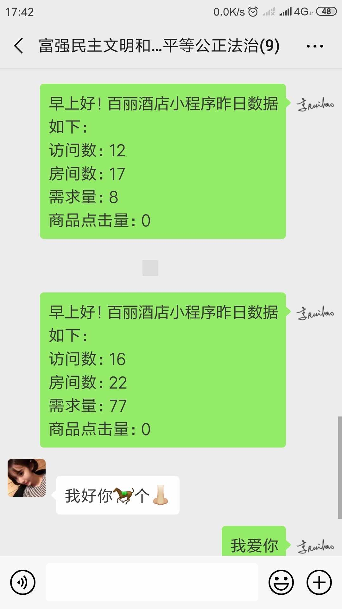
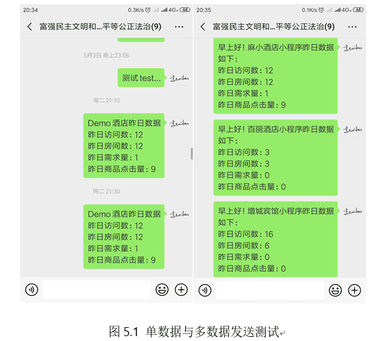
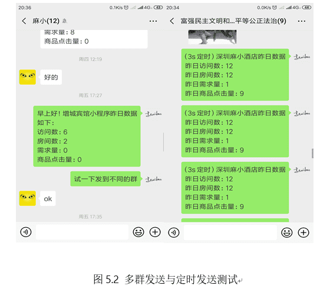

# python 实战：模拟 post 请求定时获取后台数据并打包发送至微信


&gt; 用 python 模拟 post 请求获取“麻小科技”示例酒店后台的数据，再打包发送至指定的微信群或者好友。  
&gt; 要求每天早上 8 点定时把每个酒店的数据发送至每个酒店的微信工作群。

&lt;!--more--&gt;

## 背景

&gt; 麻小科技：  
&gt; 麻小科技全名深圳市麻小科技有限公司，成立于 2017 年 1 月。是我高一的时候参加`Peer 夏令营`带我们一个玩的“老师”和他的朋友的创业公司，说老师有点奇怪，我们都是直接叫名字的，比如大家都叫我瑞豪，我也就叫他文捷哥，简称捷哥吧。他们公司主要的开发模式是，小程序前端&#43;php 后端，然后做的是酒店小程序，为每个酒店定制小程序。这些小程序可以贴在客房中给访客提供一些服务，大大节省了成本也提高了效率。  
&gt; 然后每个酒店小程序都有独立的后台，后台会记录一些点击需求的数据。现在他们有一个需求需要把每个酒店小程序后台的数据在每天早上 9 点发送至对应酒店的微信群。

## 实现代码

&gt; 缓存登录信息，短时间类无需重复登录，仅第一次需要扫码登录（相当于微信网页版），后面的登录只需在手机上确认登录信息。

```python
#!/usr/bin/python
import requests
import json
import time
from wxpy import *

## 基本信息填写：
## 酒店 id，酒店名称及群名列表数据，格式：[&#34;xxx&#34;,&#34;xxx&#34;,&#34;xxx&#34;]
## 使用时请将以下三个列表一一对应
hotel=[&#34;xxxx&#34;,&#34;xxxx&#34;] ## 酒店后台数据接口二级域名，已匿名
hotel_name=[&#34;增城宾馆&#34;,&#34;百丽酒店&#34;]
grouplist = [&#34;麻小&#34;,&#34;富强民主文明和谐自由平等公正法治&#34;]

## post 请求发送的数据
postData = {
    ## &#39;username&#39;:&#39;test&#39;,
    ## &#39;password&#39;:&#39;123456&#39;,
}

def get_data():
  result = [] #结果列表
  i = 0 #计数器
  for each in hotel:
    url=&#34;http://&#34;&#43;each&#43;&#34;.maxiaokeji.com/xxx/xxxxxxx/xxx&#34; ## 为保护隐私及权益，这里不提供接口
    r = requests.post(url,data=postData)
    ## print(r.text)

    ## 把结果转化为 json 字符串
    response=json.dumps(r.json(),indent=4,ensure_ascii=False) #sort_keys=True

    ## 把 json 转换为 dict 字典作为中间结果，再取出昨日数据
    midresult=json.loads(response)
    result.append(&#34;早上好！&#34;&#43;hotel_name[i]&#43;&#34;小程序昨日数据如下：\n 访问数：&#34;&#43;str(midresult[&#34;data&#34;][&#34;yesterday_data&#34;][&#34;type1&#34;])&#43;&#34;\n 房间数：&#34;&#43;str(midresult[&#34;data&#34;][&#34;yesterday_data&#34;][&#34;type2&#34;])&#43;&#34;\n 需求量：&#34;&#43;str(midresult[&#34;data&#34;][&#34;yesterday_data&#34;][&#34;type3&#34;])&#43;&#34;\n 商品点击量：&#34;&#43;str(midresult[&#34;data&#34;][&#34;yesterday_data&#34;][&#34;type4&#34;]))
    i&#43;=1
  ## print(result)
  return result

def wechat_send(bot,result):
  ## my_friend = bot.friends().search(&#39;lrh&#39;)[0]
  ## my_friend.send(result)
  i = 0 ## 计数器
  for group in grouplist:
    my_group = bot.groups().search(group)[0] #依次搜索每一个群名称，每次一个
    my_group.send(result[i])
    print(result[i])
    print(&#34;已发送至群：&#34;&#43;group)
    i&#43;=1

def main(bot):
  ## 设置最大休眠时间，防止程序长时间占用系统资源
  while True:
    now_hour = time.strftime(&#34;%H&#34;, time.localtime())
    now_min = time.strftime(&#34;%M&#34;, time.localtime())
    ## 设置每天 8 点发送
    if now_hour &lt; &#34;08&#34;:
      rest = 8 - int(now_hour)
      sleeptime = (rest-1)*3600 &#43; (60-int(now_min))*60
      print(&#34;启动时北京时间为：&#34;&#43;time.strftime(&#34;%H:%M&#34;, time.localtime()),&#34;\t 软件将在&#34;,rest-1,&#34;小时&#34;,int((sleeptime-(rest-1)*3600)/60),&#34;分钟后发送数据&#34;)
      time.sleep(sleeptime)
    elif now_hour &gt; &#34;08&#34;:
      rest = 8 - int(now_hour) &#43; 24
      sleeptime = (rest-1)*3600 &#43; (60-int(now_min))*60
      print(&#34;启动时北京时间为：&#34;&#43;time.strftime(&#34;%H:%M&#34;, time.localtime()),&#34;\t 软件将在&#34;,rest-1,&#34;小时&#34;,int((sleeptime-(rest-1)*3600)/60),&#34;分钟后发送数据&#34;)
      time.sleep(sleeptime)
    elif now_hour == &#34;08&#34;:
      print(&#34;软件明天开始将在每天 8 点发送数据！&#34;)
      result=get_data() ## 获取数据
      wechat_send(bot,result) ## 发送数据
      time.sleep(86400-int(now_min)*60)

if __name__==&#34;__main__&#34;:
  bot = Bot(cache_path=True) ## 初始化机器人，扫码登陆
  main(bot);
```

## 测试结果

  

## 程序打包

使用 pyinstaller 工具打包成可执行文件即可。（可执行文件不可跨平台运行，分平台打包）

&gt; 目前该程序已经上线测试中 ... 暂未反馈问题

## 收获

&gt; 第一次参与实际公司的项目开发，虽然只是一个小的需求设计，但是我在这个过程中也学到了很多，比如通过实际一两周的编程对 Python 的熟悉度远远好过以前在实验室看的一个月视频。  
&gt; 还有就是在此次开发中，也感受到了实际项目开发的团队合作重要性，刚开始拿到这个需求，由于我对 python 和后台，以及数据接口这些基本的操作都不懂，就拿数据获取来说，我一开始一位要自己模拟登陆后台（已知密码），一顿操作、百度等等失败告终，后来涛哥给了一个数据接口，加上涛哥耐心指点，我才终于拿到了数据。  
&gt; 还有在多人合作的项目中，为保持代码的可读性，要尽量的多些注释，还有函数方法的命名尽量具备可读性。比如我代码中的`wechat_send()`，一开始的命名是`wxfs()`，经捷哥指正我才改过来的。


---

> 作者: [Lruihao](https://github.com/Lruihao)  
> URL: https://lruihao.cn/posts/mx2wx/  

