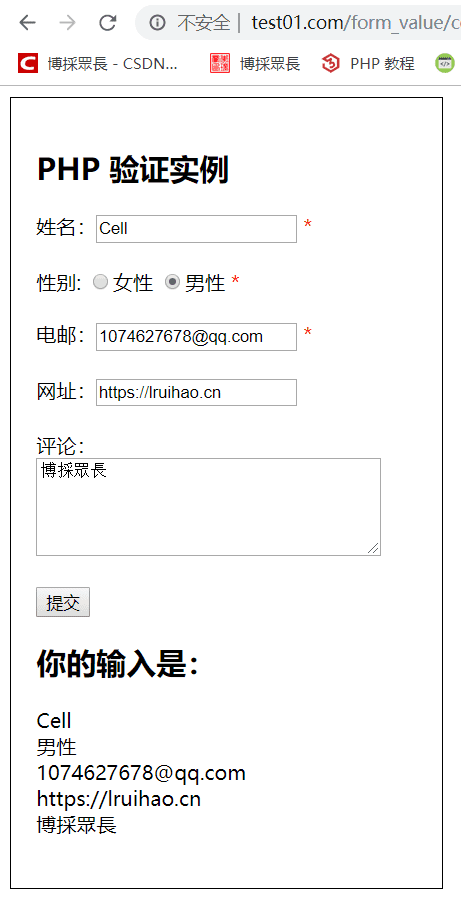

# 简单评论模块--php 表单练习


&gt; 简单模仿了一个评论模板，当然肯定是没有博客的 valine 这么强大的 hhhh，  
&gt; **PHP 表单安全性的重要提示**  
&gt; `$_SERVER[&#34;PHP_SELF&#34;]`变量能够被黑客利用！  
&gt; 如果页面中使用了`PHP_SELF`，用户能够输入下划线然后执行跨站点脚本（XSS）。  
&gt; 比如说注入 js 脚本等，valine 以前的版本也有过这样的漏洞。
&gt;
&gt; `跨站点脚本（Cross-site scripting，XSS）`是一种计算机安全漏洞类型，常见于 Web 应用程序。XSS 能够使攻击者向其他用户浏览的网页中输入客户端脚本。

&lt;!--more--&gt;

可以像 valine 一样在用户输入完后保留输入，还有一些正则控制输入提示等简单功能。UI 就丑爆了算了。

```xml 完整表单
&lt;!DOCTYPE HTML&gt;
&lt;html&gt;
&lt;head&gt;
&lt;style&gt;
.error {color: #FF0000;}
.main{
   width: 20%;
   height: 100%;
   border: 1px #000 solid;
   padding: 20px;
}
&lt;/style&gt;
&lt;/head&gt;
&lt;body&gt;

&lt;?php
// 定义变量并设置为空值
$nameErr = $emailErr = $genderErr = $websiteErr = &#34;&#34;;
$name = $email = $gender = $comment = $website = &#34;&#34;;

if ($_SERVER[&#34;REQUEST_METHOD&#34;] == &#34;POST&#34;) {
  if (empty($_POST[&#34;name&#34;])) {
    $nameErr = &#34;Name is required&#34;;
  } else {
    $name = test_input($_POST[&#34;name&#34;]);
    // 检查名字是否包含字母和空格
    if (!preg_match(&#34;/^[a-zA-Z ]*$/&#34;,$name)) {
      $nameErr = &#34;Only letters and white space allowed&#34;;
    }
  }

  if (empty($_POST[&#34;email&#34;])) {
    $emailErr = &#34;Email is required&#34;;
  } else {
    $email = test_input($_POST[&#34;email&#34;]);
    // 检查电邮地址语法是否有效
    if (!preg_match(&#34;/([\w\-]&#43;\@[\w\-]&#43;\.[\w\-]&#43;)/&#34;,$email)) {
      $emailErr = &#34;Invalid email format&#34;;
    }
  }

  if (empty($_POST[&#34;website&#34;])) {
    $website = &#34;&#34;;
  } else {
    $website = test_input($_POST[&#34;website&#34;]);
    // 检查 URL 地址语言是否有效（此正则表达式同样允许 URL 中的下划线）
    if (!preg_match(&#34;/\b(?:(?:https?|ftp):\/\/|www\.)[-a-z0-9&#43;&amp;@#\/%?=~_|!:,.;]*[-a-z0-9&#43;&amp;@#\/%
    =~_|]/i&#34;,$website)) {
      $websiteErr = &#34;Invalid URL&#34;;
    }
  }

  if (empty($_POST[&#34;comment&#34;])) {
    $comment = &#34;&#34;;
  } else {
    $comment = test_input($_POST[&#34;comment&#34;]);
  }

  if (empty($_POST[&#34;gender&#34;])) {
    $genderErr = &#34;Gender is required&#34;;
  } else {
    $gender = test_input($_POST[&#34;gender&#34;]);
  }

}

function test_input($data) {
   $data = trim($data);
   $data = stripslashes($data);
   $data = htmlspecialchars($data);
   return $data;
}
?&gt;
&lt;div class=&#34;main&#34;&gt;
   &lt;h2&gt;PHP 验证实例&lt;/h2&gt;
   &lt;form method=&#34;post&#34; action=&#34;&lt;?php echo htmlspecialchars($_SERVER[&#39;PHP_SELF&#39;]);?&gt;&#34;&gt;
      姓名：&lt;input type=&#34;text&#34; name=&#34;name&#34; value=&#34;&lt;?php echo $name;?&gt;&#34;&gt;
      &lt;span class=&#34;error&#34;&gt;* &lt;?php echo $nameErr;?&gt;&lt;/span&gt;
      &lt;br&gt;&lt;br&gt;
      性别：
      &lt;input type=&#34;radio&#34; name=&#34;gender&#34; &lt;?php if (isset($gender) &amp;&amp; $gender==&#34;女性&#34;) echo &#34;checked&#34;;?&gt; value=&#34;女性&#34;&gt;女性
      &lt;input type=&#34;radio&#34; name=&#34;gender&#34; &lt;?php if (isset($gender) &amp;&amp; $gender==&#34;男性&#34;) echo &#34;checked&#34;;?&gt; value=&#34;男性&#34;&gt;男性
      &lt;span class=&#34;error&#34;&gt;* &lt;?php echo $genderErr;?&gt;&lt;/span&gt;
      &lt;br&gt;&lt;br&gt;
      电邮：&lt;input type=&#34;text&#34; name=&#34;email&#34; value=&#34;&lt;?php echo $email;?&gt;&#34;&gt;
      &lt;span class=&#34;error&#34;&gt;* &lt;?php echo $emailErr;?&gt;&lt;/span&gt;
      &lt;br&gt;&lt;br&gt;
      网址：&lt;input type=&#34;text&#34; name=&#34;website&#34; value=&#34;&lt;?php echo $website;?&gt;&#34;&gt;
      &lt;span class=&#34;error&#34;&gt;&lt;?php echo $websiteErr;?&gt;&lt;/span&gt;
      &lt;br&gt;&lt;br&gt;
      评论：&lt;textarea name=&#34;comment&#34; rows=&#34;5&#34; cols=&#34;40&#34;&gt;&lt;?php echo $comment;?&gt;&lt;/textarea&gt;
      &lt;br&gt;&lt;br&gt;
      &lt;input type=&#34;submit&#34; name=&#34;submit&#34; value=&#34;提交&#34;&gt;
      &lt;h2&gt;你的输入是：&lt;/h2&gt;
      &lt;?php
         echo $name.&#34;&lt;br/&gt;&#34;;
         echo $gender.&#34;&lt;br/&gt;&#34;;
         echo $email.&#34;&lt;br/&gt;&#34;;
         echo $website.&#34;&lt;br/&gt;&#34;;
         echo $comment.&#34;&lt;br/&gt;&#34;;
      ?&gt;
      &lt;br/&gt;
   &lt;/form&gt;
&lt;/div&gt;
&lt;/body&gt;
&lt;/html&gt;
```




---

> 作者: [Lruihao](https://github.com/Lruihao)  
> URL: https://lruihao.cn/posts/phpform/  

