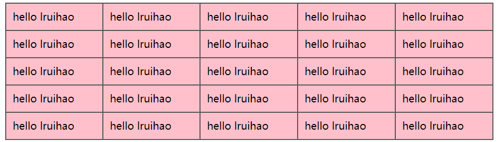

# php 函数学习


> 练习 php 函数的基本使用。  
> 注：  
> 必选参数在可选参数的前面。  
> 可在函数中定义函数，需要先调用外层函数才能调用内层函数。

<!--more-->

```php php 函数动态创建表格
<?php
/*
创建表格
*/
function createTable($rows,$cols,$bgcolor='pink',$content='x'){
  $table = "<table border='1' bgcolor='{$bgcolor}' cellpadding='10' cellspacing='0' width='50%' >";
  for($i=1;$i<=$rows;$i++){
    $table.="<tr>";
    for($j=1;$j<=$cols;$j++){
      $table.="<td>{$content}</td>";
    }
    $table .="</tr>";
  }
  $table.="</table>";
  return $table;
}
echo createTable(5,5,'pink','hello lruihao');
?>
```




---

> 作者: [Lruihao](https://github.com/Lruihao)  
> URL: https://lruihao.cn/posts/phpfunc/  

