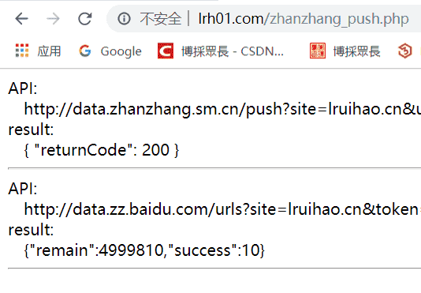

# php 同时主动推送链接到百度，神马等站长平台


> php 主动推送站点链接到百度站长，神马站长进行 SEO。

<!--more-->

## 代码

把需要提交的链接和各站长 api 分别放在两个 txt 文件里面，然后运行 php 文件进行提交，不同站长提交成功一般返回的都是 `200` 状态码。

```php
<?php

  //链接存放路径和站长 api 文件存放路径
  $urls_path = "H:\\lruihao.cn\\public\\baidu_urls.txt";
  $apis_path = "G:\\Demo\\lrh01\\zhanzhang_api.txt";
  //将文件每一行读到一个数组里面去
  $urls = file($urls_path, FILE_IGNORE_NEW_LINES | FILE_SKIP_EMPTY_LINES);
  $apis = file($apis_path, FILE_IGNORE_NEW_LINES | FILE_SKIP_EMPTY_LINES);

  for($x=0;$x<count($apis);$x++){
    $ch = curl_init();
    $options =  array(
      CURLOPT_URL => $apis[$x],
      CURLOPT_POST => true,
      CURLOPT_RETURNTRANSFER => true,
      CURLOPT_POSTFIELDS => implode("\n", $urls),
      CURLOPT_HTTPHEADER => array('Content-Type: text/plain'),
    );
    curl_setopt_array($ch, $options);
    $result = curl_exec($ch);
    echo "API: <br/>&emsp;".$apis[$x]."<br/>";
    echo "result: <br/>&emsp;".$result."<hr/>";
  }

?>
```

## 提交结果




---

> 作者: [Lruihao](https://github.com/Lruihao)  
> URL: https://lruihao.cn/posts/phppushurl/  

