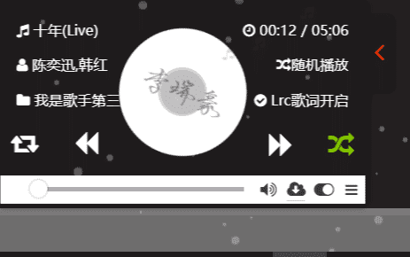
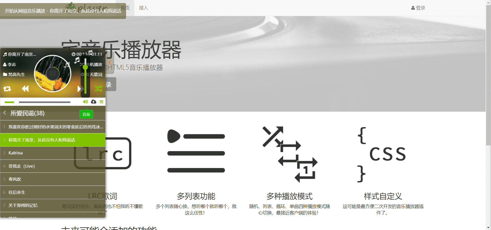
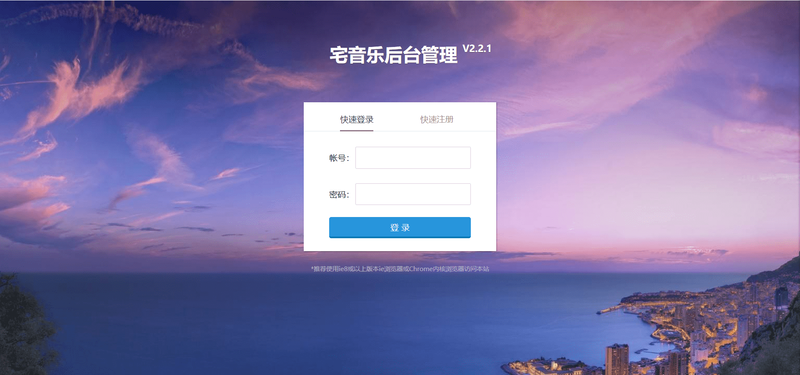
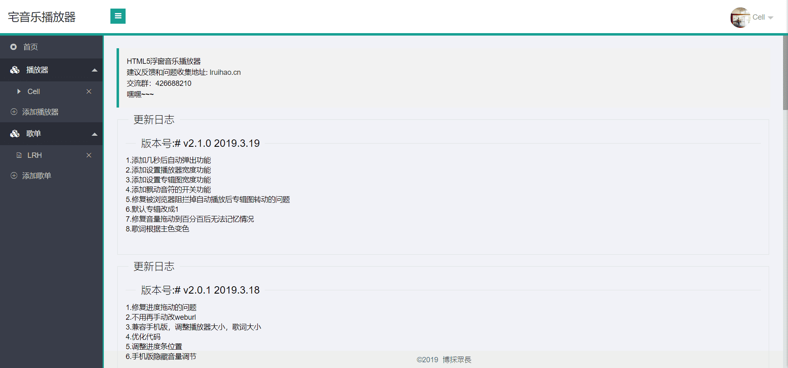
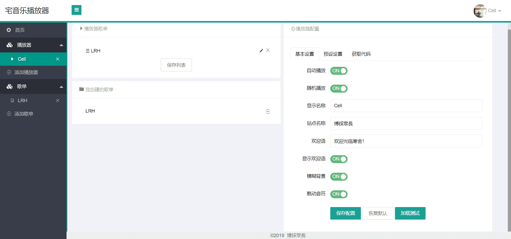
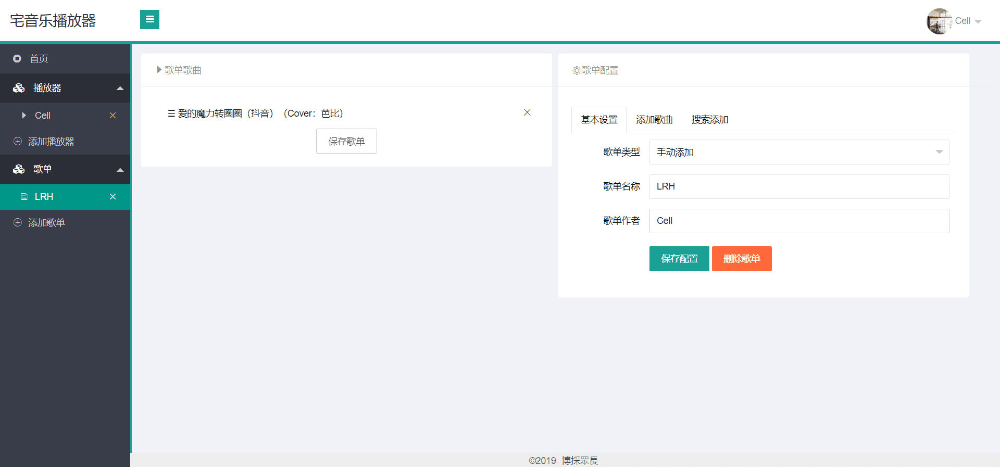

# 宅音乐播放器


&gt; 宅音乐播放器，HTML5 网页播放器，集成后台管理及 API 调用，目前正在开发中，敬请关注~  
&gt; [原项目](https://github.com/lzx8589561/zhai-music) 由 [IT 技术宅](https://www.ilt.me) 开源，使用 thinkPHP 开发后台。 [fork 地址](https://github.com/Lruihao/zhai-music) 是我个人学习模仿的库，也是相当于备份源码。  
&gt; _注：插件修改于明月浩空免费版，仅用于学习交流，无商业价值，如发现商业传播，将禁止软件的免费使用。_

&lt;!--more--&gt;

## 技术栈

- 后端：thinkphp 5.1
- 前端：layui
- 数据库：mysql

## 演示站

&gt; 已兼容移动端，测试账号仅供测试请勿修改密码！

```text 测试账号
test
test123
```

- &lt;https://player.ilt.me/&gt;
- &lt;https://player.lruihao.cn/&gt;

## 安装

### 视频安装教程

&lt;https://www.bilibili.com/video/av46476706&gt;

### 依赖

- composer
- php 5.6&#43;
- mysql 5.5&#43;

### 步骤

安装 php 依赖包

```
composer install
```

配置数据库，配置链接数据库名以及用户名密码

```
/config/database.php
```

创建数据库

```
字符编码：utf8 -- UTF-8 Unicode
导入数据库脚本，脚本位置 extend/database
```

### 伪静态配置

#### nginx

```
  location / {
      index  index.htm index.html index.php;
      #访问路径的文件不存在则重写 URL 转交给 ThinkPHP 处理
      if (!-e $request_filename) {
         rewrite  ^/(.*)$  /index.php?s=$1  last;
         break;
      }
  }
```

#### apache

项目自带 apache 静态化无需配置

### 启动项目

- 添加 public 为 web 根目录
- 若为 apache 服务器则默认伪静态，nginx 可自行配置伪静态

## 预览



### 首页



### 登陆页面



### 后台首页



### 后台播放器管理页面



### 后台歌单管理页面




---

> 作者: [Lruihao](https://github.com/Lruihao)  
> URL: https://lruihao.cn/posts/player/  

