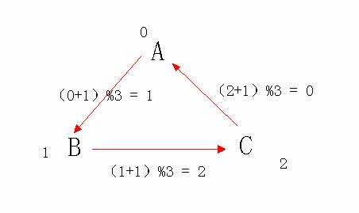
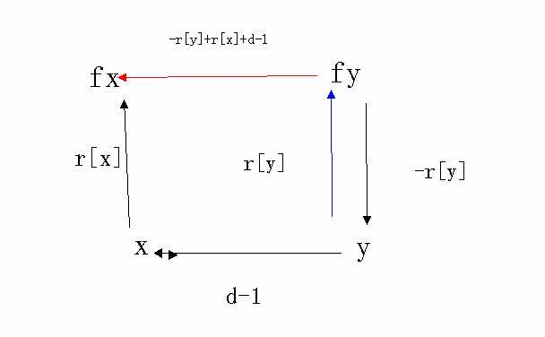

# 食物链-Poj1182（带权并查集经典模板）


[题目链接](http://poj.org/problem?id=1182)  
[思路参考 1](https://blog.csdn.net/freezhanacmore/article/details/8767413),[思路参考 2](https://blog.csdn.net/niushuai666/article/details/6981689)（没看懂）

&lt;!--more--&gt;

~~先占坑，有时间再理理思路。~~

&gt; 同一棵树中
&gt;
&gt; &gt; d=1, 即 x 和 y 是同类，则需满足 r[x]==r[y]  
&gt; &gt; d=2,x 应该吃了 y, 也就是 (r[x]&#43;1)%3 == r[y] 
&gt;
&gt; 不同树合并且更新关系 (**x 树做主根**)  
&gt; &#39; **如果 x 和 y 为关系 r1, y 和 z 为关系 r2，那么 x 和 z 的关系就是（r1&#43;r2）%3**
&gt;
&gt; &gt; 如果 d==1 则 x 和 y 是同类，那么 y 对 x 的关系是 0, 如果 d==2 , 则 x 吃了 y, 那么 y 对 x 的关系是 1, x 对 y 的关系是 2。综上所述 , 无论 d 为 1 或者是为 2, y 对 x 的关系都是 d-1。  
&gt; &gt; fy 对 y 的关系为 3-r[y] （有点互补的感觉，注意这里是不同类喔）  
&gt; &gt; y 对 x 的关系为 d-1,  
&gt; &gt; x 对 fx 的关系为 r[x]  
&gt; &gt; 所以 fy 对 fx 的关系是（3-r[y] &#43; d-1 &#43; r[x]）%3。可以借助向量图理解 fy-&gt;y-&gt;x-&gt;fx 

```c
#include&lt;cstdio&gt;

const int maxn = 50000&#43;10;

int p[maxn]; //存父节点
int r[maxn];//存与父节点的关系 0 同一类，1 被父节点吃，2 吃父节点

void set(int n) //初始化
{
    for(int x = 1; x &lt;= n; x&#43;&#43;)
    {
        p[x] = x; //开始自己是自己的父亲节点
        r[x] = 0;//开始自己就是自己的父亲，每一个点均独立
    }
}

int find(int x) //找父亲节点
{
    if(x == p[x]) return x;

    int t = p[x];
    p[x] = find(p[x]);
    r[x] = (r[x]&#43;r[t])%3; //回溯由子节点与父节点的关系和父节点与根节点的关系找子节点与根节点的关系
    return p[x];
}

void Union(int x, int y, int d)
{
    int fx = find(x);
    int fy = find(y);

    p[fy] = fx; //合并树 注意：被 x 吃，所以以 x 的根为父
    r[fy] = (r[x]-r[y]&#43;3&#43;(d-1))%3; //对应更新与父节点的关系
}

int main()
{
    int n, m;
    scanf(&#34;%d%d&#34;, &amp;n, &amp;m);
    set(n);

    int ans = 0;
    int d, x, y;
    while(m--)
    {
        scanf(&#34;%d%d%d&#34;, &amp;d, &amp;x, &amp;y);

        if(x &gt; n || y &gt; n || (d == 2 &amp;&amp; x == y)) ans&#43;&#43;; //如果节点编号大于最大编号，或者自己吃自己，说谎

        else if(find(x) == find(y)) //如果原来有关系，也就是在同一棵树中，那么直接判断是否说谎
        {
            if(d == 1 &amp;&amp; r[x] != r[y]) ans&#43;&#43;; //如果 x 和 y 不属于同一类
            if(d == 2 &amp;&amp; (r[x]&#43;1)%3 != r[y]) ans&#43;&#43;; // 如果 x 没有吃 y（注意要对应 Uinon(x, y) 的情况，否则一路 WA 到死啊！！！)
        }
        else Union(x, y, d); //如果开始没有关系，则建立关系
    }
    printf(&#34;%d\n&#34;, ans);
    return 0;
}

```


---

> 作者: [Lruihao](https://github.com/Lruihao)  
> URL: https://lruihao.cn/posts/poj1182/  

