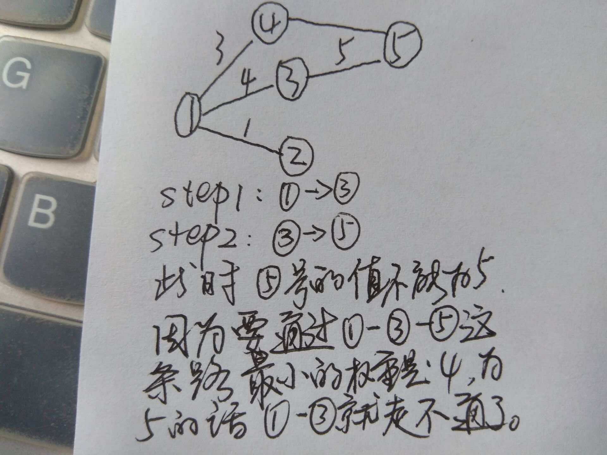

# Heavy Transportation-poj1797(dijkstra 或最大生成树）


[题目链接](http://poj.org/problem?id=1797)

大意：  
要从城市 1 到城市 N 运送货物，有 M 条道路，每条道路都有它的最大载重量，问从城市 1 到城市 N 运送最多的重量是多少。  
其实题意很简单，就是找一条 1--&gt;N 的路径，在不超过每条路径的最大载重量的情况下，使得运送的货物最多。一条路径上的最大载重量为这个路径上权值最小的边；


&lt;!--more--&gt;

```cpp
//dijkstra
#include&lt;iostream&gt;
#include&lt;cstdio&gt;
#define min(a,b) (a&lt;b?a:b)
using namespace std;

int n,m,v[1010],maps[1010][1010],d[1010];//此时 d 表示 1 到每一个点的能通过的最大的重量

int dijkstra(){
    int i,j,k;
    for(i=1;i&lt;=n;i&#43;&#43;){
        v[i]=0;
        d[i]=maps[1][i];//这个时候 d 不代表最短路径，而是从 1 到 n 的最大承载量
    }
    for(i=1;i&lt;=n;i&#43;&#43;){//n 个点
        int f=-1;
        for(j=1;j&lt;=n;j&#43;&#43;)
            if(!v[j]&amp;&amp;d[j]&gt;f){
                f=d[j];
                k=j;
            }
        v[k]=1;
        for(j=1;j&lt;=n;j&#43;&#43;)
            if(!v[j]&amp;&amp;d[j]&lt;min(d[k],maps[k][j]))//更新说明见图解
                d[j]=min(d[k],maps[k][j]);
    }
    return d[n];
}

int main(){
    int ans=1;
    int a,b,w;
    int T;
    scanf(&#34;%d&#34;,&amp;T);
    while(T--){
        for(int i=0;i&lt;=n;i&#43;&#43;)
            for(int j=0;j&lt;=n;j&#43;&#43;)
                maps[i][j]=0;
        scanf(&#34;%d%d&#34;,&amp;n,&amp;m);
        for(int i=1;i&lt;=m;i&#43;&#43;) {
            scanf(&#34;%d%d%d&#34;,&amp;a,&amp;b,&amp;w);
            maps[a][b]=maps[b][a]=w;
        }
        printf(&#34;Scenario #%d:\n%d\n\n&#34;,ans&#43;&#43;,dijkstra());

    }
    return 0;
}
```


---

> 作者: [Lruihao](https://github.com/Lruihao)  
> URL: https://lruihao.cn/posts/poj1797/  

