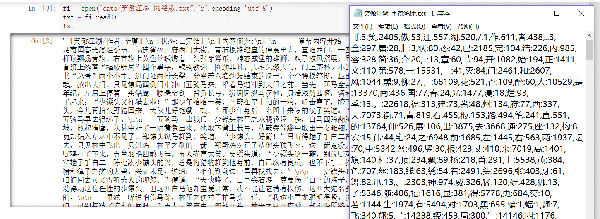
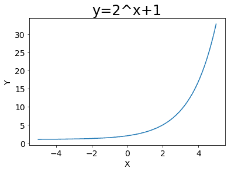
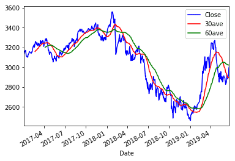
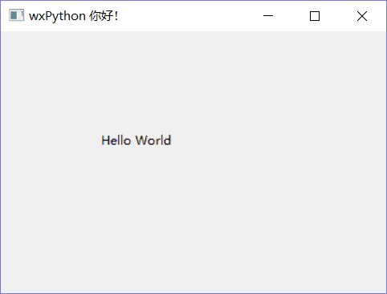

# python 实训总结Ⅱ


&gt; 后面几天讲的有点杂，简单记录一下知识点。

&lt;!--more--&gt;

## 6.19

&gt; 这些知识点在课上都只是简单的提到了一下。  
&gt; 比如一些库的使用与安装都不会再课上详细讲解，需要课后再去研究。

### [切片操作](https://www.jianshu.com/p/15715d6f4dad)

列表切片操作

### 字符串

#### python 原始字符串

```pythonthon
print(r&#34;D:\three\two&#34;)
```

#### 长字符串

用三个单引号或者双引号包裹，前后呼应，成双成对。

#### 用、换行字符表示字符未结束

### 格式化输出 format

`&#34;=={}==&#34;`，`{}`表示占位符，其前后字符保持原样输出。

```python TempConvert.py
#TempConvert.py
TempStr = input(&#34;请输入带有符号的温度值：&#34;)
if TempStr[-1] in [&#39;F&#39;,&#39;f&#39;]:
    C = (eval(TempStr[0:-1]) - 32)/1.8
    print(&#34;转换后的温度是{:.2f}C&#34;.format(C))
elif TempStr[-1] in [&#39;C&#39;,&#39;c&#39;]:
    F = 1.8*eval(TempStr[0:-1]) &#43; 32
    print(&#34;转换后的温度是{:.2f}F&#34;.format(F))
else:
    print(&#34;输入格式错误&#34;)
```

### 多变量赋值与交换（斐波那契数列）

python 3.x 版本 `end=&#34;&#34;` 可使输出不换行

```python
print(x, end=&#34;&#34;)
```

```python 斐波那契数列
#斐波那契数列
a, b = 1,1
while a &lt; 500: ## 输出不大于 500 的序列
    print(a,end=&#34;,&#34;)
    a,b = b,a &#43; b #交换变量
```

### 笑傲江湖统计字符 (dict, 文件流）

&gt; 统计《笑傲江湖》小说中出现的所有中文字符及标点符号的数量，每个字符及数目间用冒号`:`隔开，例如&#34;笑：1024&#34;，将所有字符及数量的对应采用逗号分隔，以 CSV 文件格式保存到`“笑傲江湖--字符统计。txt”`文件中。注意，统计字符不包括空格和回车。

&gt; csv 文件格式： ‘,’逗号连接元素

```python
fi = open(&#34;data/笑傲江湖 - 网络版。txt&#34;,&#34;r&#34;,encoding=&#34;utf-8&#34;)
fo = open(&#34;data/笑傲江湖 - 字符统计。txt&#34;,&#34;w&#34;,encoding=&#34;utf-8&#34;)

txt = fi.read() #打开文件
#txt
d = {}

for c in txt:
    d[c] = d.get(c,0)&#43;1

del d[&#39; &#39;] #删除字典中的空格和回车的键值对
del d[&#39;\n&#39;]

ls = []

for key in d:
    ls.append(&#34;{}:{}&#34;.format(key,d[key]))

fo.write(&#34;,&#34;.join(ls))
fi.close()
fo.close()
```



### numpy 模块

**...**

### pandas 模块

**...**

## 6.20

### matplotlib 绘图

```python 指数函数
import matplotlib.pyplot as plt
import numpy as np
x = np.arange(-5,5,0.01)
y = 2**x&#43;1
plt.plot(x,y)
plt.title(&#34;y=2^x&#43;1&#34;,fontsize=24)
plt.xlabel(&#34;X&#34;,fontsize=14)
plt.ylabel(&#34;Y&#34;,fontsize=14)
plt.tick_params(axis=&#34;both&#34;,labelsize=14)
plt.show()
```



### 爬虫

举了一个金融界，炒股，获取数据的爬虫
（今天没仔细听课，这数据爬过什么意思，咱不懂，咱也不敢问！）

```python stock15
#! /usr/bin/env python
#-*- encoding: utf-8 -*-
#author pythontab.com
import numpy as np
import matplotlib.pyplot as plt
import pandas as pd
import pandas_datareader.data as web
import datetime
#import tushare as ts

df_stockload = web.DataReader(&#34;000001.SS&#34;, &#34;yahoo&#34;, datetime.datetime(2017,1,1), datetime.date.today())
#print(type(datetime.datetime.now().strftime(&#39;%Y-%m-%d&#39;)))
#df_stockload = ts.get_hist_data(&#39;sh&#39;,start=&#39;2017-01-01&#39;,end=datetime.datetime.now().strftime(&#39;%Y-%m-%d&#39;))
print (df_stockload.columns)#查看列名
print (df_stockload.index)#查看索引
print (df_stockload.describe())#查看各列数据描述性统计

#绘制移动平均线
df_stockload.Close.plot(c=&#39;b&#39;)
df_stockload.Close.rolling(window=30).mean().plot(c=&#39;r&#39;) #pd.rolling_mean(df_stockload.Close,window=30).plot(c=&#39;r&#39;)
df_stockload.Close.rolling(window=60).mean().plot(c=&#39;g&#39;) #pd.rolling_mean(df_stockload.Close,window=60).plot(c=&#39;g&#39;)
plt.legend([&#39;Close&#39;,&#39;30ave&#39;,&#39;60ave&#39;],loc=&#39;best&#39;)
plt.show()
```

```python 结果
Index([&#39;High&#39;, &#39;Low&#39;, &#39;Open&#39;, &#39;Close&#39;, &#39;Volume&#39;, &#39;Adj Close&#39;], dtype=&#39;object&#39;)
DatetimeIndex([&#39;2017-01-03&#39;, &#39;2017-01-04&#39;, &#39;2017-01-05&#39;, &#39;2017-01-06&#39;,
               &#39;2017-01-09&#39;, &#39;2017-01-10&#39;, &#39;2017-01-11&#39;, &#39;2017-01-12&#39;,
               &#39;2017-01-13&#39;, &#39;2017-01-16&#39;,
               ...
               &#39;2019-06-05&#39;, &#39;2019-06-06&#39;, &#39;2019-06-10&#39;, &#39;2019-06-11&#39;,
               &#39;2019-06-12&#39;, &#39;2019-06-13&#39;, &#39;2019-06-14&#39;, &#39;2019-06-19&#39;,
               &#39;2019-06-20&#39;, &#39;2019-06-21&#39;],
              dtype=&#39;datetime64[ns]&#39;, name=&#39;Date&#39;, length=596, freq=None)
              High          Low         Open        Close        Volume  \
count   596.000000   596.000000   596.000000   596.000000  5.960000e&#43;02
mean   3076.147753  3039.201569  3056.960338  3060.169056  5.098201e&#43;06
std     269.276147   273.757358   271.612122   272.072346  1.199107e&#43;08
min    2488.479004  2440.906982  2446.019043  2464.363037  8.820000e&#43;04
25%    2845.308228  2800.168762  2825.239502  2827.754822  1.375250e&#43;05
50%    3153.184937  3118.613525  3134.300537  3139.085449  1.666500e&#43;05
75%    3280.115234  3244.825256  3265.322021  3268.600342  2.091250e&#43;05
max    3587.031982  3534.195068  3563.639893  3559.465088  2.927580e&#43;09

         Adj Close
count   596.000000
mean   3060.169056
std     272.072346
min    2464.363037
25%    2827.754822
50%    3139.085449
75%    3268.600342
max    3559.465088
```



## 6.21

### 类

比第一天稍微仔细一点讲了一下类，有点需要注意：

- `self`相当于`this`表示当前对象
- python 类的所有函数的第一个参数都要写`self`参数，self 也可以是其他的比如`lrh`等字符替代，但是必须保持一致。
- `__`表示私有的
- class 的定义可以不加 (),() 内可写继承的父类

### GUI 设计 [wxPython](https://blog.csdn.net/mist99/article/details/80742548)

```bosh 安装
pip install wxPython
```

```python 导入
import wx
```

```python 基本架构
import wx #导入 wxPython 库

class Panel(wx.Panel):

    def __init__(self,parent):

        wx.Panel.__init__(self,parent=parent, id=-1)

        pass

class Frame(wx.Frame):

    def __init__(self):

        wx.Frame.__init__(self, parent = None, title = u&#39;量化软件&#39;, size=(1000,600), style=wx.DEFAULT_FRAME_STYLE^wx.MAXIMIZE_BOX)

        self.DispPanel= Panel(self)

        pass

class App(wx.App):

    def OnInit(self):

        self.frame = Frame()

        self.frame.Show()

        self.SetTopWindow(self.frame)

        return True

if __name__ == &#39;__main__&#39;:

    app = App()

    app.MainLoop()
```

```python helloworld
import wx

app = wx.App()
window = wx.Frame(None, title=&#34;wxPython 你好！&#34;, size=(400, 300))
panel = wx.Panel(window)
label = wx.StaticText(panel, label=&#34;Hello World&#34;, pos=(100, 100))
window.Show(True)
app.MainLoop()
```



### talib 库的安装

[下载 whl 文件](https://www.lfd.uci.edu/~gohlke/pythonlibs/#ta-lib)

```
pip install TA_Lib-0.4.17-cp37-cp37m-win_amd64.whl
pip install TA-Lib
```

### 选择排序递归版

```python
def SelectSort(L):
    L=L[:]
    if len(L)&lt;=1:
        return L
    min = 0
    for i in range(1,len(L)):
        if L[i]&lt;L[min]:
            min = i
    L[min],L[0] = L[0],L[min]
    return [L[0]]&#43;SelectSort(L[1:])

L = [5,2,3,6,1,9,8,10,0]
print(SelectSort(L))
```

```python 结果
[0, 1, 2, 3, 5, 6, 8, 9, 10]
```

### 机房上机系统（自我实践）

```python 简单机房上机系统源码
import time

class student():
    def __init__(self,stu_no=&#34;&#34;,stu_name=&#34;&#34;,stu_xi=&#34;&#34;,stu_time=&#34;&#34;):
        self.stu_no = stu_no
        self.stu_name = stu_name
        self.stu_xi = stu_xi
        self.stu_time = stu_time

    def print(self):
        print(&#34;学号：&#34;&#43;self.stu_no&#43;&#34;\t 姓名：&#34;&#43;self.stu_name&#43;&#34;\t 系别：&#34;&#43;self.stu_xi&#43;&#34;\t 机时 (h)：&#34;&#43;self.stu_time)

    def get_stu_name(self):
        return self.stu_name

    def get_stu_time(self):
        return int(self.stu_time)

    def set_stu_time(self,add_time):
        self.stu_time = add_time

def menu():
    print(&#34;\t 机房上机系统 V0.1&#34;)
    print(&#34;********************************&#34;)
    print(&#34;\t—&gt;1. 录入学生信息&#34;)
    print(&#34;\t—&gt;2. 上机&#34;)
    print(&#34;\t—&gt;3. 下机&#34;)
    print(&#34;\t—&gt;4. 缴费&#34;)
    print(&#34;\t—&gt;5. 退出&#34;)
    print(&#34;********************************&#34;)
    select = eval(input(&#34;请输入序号：&#34;))
    while select not in [1,2,3,4,5]:
        print(&#34;输入错误，请重新输入！&#34;)
        select = eval(input(&#34;请输入序号：&#34;))
    return select

def get_time(): #获取当前时间
    return time.strftime(&#34;%H:%M:%S&#34;, time.localtime())

def main():
    ## 全局变量
    text = [] ## 上机记录列表
    start_time = &#34;&#34;
    end_time = &#34;&#34;
    sum = 0 ## 本系统按小时计费，不足一小时按一小时算
    people = student()
    online_flag = False
    down_flag = False
    input_flag = False

    while True:
        select = menu() ## 启用菜单

        if select == 1:
            if input_flag:
                print(&#34;已录入，无需重复操作，缴费请输入 4:&#34;)
                continue
            else:
                input_flag = True
                stu_no = input(&#34;请输入学号：&#34;)
                stu_name = input(&#34;请输入姓名：&#34;)
                stu_xi = input(&#34;请输入系别：&#34;)
                stu_time = input(&#34;请输入机时：&#34;)
                people = student(stu_no,stu_name,stu_xi,stu_time)
                people.print()
                continue

        elif select == 2:
            if not input_flag:
                print(&#34;未录入学生信息，请录入！&#34;)
                continue
            if not online_flag:
                online_flag = True
                start_time = get_time()
                start_num = int(start_time[0:2])
                #print(start_num)

                text.append(&#34;上机时间：&#34;&#43;start_time)
                print(&#34;已上机！上机时间为：&#34;&#43;start_time)
                continue
            else:
                print(&#34;已上机！上机时间为：&#34;&#43;start_time)
                continue

        elif select == 3:
            if not online_flag:
                print(&#34;还未上机，请上机！&#34;)
                continue
            else:
                end_time = get_time()
                end_num = int(end_time[0:2])
                sum = end_num - start_num
                sum = sum if(sum&gt;=0) else sum&#43;24
                sum = sum&#43;1 if(sum==0) else sum
                print(&#34;已下机！下机时间为：&#34;&#43;end_time&#43;&#34;\n 上机时长 (h)：&#34;&#43;str(sum)&#43;&#34;\t 剩余机时 (h)：&#34;&#43;str(people.get_stu_time()-sum))
                text.append(&#34;下机时间：&#34;&#43;end_time&#43;&#34;\n 上机时长 (h)：&#34;&#43;str(sum)&#43;&#34;\t&#34;&#43;people.get_stu_name()&#43;&#34;剩余机时 (h)：&#34;&#43;str(people.get_stu_time()-sum))
                people.set_stu_time(str(people.get_stu_time()-sum))
                down_flag = True
                continue

        elif select == 4:
            if not input_flag:
                print(&#34;未录入学生信息，请录入！&#34;)
                continue
            else:
                people.print()
                add_time = eval(input(&#34;请输入机时：&#34;))
                people.set_stu_time(str(add_time&#43;people.get_stu_time()))
                people.print()

        else:
            if down_flag:
                print(&#34;3s 后退出系统，感谢使用！&#34;)
                time.sleep(3) ## 延迟 3s，显示提示文字
                break ## 退出系统 写入文件
            else:
                print(&#34;请下机！&#34;)
                continue

    #写入 computer.txt 文件
    fo = open(&#34;D:\\computer.txt&#34;,&#34;w&#34;,encoding=&#34;utf-8&#34;)
    fo.write(&#34;\n&#34;.join(text))
    fo.close()

if __name__==&#34;__main__&#34;:
    main()
```

### 量化交易代码分析与调试

由于 python 的版本问题和一些库的导入问题所以还未调试成功，先挂上代码。以后改篇再论。

```python 主要代码
#! /usr/bin/env python
#-*- encoding: utf-8 -*-
#author pythontab.com
import wx
import wx.adv
import numpy as np
import pandas as pd
import pandas_datareader.data as web
import matplotlib
import matplotlib.pyplot as plt
from matplotlib.figure import Figure
import matplotlib.dates as mdates
import mpl_finance as mpf
from matplotlib.backends.backend_wxagg import FigureCanvasWxAgg as FigureCanvas
import matplotlib.gridspec as gridspec#分割子图
import datetime
import talib
import csv,os
import codecs

from RedefPanelMod import MPL_Panel_Base,Loop_Panel_Base
from StockDataMod import GetStockDatPro
from IndicatStrateMod import Excave_Indic_Base, QuantPickTimeSys,FactorPickStockAng

plt.rcParams[&#39;font.sans-serif&#39;]=[&#39;SimHei&#39;] #用来正常显示中文标签
plt.rcParams[&#39;axes.unicode_minus&#39;]=False #用来正常显示负号

class UserDialog(wx.Dialog):## user-defined

    def __init__(self,parent,text):
        wx.Dialog.__init__(self,parent,-1,u&#34;选股提示&#34;,size=(400,500),style=wx.CAPTION|wx.CLOSE_BOX|wx.MAXIMIZE_BOX|wx.MINIMIZE_BOX)

        sizer = wx.BoxSizer(wx.VERTICAL)

        pstock_Text = wx.StaticText(self, -1, u&#39;选股策略筛选结果&#39;)
        pstock_Text.SetFont(wx.Font(18,wx.DEFAULT,wx.NORMAL,wx.BOLD))
        pstock_sure = wx.TextCtrl(self, -1, &#34;角度值：\n&#34;,size=(350,300),style = wx.TE_MULTILINE|wx.TE_READONLY)#多行 | 只读
        pstock_sure.SetFont(wx.Font(10,wx.DEFAULT,wx.NORMAL,wx.BOLD))

        okbtn = wx.Button(self,wx.ID_OK,u&#34;确认&#34;)
        okbtn.SetDefault()

        sizer.Add(pstock_Text,flag=wx.ALIGN_CENTER)
        sizer.Add(pstock_sure,flag=wx.ALIGN_CENTER)
        sizer.Add(okbtn,flag=wx.ALIGN_CENTER)
        self.SetSizer(sizer)
        for i in text:pstock_sure.AppendText(i)


class Frame(wx.Frame):
    def __init__(self):
        wx.Frame.__init__(self, parent = None, title = u&#39;量化软件&#39;, size=(1500,800),
                      style=wx.DEFAULT_FRAME_STYLE^wx.MAXIMIZE_BOX)
        #创建显示区面板
        self.DispPanel = MPL_Panel_Base(self)
        self.BackPanel = Loop_Panel_Base(self)
        self.am = self.DispPanel.am
        self.vol = self.DispPanel.vol
        self.devol = self.DispPanel.devol
        self.macd = self.DispPanel.macd

        #创建参数区面板
        self.ParaPanel = wx.Panel(self,-1)

        paraInput_Box = wx.StaticBox(self.ParaPanel, -1, u&#39;参数输入&#39;)
        paraInput_Sizer = wx.StaticBoxSizer(paraInput_Box, wx.VERTICAL)
        self.StNameCodedict = {u&#34;开山股份&#34;:&#34;300257.SZ&#34;,u&#34;浙大网新&#34;:&#34;600797.SS&#34;,u&#34;水晶光电&#34;:&#34;002273.SZ&#34;, u&#34;高鸿股份&#34;:&#34;000851.SZ&#34;}

        #初始化股票代码变量
        self.stockName_Val = u&#34;开山股份&#34;
        self.stockCode_Val = self.StNameCodedict[self.stockName_Val]

        self.stockName_CMBO = wx.ComboBox(self.ParaPanel, -1,self.stockName_Val, choices = list(self.StNameCodedict.keys()), style = wx.CB_READONLY|wx.CB_DROPDOWN) #股票名称
        stockCode_Text = wx.StaticText(self.ParaPanel, -1, u&#39;股票名称&#39;)

       #策略选取
        strate_Text = wx.StaticText(self.ParaPanel, -1, u&#39;策略名称&#39;)
        strate_Combo_Val = [u&#34;双趋势融合&#34;, u&#34;阿尔法&#34;, u&#34;布林带&#34;]
        self.pickstrate_Val = u&#34;双趋势融合&#34;
        self.pickstrate_CMBO = wx.ComboBox(self.ParaPanel, -1, self.pickstrate_Val, choices = strate_Combo_Val, style = wx.CB_READONLY|wx.CB_DROPDOWN) #策略名称

        #日历控件选择数据周期
        self.dpcEndTime = wx.adv.DatePickerCtrl(self.ParaPanel, -1,style = wx.adv.DP_DROPDOWN|wx.adv.DP_SHOWCENTURY|wx.adv.DP_ALLOWNONE)#结束时间
        self.dpcStartTime = wx.adv.DatePickerCtrl(self.ParaPanel, -1,style = wx.adv.DP_DROPDOWN|wx.adv.DP_SHOWCENTURY|wx.adv.DP_ALLOWNONE)#起始时间
        DateTimeNow = wx.DateTime.Now()#wx.DateTime 格式&#34;03/03/18 00:00:00&#34;
       #DateTimeNow = datetime.datetime.fromtimestamp(wx.DateTime.Now().GetTicks())
       #DateTimeNow = datetime.datetime.fromtimestamp(DateTimeNow)
        self.dpcEndTime.SetValue(DateTimeNow)
        DateTimeNow.SetYear(DateTimeNow.year-1)
        self.dpcStartTime.SetValue(DateTimeNow)
        stockData_Text = wx.StaticText(self.ParaPanel, -1, u&#39;日期 (Start-End)&#39;)

        #初始化时间变量
        dateVal = self.dpcStartTime.GetValue()
        self.stockSdate_Val = datetime.datetime(dateVal.year,dateVal.month&#43;1,dateVal.day)
        dateVal = self.dpcEndTime.GetValue()
        self.stockEdate_Val = datetime.datetime(dateVal.year,dateVal.month&#43;1,dateVal.day)

        paraInput_Sizer.Add(stockCode_Text,proportion=0,flag=wx.EXPAND|wx.ALL,border=2)
        paraInput_Sizer.Add(self.stockName_CMBO, 0, wx.EXPAND|wx.ALL|wx.CENTER, 2)
        paraInput_Sizer.Add(stockData_Text,proportion=0,flag=wx.EXPAND|wx.ALL,border=2)
        paraInput_Sizer.Add(self.dpcStartTime, 0, wx.EXPAND|wx.ALL|wx.CENTER, 2)
        paraInput_Sizer.Add(self.dpcEndTime, 0, wx.EXPAND|wx.ALL|wx.CENTER, 2)
        paraInput_Sizer.Add(strate_Text, 0, wx.EXPAND|wx.ALL|wx.CENTER, 2)
        paraInput_Sizer.Add(self.pickstrate_CMBO, 0, wx.EXPAND|wx.ALL|wx.CENTER, 2)

        RadioList = [&#34;不显示&#34;,&#34;跳空缺口&#34;, &#34;金叉/死叉&#34;, &#34;N 日突破&#34;]
        self.StratInputBox = wx.RadioBox(self.ParaPanel, -1, label=u&#39;指标提示&#39;, choices=RadioList,majorDimension = 4, style = wx.RA_SPECIFY_ROWS)
        self.StratInputBox.Bind(wx.EVT_RADIOBOX,self.OnRadioBox_Indicator)
        #初始化指标变量
        self.IndicatInput_Val = self.StratInputBox.GetStringSelection()

        self.TextAInput = wx.TextCtrl(self.ParaPanel, -1, &#34;交易信息提示：&#34;, style = wx.TE_MULTILINE|wx.TE_READONLY)#多行 | 只读

        vboxnetA = wx.BoxSizer(wx.VERTICAL)#纵向 box
        vboxnetA.Add(paraInput_Sizer,proportion=0,flag=wx.EXPAND|wx.BOTTOM,border=2) #proportion 参数控制容器尺寸比例
        vboxnetA.Add(self.StratInputBox,proportion=0,flag=wx.EXPAND|wx.BOTTOM,border=2)
        vboxnetA.Add(self.TextAInput,proportion=1,flag=wx.EXPAND|wx.ALL,border=2)
        self.ParaPanel.SetSizer(vboxnetA)

        #创建 Right 面板
        self.CtrlPanel = wx.Panel(self,-1)
        #创建 FlexGridSizer 布局网格
        self.FlexGridSizer=wx.FlexGridSizer(rows=3, cols=1, vgap=3, hgap=3)

        #行情按钮
        self.Firmoffer = wx.Button(self.CtrlPanel,-1,&#34;行情&#34;)
        self.Firmoffer.Bind(wx.EVT_BUTTON,self.FirmEvent)#绑定行情按钮事件
        #选股按钮
        self.Stockpick = wx.Button(self.CtrlPanel,-1,&#34;选股&#34;)
        self.Stockpick.Bind(wx.EVT_BUTTON,self.PstockpEvent)#绑定选股按钮事件
        #回测按钮
        self.Backtrace = wx.Button(self.CtrlPanel,-1,&#34;回测&#34;)
        self.Backtrace.Bind(wx.EVT_BUTTON,self.BackEvent)#绑定回测按钮事件

        #加入 Sizer 中
        self.FlexGridSizer.Add(self.Firmoffer,proportion = 1, border = 5,flag = wx.ALL | wx.EXPAND)
        self.FlexGridSizer.Add(self.Stockpick,proportion = 1, border = 5,flag = wx.ALL | wx.EXPAND)
        self.FlexGridSizer.Add(self.Backtrace,proportion = 1, border = 5,flag = wx.ALL | wx.EXPAND)
        self.FlexGridSizer.SetFlexibleDirection(wx.BOTH)

        self.CtrlPanel.SetSizer(self.FlexGridSizer)

        self.HBoxPanel = wx.BoxSizer(wx.HORIZONTAL)
        self.HBoxPanel.Add(self.ParaPanel,proportion = 1.5, border = 2,flag = wx.EXPAND|wx.ALL)
        self.HBoxPanel.Add(self.DispPanel,proportion = 8, border = 2,flag = wx.EXPAND|wx.ALL )
        self.HBoxPanel.Add(self.CtrlPanel,proportion = 1, border = 2,flag = wx.EXPAND|wx.ALL )
        self.SetSizer(self.HBoxPanel)

    def ProcessStock(self):
        #df_stockload = web.DataReader(&#34;600797.SS&#34;, &#34;yahoo&#34;, datetime.datetime(2017,1,1), datetime.date.today())
        df_stockload = GetStockDatPro(self.stockCode_Val,self.stockSdate_Val, self.stockEdate_Val)

        &#34;&#34;&#34; 绘制移动平均线图 &#34;&#34;&#34;
        #self.am.plot(self.numic[0:self.butNum],self.close[0:self.butNum],&#39;#0f0ff0&#39;,linewidth=1.0)

        dispCont_List = []

        examp_trade= Excave_Indic_Base()
        if self.IndicatInput_Val == u&#34;金叉/死叉&#34;:
            dispCont_pd,dispCont_List = examp_trade.plot_Aver_Cross(df_stockload)
            self.DispPanel.draw_avercross(df_stockload,dispCont_pd)
        elif self.IndicatInput_Val == u&#34;跳空缺口&#34;:
            dispCont_pd,dispCont_List = examp_trade.plot_Jump_Thrd(df_stockload)
            self.DispPanel.draw_jumpgap(df_stockload,dispCont_pd)
        elif self.IndicatInput_Val == u&#34;N 日突破&#34;:
            dispCont_pd,dispCont_List = examp_trade.plot_Ndays_Break(df_stockload)
            self.DispPanel.draw_ndaysbreak(df_stockload,dispCont_pd)
        else:
            dispCont_List = dispCont_List

        self.TextAInput.SetValue(u&#34;指标提示信息如下：&#34;&#43;&#39;\n&#39;)
        for i in dispCont_List:self.TextAInput.AppendText(i)

        numic = np.arange(0,len(df_stockload.index))
        butNum = len(df_stockload.index)
        self.DispPanel.xylabel_tick_lim(self.stockName_Val,df_stockload.index)
        self.DispPanel.draw_subgraph(df_stockload,numic)

    def ProcessLoop(self):

        df_stockload = GetStockDatPro(self.stockCode_Val,self.stockSdate_Val, self.stockEdate_Val)
        dispCont_List = []
        if self.pickstrate_Val == u&#34;双趋势融合&#34;:
            #多趋势融合策略执行 &#34;&#34;&#34;
            examp_trade= QuantPickTimeSys(df_stockload)
            dispCont_List = examp_trade.run_factor_plot(self.BackPanel.trade,self.BackPanel.total,self.BackPanel.profit)
        else:
            #执行其他策略
            pass

        self.TextAInput.SetValue(u&#34;策略提示信息如下：&#34;&#43;&#39;\n&#39;)
        for i in dispCont_List:self.TextAInput.AppendText(i)
        self.BackPanel.xylabel_tick_lim(self.stockName_Val)

    def reFlashLoop(self):
        self.BackPanel.clear_subgraph()#必须清理图形才能显示下一幅图
        self.ProcessLoop()
        self.BackPanel.update_subgraph()#必须刷新才能显示下一幅图

    def reFlashFrame(self):
        self.DispPanel.clear_subgraph()#必须清理图形才能显示下一幅图
        self.ProcessStock()
        self.DispPanel.update_subgraph()#必须刷新才能显示下一幅图

    def FirmEvent(self,event):
        #显示行情面板
        self.HBoxPanel.Hide(self.BackPanel)
        self.HBoxPanel.Replace(self.BackPanel,self.DispPanel)
        self.HBoxPanel.Show(self.DispPanel)
        #self.HBoxPanel.Remove(self.BackPanel)
        self.SetSizer(self.HBoxPanel)
        self.HBoxPanel.Layout()

        #获取列表股票代码和起始时间
        self.stockName_Val = self.stockName_CMBO.GetString(self.stockName_CMBO.GetSelection())
        self.stockCode_Val = self.StNameCodedict[self.stockName_Val]

        dateVal = self.dpcStartTime.GetValue()
        self.stockSdate_Val = datetime.datetime(dateVal.year,dateVal.month&#43;1,dateVal.day)
        dateVal = self.dpcEndTime.GetValue()
        self.stockEdate_Val = datetime.datetime(dateVal.year,dateVal.month&#43;1,dateVal.day)

        self.reFlashFrame()

    def BackEvent(self,event):
        #显示回测面板
        self.HBoxPanel.Hide(self.DispPanel)
        self.HBoxPanel.Replace(self.DispPanel,self.BackPanel)
        self.HBoxPanel.Show(self.BackPanel)
        #self.HBoxPanel.Remove(self.DispPanel)
        self.SetSizer(self.HBoxPanel)
        self.HBoxPanel.Layout()

        #获取策略名称
        self.pickstrate_Val = self.pickstrate_CMBO.GetString(self.pickstrate_CMBO.GetSelection())
        self.reFlashLoop()

    def PstockpEvent(self,event):
        dispCont_List = []
        &#34;&#34;&#34; 选股策略执行 &#34;&#34;&#34;
        examp_trade= FactorPickStockAng()
        for index, stockName in enumerate(self.StNameCodedict.keys()) :
            print(&#34;stockName&#34;,stockName,self.StNameCodedict[stockName])
            df_stockload = GetStockDatPro(self.StNameCodedict[stockName],self.stockSdate_Val, self.stockEdate_Val)
            df_stockload.fillna(method=&#39;bfill&#39;,inplace=True)#后一个数据填充 NAN1
            dispCont_List.append(stockName&#43;&#39;\n&#39;&#43;examp_trade.fit_pick(df_stockload.Close)&#43;&#39;\n&#39;)
        print(dispCont_List)
        &#34;&#34;&#34; 选股策略执行 &#34;&#34;&#34;
        &#34;&#34;&#34; 自定义提示框 &#34;&#34;&#34;
        myPickStock = UserDialog(self,dispCont_List)
        if myPickStock.ShowModal() == wx.ID_OK:
            pass
        else:
            pass
        &#34;&#34;&#34; 自定义提示框 &#34;&#34;&#34;

    def OnRadioBox_Indicator(self,event):
        self.IndicatInput_Val = self.StratInputBox.GetStringSelection()


class App(wx.App):
    def OnInit(self):
        self.frame = Frame()
        self.frame.ProcessStock()
        self.frame.Show()
        self.SetTopWindow(self.frame)
        return True

if __name__ == &#39;__main__&#39;:
    app = App()
    app.MainLoop()
```


---

> 作者: [Lruihao](https://github.com/Lruihao)  
> URL: https://lruihao.cn/posts/pysx2/  

