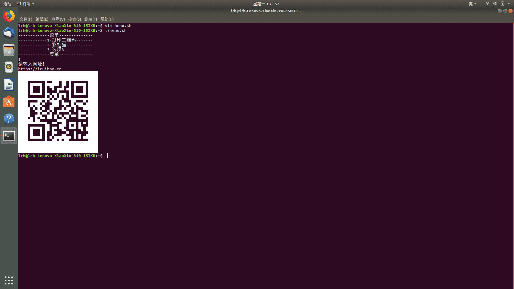
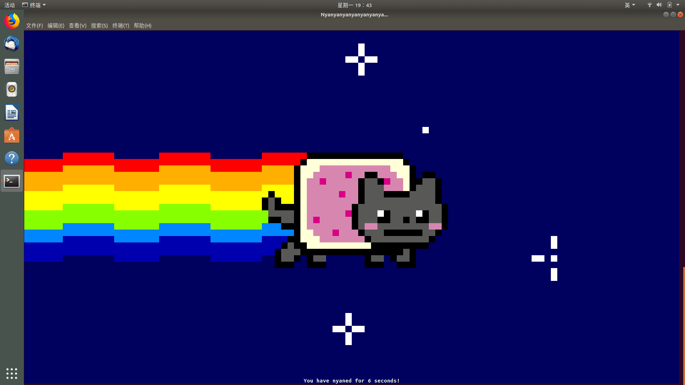
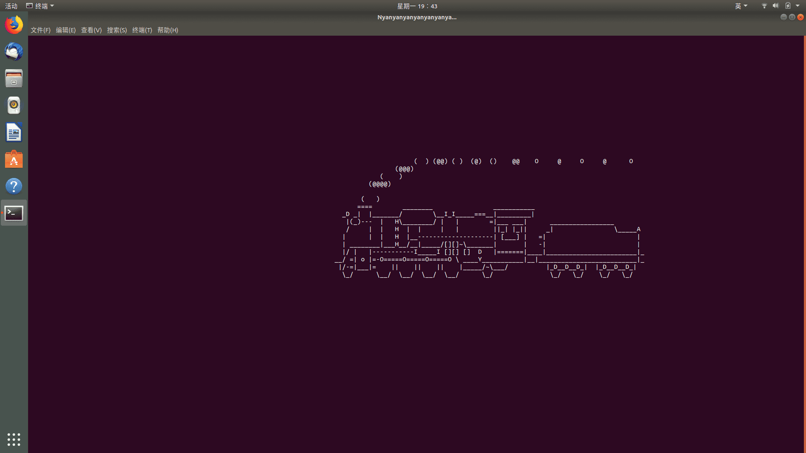
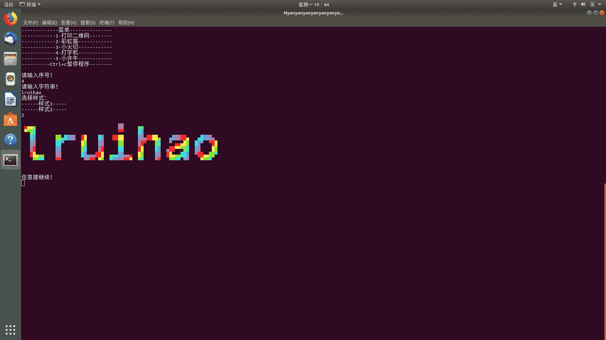
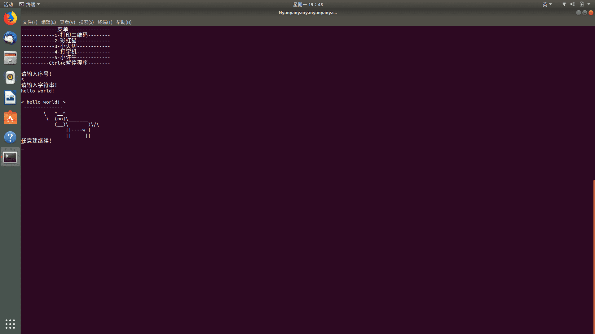

# shell 脚本初体验


今天上机学了几个小命令

- read
- echo
- if

然后自己写了一个小脚本觉得还挺有趣的

&lt;!--more--&gt;

```sh
#!/bin/bash
#liruihao
#menu.sh
#sudo apt curl install nyancat sl figlet toilet cowsay
echo &#34;-------------菜-单--------------&#34;
echo &#34;------------1-打印二维码--------&#34;
echo &#34;------------2-彩虹猫------------&#34;
echo &#34;------------3-小火切------------&#34;
echo &#34;------------4-打字机------------&#34;
echo &#34;------------5-小许牛------------&#34;
echo &#34;----------Ctrl&#43;c 暂停程序--------&#34;
echo &#34;&#34;
echo &#34;请输入序号！&#34;
read i
if test $i -eq 1
then
  echo &#34;请输入网址！&#34;
  read s1
         echo $s1 |curl -F-=\&lt;- qrenco.de
fi
if test $i -eq 2
then
  nyancat
fi
if test $i -eq 3
then
  sl
fi
if test $i -eq 4
then
  echo &#34;请输入字符串！&#34;
  read s2
  echo &#34;选择样式：&#34;
  echo &#34;------样式 1-----&#34;
  echo &#34;------样式 2-----&#34;
  read j
  if test $j -eq 1
  then
    figlet $s2
  else
    toilet -f mono12 -F gay $s2
  fi
fi
if test $i -eq 5
then
  echo &#34;请输入字符串！&#34;
  read s3
  cowsay $s3
fi
echo &#34;任意建继续！&#34;
read x
clear
./menu.sh

```









---

> 作者: [Lruihao](https://github.com/Lruihao)  
> URL: https://lruihao.cn/posts/shell/  

