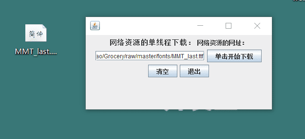

# Java 实现一个单线程的资源下载器


&gt; 实现一个简单的基于单线程的资源下载器，如图所示，用户可以任意指定下载资源的链接地址，系统根据该地址判断资源是否存在，如果存在，则将该资源下载到本地。

&lt;!--more--&gt;

## GUI 设计基本流程

先记录一下 GUI 设计的基本流程：

1. 根据需要从相应的顶层容器继承（如果创建窗体就继承 JFrame，对话框就继承 JDialog），新建一个子类。
2. 然后设置顶层容器的属性，包括大小、位置、标题和关闭事件等。
3. 设置界面上 GUI 组件的事件响应。 `public void actionPerformed(ActionEvent e) {}`
4. 向顶层容器上添加 GUI 组件，并设置布局。（通常利用 JPanel 组件先作为微型容器）
5. 创建新建子类的实例，调用 setVisible(true) 方法显示页面。（也可以直接在子类中设置 setVisible(true)）

## 实现代码

```java
package cn.lruihao.base;

import java.awt.FlowLayout;
import java.awt.Font;
import java.awt.HeadlessException;
import java.awt.event.ActionEvent;
import java.awt.event.ActionListener;
import java.io.FileOutputStream;
import java.io.InputStream;
import java.net.URL;
import java.net.URLConnection;

import javax.swing.JButton;
import javax.swing.JFrame;
import javax.swing.JLabel;
import javax.swing.JOptionPane;
import javax.swing.JPanel;
import javax.swing.JTextField;

public class SingleThreadDown extends JFrame implements ActionListener {
  private final JPanel panel=new JPanel();
  private final JLabel label1=new JLabel(&#34;网络资源的单线程下载：&#34;);
  private final JLabel label2=new JLabel(&#34;网络资源的网址：&#34;);
  JButton StartButton = new JButton(&#34;单击开始下载&#34;);
  JButton resetButton = new JButton(&#34;清空&#34;);
  JButton exitButton = new JButton(&#34;退出&#34;);
  JTextField urlField  = new JTextField(20);

  public SingleThreadDown() {
    panel.setLayout(new FlowLayout()); //布局管理器
    label1.setFont(new Font(&#34;雅黑&#34;,Font.BOLD,15));
    panel.add(label1);
    panel.add(label2);
    panel.add(urlField);
    panel.add(StartButton);
    panel.add(resetButton);
    panel.add(exitButton);
    setContentPane(panel);
    setSize(400,200);
    setLocation(400,400);
    setVisible(true); //面板可视化，也可以在 main 中通过 JFrame 子类对象调用方法设置
    setDefaultCloseOperation(JFrame.EXIT_ON_CLOSE); //默认关闭事件
    StartButton.addActionListener(this);//添加点击事件，传入 ActionListener 对象，由于子类继承了 ActionListener 接口，所以 this
    resetButton.addActionListener(this);
    exitButton.addActionListener(this);
  }

  public void download(String address) throws Exception {
    URL url = new URL(address);
    URLConnection urlcon = url.openConnection();
    urlcon.connect();
    InputStream in=urlcon.getInputStream();//获取的字节流对象
    String filePath = url.getFile();
    int pos=filePath.lastIndexOf(&#34;/&#34;); //&#34;/&#34;分割的最后一个串的下标
    String fileName = filePath.substring(pos&#43;1);
    FileOutputStream out = new FileOutputStream(&#34;C:\\Users\\李瑞豪、\Desktop\\&#34;&#43;fileName);
    byte[] b = new byte[1024];
    int len=0;
    while((len=in.read(b,0,1024))!=-1) {
      out.write(b,0,len);
    }
    out.close();
    in.close();
    JOptionPane.showMessageDialog(this, &#34;下载完毕&#34;);
  }

  @Override
  public void actionPerformed(ActionEvent e) {
    if(e.getSource()==StartButton) {
      if(&#34;&#34;.equals(urlField.getText())){
        JOptionPane.showMessageDialog(this, &#34;请输入资源地址&#34;);
      }
      String url = urlField.getText();
      try {
        download(url);
      } catch (Exception e1) {
        JOptionPane.showMessageDialog(this, &#34;资源地址有误，请检查~&#34;);
        e1.printStackTrace();
      }
    }else if(e.getSource()==resetButton) {
      urlField.setText(&#34;&#34;);
    }else {
      System.exit(0);
    }

  }

  public static void main(String[] args) {
    new SingleThreadDown();

  }

}
```

## 运行结果测试

通过`https://github.com/Lruihao/Grocery/raw/master/fonts/MMT_last.ttf`下载沐目体 ttf 字体文件，稍微等待一下弹出对话框“下载完毕”，经检查下载内容正常。




---

> 作者: [Lruihao](https://github.com/Lruihao)  
> URL: https://lruihao.cn/posts/singlethreaddown/  

