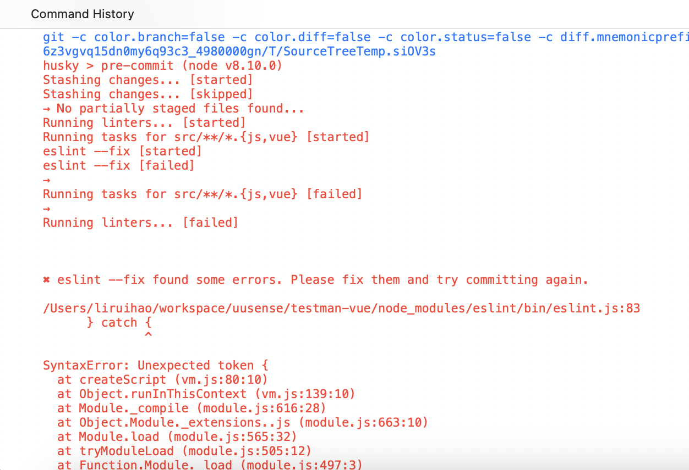

# 解决 SourceTree 提交时候 Husky 命令失败问题


## 问题描述

在使用 SourceTree 提交代码的时候，会出现 husky 命令失败的问题（通过命令行提交代码没有问题），如下图所示：



看错误，是一个 catch 参数的问题，在新版本的 Node 中，catch 参数是可以省略的，但是在旧版本中，catch 参数是必须的。

由于使用了 nvm 管理 Node 版本，项目中的 Node 是正常的，但是 SourceTree 使用的是系统的 Node，所以会出现这个问题。

## 解决方案

知道了问题的原因，解决起来就很简单了，只需要将 SourceTree husky hook 阶段的 Node 版本切换到项目中的 Node 版本即可。

配置 `.huskyrc` 文件，内容如下：

```bash {title="~/.huskyrc"}
export PATH=\"$(dirname $(which node)):\$PATH\"
```

如果你使用了 `zsh` 和 `nvm`, 建议在 `$ZSH_CUSTOM` 目录下添加一个自定义 zsh 脚本。
这个脚本会在你进入包含了 `.nvmrc` 文件目录中自动切换 node 版本，切换版本后修正 `~/.huskyrc` 的 path 内容。

```bash
vim $ZSH_CUSTOM/nvm_custom.zsh
```

```zsh {title="$ZSH_CUSTOM/nvm_custom.zsh"}
# https://github.com/nvm-sh/nvm#manual-install
export NVM_DIR="$HOME/.nvm"
[ -s "$NVM_DIR/nvm.sh" ] && \. "$NVM_DIR/nvm.sh"  # This loads nvm
[ -s "$NVM_DIR/bash_completion" ] && \. "$NVM_DIR/bash_completion"  # This loads nvm bash_completion

# https://github.com/nvm-sh/nvm#deeper-shell-integration
autoload -U add-zsh-hook
load-nvmrc() {
  local node_version="$(nvm version)"
  local nvmrc_path="$(nvm_find_nvmrc)"

  if [ -n "$nvmrc_path" ]; then
    local nvmrc_node_version=$(nvm version "$(cat "${nvmrc_path}")")

    if [ "$nvmrc_node_version" = "N/A" ]; then
      nvm install
    elif [ "$nvmrc_node_version" != "$node_version" ]; then
      nvm use
    fi
  elif [ "$node_version" != "$(nvm version default)" ]; then
    echo "Reverting to nvm default version"
    nvm use default
  fi

  # fix husky hook
  # ref: https://github.com/typicode/husky/issues/390#issuecomment-762213421
  # for husky 8 ~/.huskyrc, for husky 9 ~/.config/husky/init.sh
  echo "export PATH=\"$(dirname $(which node)):\$PATH\"" > ~/.config/husky/init.sh
}
add-zsh-hook chpwd load-nvmrc
load-nvmrc

# https://github.com/nvm-sh/nvm#use-a-mirror-of-node-binaries
export NVM_NODEJS_ORG_MIRROR=https://mirrors.ustc.edu.cn/node/
```

> 如果你使用的是 husky 9 之后的版本，需要将 `~/.huskyrc` 替换为 `~/.config/husky/init.sh`。

## 参考

- [解决 SourceTree 提交时候 husky 命令失败问题](https://wxhboy.cn/2022/04/12/%E8%A7%A3%E5%86%B3SourceTree%E6%8F%90%E4%BA%A4%E6%97%B6%E5%80%99husky%E5%91%BD%E4%BB%A4%E5%A4%B1%E8%B4%A5%E9%97%AE%E9%A2%98/)
- <https://github.com/typicode/husky/issues/390#issuecomment-762213421>
- <https://github.com/typicode/husky/issues/904#issuecomment-862184954>
- <https://github.com/nvm-sh/nvm#deeper-shell-integration>


---

> 作者: [Lruihao](https://github.com/Lruihao)  
> URL: https://lruihao.cn/posts/sourcetree-husky/  

