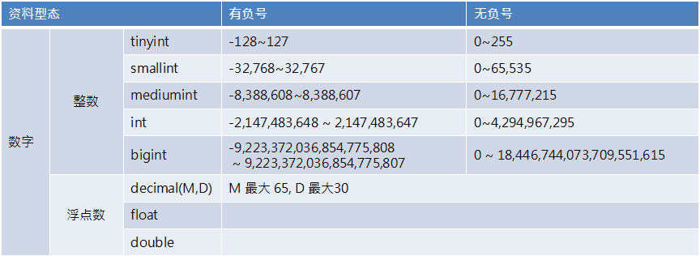
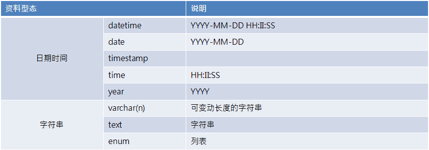

# SQL 总结


> SQL 增删改查 (CRUD) 语句与常用函数总结。

<!--more-->

## SQL Introduction

一般我们对数据库的操作主要分为四种，增** C**(CREATE)、删** D**(DELETE)、改** U**(UPDATE)、查** R**(READ)，所以，我就从** CRUD **这四个方面来制作查询表。

**开发规则：**

1. 尽量减少对数据库的访问次数，且不能查询无用的数据，浪费效能（例如：我只要男生的数据，你把所有人的数据都查询出来）。

2. 属于`SQL`语法的要使用大写 （SELECT, WHERE, INSERT etc...）。

3. 属于使用者自己定义的要使用小写（表名、列名 etc...）。

4. 表名与列名前后使用 \` 包起来，防止与关键字冲突（例如： INSERT INTO \`user\` VALUES('a','b'); ）。

5. 禁止使用 Table Join。

6. 禁止使用 Oracle Trigger。

7. 禁止使用 SELECT \* （为了加强代码可读性）。

8. 不能将查询数据库的 SQL 放在循环中查询。

## 新增（CREATE）

| 功能       | 语句                                                                                                                                                                                                                |
| :--------- | :------------------------------------------------------------------------------------------------------------------------------------------------------------------------------------------------------------------ |
| 创建数据库 | `CREATE DATABASE <数据库名>;`                                                                                                                                                                                       |
| 创建数据表 | `CREATE TABLE  <表名> (`<br/>`<列名 1> <数据类型> <约束条件>,`<br/>`<列名 2> <数据类型> <约束条件>,`<br/>`<列名 3> <数据类型> <约束条件>,`<br/>`......`<br/>`<该表的的约束条件 1> `<br/>`<该表的的约束条件 2>...);` |
| 插入数据   | `INSERT INTO <表名> （列名 1, 列名 2,...) VALUES （值 1, 值 2,...);`<br/>（每列都有数据插入时，可省略列名。但是为了代码的可读性，不建议如此操作。）                                                                 |
| 增加列     | `ALTER TABLE <表名> ADD <列名> <数据类型> <约束条件> AFTER <前一列列名>;`<br/>（默认插入到最后一列）                                                                                                                |

## 删除（DELETE）

| 功能       | 语句                                                |
| :--------- | :-------------------------------------------------- |
| 删除数据库 | `DROP DATABASE <数据库名>;`                         |
| 删除数据表 | `DROP TABLE <表名>;`                                |
| 清空表数据 | `DELETE FROM <表名>;` 或者 `TRUNCATE TABLE <表名>;` |
| 删除行数据 | `DELETE FROM <表名> WHERE <条件>;`                  |
| 删除列数据 | `ALTER TABLE <表名> DROP <列名>;`                   |

## 修改（UPDATE）

| 功能         | 语句                                                                      |
| :----------- | :------------------------------------------------------------------------ |
| 修改数据库名 | `RENAME DATABASE <旧名称> TO <新名称>;`                                   |
| 修改表名     | `RENAME TABLE <旧名称> TO <新名称>;`                                      |
| 修改数据     | `UPDATE <表名> SET <列名 1> = <新值 1>,<列名 2> = <新值 2> WHERE <条件>;` |
| 修改列名     | `ALTER TABLE <表名> CHANGE <旧列名> <新列名> <数据类型> <约束条件>;`      |

> 注意：重命名数据库与数据表一般不推荐使用，若想测试，请先备份好自己的数据库~

## 查询（&nbsp;R&nbsp;E&nbsp;A&nbsp;D&nbsp;）

| 功能                     | 语句                                                                                                                                                                    |
| :----------------------- | :---------------------------------------------------------------------------------------------------------------------------------------------------------------------- |
| 查询所有数据库           | `SHOW DATABASES;`                                                                                                                                                       |
| 查询指定数据库中所有表名 | `USE <数据库名>;` 然后 `SHOW TABLES;`<br/>或者 `SHOW TABLES FROM <数据库名>;`                                                                                           |
| 查询表中所有列信息       | `SHOW COLUMNS FROM <表名>;`                                                                                                                                             |
| 查询表中所有数据         | `SELECT <列名 1>,<列名 2>,<列名 3>,... FROM <表名>;`                                                                                                                    |
| 查询表中某个数据         | `SELECT <列名> FROM <表名>;`                                                                                                                                            |
| 查询表中指定多个数据     | `SELECT <列名 1>,<列名 2>,<列名 3>,... FROM <表名> WHERE <条件>;`                                                                                                       |
| 查询表中指定一个数据     | `SELECT <列名> FROM <表名> WHERE <条件>;`                                                                                                                               |
| 查询指定范围数据         | `SELECT <列名 1>,<列名 2>,<列名 3>,... FROM <表名> WHERE `<br/>`<某列名> BETWEEN <某列名范围值-小> AND <某列名范围值-大>;`                                              |
| 字符串模式匹配查询       | `SELECT <列名> FROM <表名> WHERE name LIKE 'Y%';`<br/>（查询以 Y 开头的，更多匹配方式自行百度哦~。）                                                                    |
| 指定多个值数据查询       | `SELECT <列名 1>,<列名 2>,<列名 3>,... FROM <表名> WHERE `<br/>`<某列名> IN ('<某列名值 1>','<某列名值 2>','<某列名值 3>',...);`                                        |
| 查询结果排序             | `SELECT <列名 1>,<列名 2>,<列名 3>,... FROM <表名> ORDER BY <某列名> DESC;`<br/>（此处为递减排列，默认为递增`ASC`）                                                     |
| 查询指定几笔数据         | `SELECT <列名 1>,<列名 2>,<列名 3>,... FROM <表名> LIMIT n,m;`<br/>（从`n`到`m`笔数据）                                                                                 |
| 分群查询                 | `SELECT <列名 1>,<列名 2>,<列名 3>,...,<函数> FROM <表名> GROUP BY <列名 1>,<列名 2>,<列名 3>,...;`<br/>（常搭配函数有：`SUM()`、`AVG()`、`COUNT()`、`MAX()`、`MIN()`） |

## 常用函数

| 函数名                                                   | 用途                                     |
| :------------------------------------------------------- | :--------------------------------------- |
| `ABS`（数值）                                            | ABS 函数（求绝对值）                     |
| `MOD`（被除数，除数）                                    | MOD 函数（求余）                         |
| `ROUND`（对象数值，保留小数的位数）                      | ROUND 函数（四舍五入）                   |
| 字符串 1 &Iota;&Iota; 字符串 2                           | &Iota;&Iota; 函数（拼接）                |
| `LENGTH`（字符串）                                       | LENGTH 函数（求字符串长度）              |
| `LOWER`（字符串）                                        | LOWER 函数（小写转换）                   |
| `UPPER`（字符串）                                        | UPPER 函数（大写转换）                   |
| `REPLACE`（对象字符串，替换前的字符串，替换后的字符串）  | REPLACE 函数（字符串的替换）             |
| `SUBSTRING` （对象字符串，截取的起始位置，截取的字符数） | SUBSTRING 函数（字符串的截取）           |
| `CURRENT_DATE`                                           | CURRENT_DATE 函数（当前日期）            |
| `CURRENT_TIME`                                           | CURRENT_TIME 函数（当前时间）            |
| `CURRENT_TIMESTAMP`                                      | CURRENT_TIMESTAMP 函数（当前日期和时间） |
| `EXTRACT`（日期元素 FROM 日期）                          | EXTRACT 函数（截取日期元素）             |
| `CAST`（转换前的值 AS 想要转换的数据类型）               | CAST 函数（类型转换）                    |
| `COALESCE`（数据 1, 数据 2, 数据 3....)                  | COALESCE 函数（将 NULL 转换为其他值）    |

补充：CASE 表达式。

```
CASE WHEN <求值表达式> THEN <表达式>
     WHEN <求值表达式> THEN <表达式>
     WHEN <求值表达式> THEN <表达式>
     ......
     ELSE <表达式>
 END
```

## 其他知识

### 常见数据类型




### 别名

给表设置别名，让 SQL 更简洁。例如：

`SELECT <col-1>,<col-2>,<col-3>,... FROM <table1> <alias-a>,<table2> <alias-b> WHERE <alias-a>.<id> = <alias-b>.<id>;`

列名也可以设置别名。例如：

`SELECT <col-1> <alias-a>,<col-2> <alias-b>,<col-3> <alias-c>,... FROM <table>;`  
或者  
`SELECT <col-1> AS <alias-a>,<col-2> AS <alias-b>,<col-3> AS <alias-c>,... FROM <table>;`

## 总结

以上整理的内容均为基础内容，更多进阶知识还需各位自行 Google。


---

> 作者: [Lruihao](https://github.com/Lruihao)  
> URL: https://lruihao.cn/posts/sql/  

