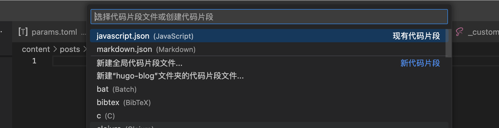

# VSCode 添加用户代码片段，自定义用户代码片段


在使用 VScode 开发中经常会有一些重复使用的代码块，复制粘贴也很麻烦，这时可以在 VScode 中添加用户代码片段，输入简写即可快捷输入。

<!--more-->

## 新建代码片段

在 VScode 主界面->点击左下角设置图标->点击用户代码片段，可以建立全局代码片段，也可以建立单个项目的代码片段，也可以设置语言类型的代码片段。



## 代码片段格式

代码片段格式如下：

```json
{
  // Example:
  // 在这里放置你的 JavaScript 代码片段。每个代码片段都有一个名称、前缀、代码块和描述。前缀用于触发代码片段，代码块将被展开并插入。可能使用的变量有：
  // $1、$2 表示标签停止点，$0 表示最终光标位置，${1:label}、${2:another} 表示占位符。具有相同 id 的占位符是相互关联的。
  // 示例：
  // "Print to console": {
  //  "prefix": "log",
  //  "body": [
  //   "console.log('$1');",
  //   "$2"
  //  ],
  //  "description": "Log output to console"
  // }
}
```

可以使用工具 [snippet-generator](https://snippet-generator.app/) 生成代码片段。

## 常用代码片段

### JavaScript

```json {title=javascript.json}
{
  "Print to console": {
    "prefix": "cl",
    "body": [
      "console.log('$1');",
    ],
    "description": "Log output to console"
  }
}
```

### Markdown

```json {title=markdown.json}
{
  "Font Matter": {
    "prefix": "fm",
    "body": [
      "---",
      "title: $1",
      "date: $CURRENT_YEAR-$CURRENT_MONTH-$CURRENT_DATE$T$CURRENT_HOUR:$CURRENT_MINUTE:$CURRENT_SECOND+08:00",
      "draft: true",
      "categories: $2",
      "tags: $3",
      "description: $4",
      "keywords: $5",
      "---"
    ],
    "description": "Font Matter"
  },
  "Markdown Table": {
    "prefix": "table",
    "body": [
      "| $1 | $2 |",
      "| --- | --- |",
      "| $3 | $4 |"
    ],
    "description": "Markdown Table"
  },
  "FixIt Shortcode TypeIt": {
    "prefix": "typeit",
    "body": [
      "",
      "$1",
      ""
    ],
    "description": "FixIt Shortcode TypeIt"
  },
}
```


---

> 作者: [Lruihao](https://github.com/Lruihao)  
> URL: https://lruihao.cn/posts/vscode-snippets/  

