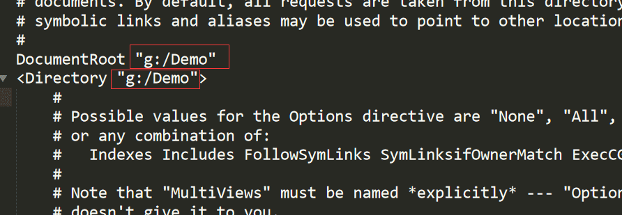
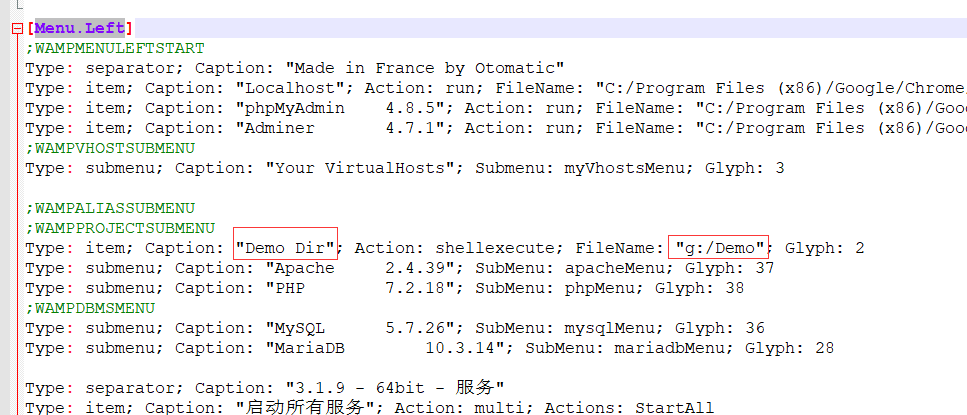
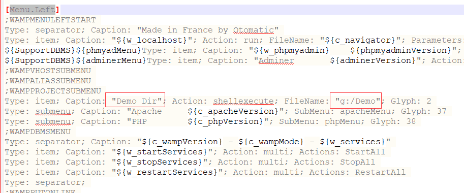
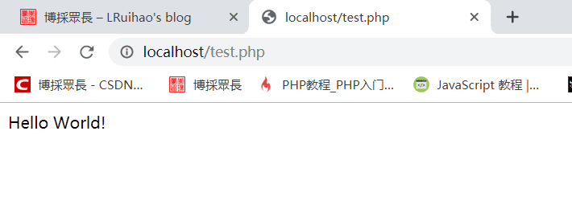

# WAMPServer 自定义网站根目录等设置


&gt; 使用 WAMPServer 时自定义网站根目录。

&lt;!--more--&gt;

## WAMPServer 自定义网站根目录

### 修改 apache 配置文件

打开`httpd.conf`文件搜索`documentroot`后，找到路径修改为自定义的。  


再打开`httpd-vhost.conf`文件修改对应的路径。  
`修改完配置文件需要重启所有服务！`

### 修改 wampmanager 文件

在 wampserver 安装路径根目录知道`wampmanager.ini`和`wampmanager.tpl`两个文件。搜索`menu.left`, 然后也修改为自定义的路径。
`然后退出，重启软件！`

  


### 编写 php 文件测试

```php test.php
&lt;?php
  echo &#34;hello world&#34;;
?&gt;
```



## WAMPServer 多站点配置

打开`httpd-vhost.conf`文件，复制原有的几行配置文件，粘贴修改路径和域名等配置。比如

```conf
## Virtual Hosts
#
&lt;VirtualHost *:80&gt;
  ServerName localhost
  ServerAlias localhost
  DocumentRoot &#34;g:/Demo&#34;
  &lt;Directory &#34;g:/Demo&#34;&gt;
    Options &#43;Indexes &#43;Includes &#43;FollowSymLinks &#43;MultiViews
    AllowOverride All
    Require local
  &lt;/Directory&gt;
&lt;/VirtualHost&gt;

&lt;VirtualHost *:80&gt;
  ServerName test01.com
  DocumentRoot &#34;g:/Demo/test01&#34;
&lt;/VirtualHost&gt;

&lt;VirtualHost *:80&gt;
  ServerName test02.com
  DocumentRoot &#34;g:/Demo/test02&#34;
&lt;/VirtualHost&gt;
```

再打开`C:\Windows\System32\drivers\etc\hosts`文件，在文件最后添加类似于云服务器的域名解析，进行本地域名解析，当输入域名时优先从本地申请资源。

```plain
...

## For example:
#
## 102.54.94.97 rhino.acme.com ## source server
## 38.25.63.10 x.acme.com ## x client host
## localhost name resolution is handled within DNS itself.
#  127.0.0.1 localhost
#  ::1 localhost
127.0.0.1 steamcommunity.com
192.168.28.1 windows10.microdone.cn
127.0.0.1 localhost
::1 localhost
127.0.0.1 test01.com
127.0.0.1 test02.com
```

## WAMPServer 自拟定端口

WAMP 服务我安装了好几次，每次因为修改配置文件搞崩了。第一次装的时候发现 80 端口被占用了，因为以前玩了一下 Windows 的 IIS，暂停 IIS 的网站，再使用命令或者直接在控制面板关掉就好了。

1. 如果不使用 80 多为默认端口，比如修改为 8080，还是在`httpd.conf`文件里修改。搜索`80`都改成`8080`然后，Ctrl&#43;S 保存，重新启动 WampServer  
    在浏览器地址栏输入`localhost:8000`

    ```conf
    #监听端口
    Listen 0.0.0.0:8080
    Listen [::0]:8080
    ServerName localhost:8080
    ```

2. 使用 Notepad&#43;&#43;打开 C:\wamp 目录下的 wampmanager.ini 和 wampmanager.tpl  
   Ctrl&#43;F 查找 `localhost`  
   将其全部替换为`localhost:8000`  
   然后，Ctrl&#43;S 保存，重新启动 WampServer


---

> 作者: [Lruihao](https://github.com/Lruihao)  
> URL: https://lruihao.cn/posts/wamproot/  

