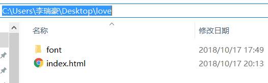

# ttf 字体压缩


## 安装 Node.js

font-spider 是 nodejs 的一个模块，所以需要安装 nodejs。

## 安装字蛛

输入命令

```bash
npm install font-spider -g
```

## 运行

安装成功之后就开始压缩了


我的 css

```css
<style type="text/css">
  @font-face {
    font-family: MMT;
    src: url("font/MMT_579767_SOAJ0_0.ttf");
  }
</style>
```

生成新的字体库，命令行输入

```bash
font-spider C:\Users\李瑞豪\Desktop\xxx\index.html
```


[官网](http://font-spider.org)


---

> 作者:   
> URL: https://lruihao.cn/posts/web-font/  

