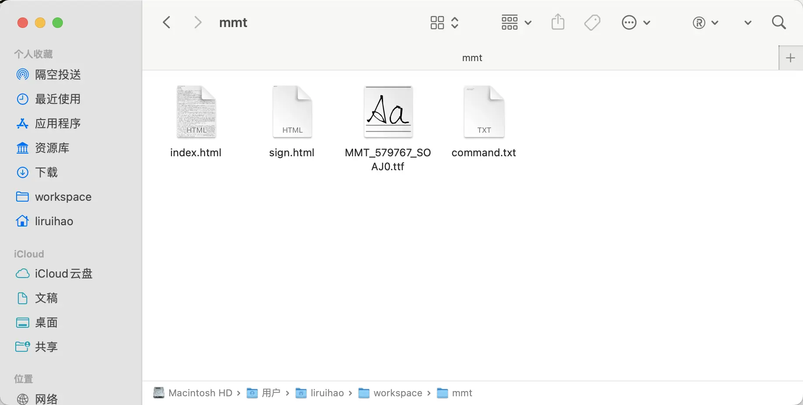
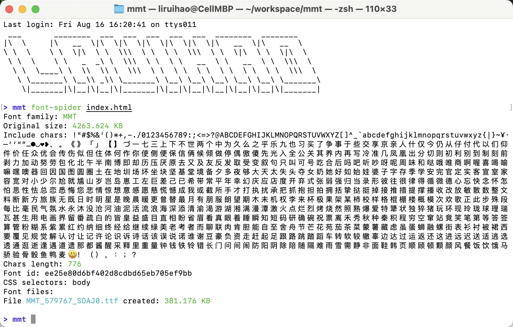
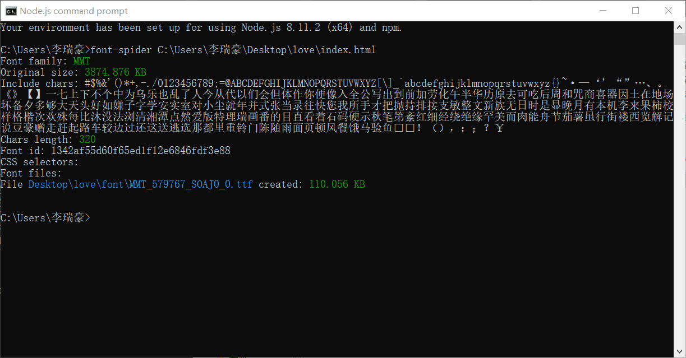

# Ttf 字体压缩


HTML 网页引用中文字体，文件过大，加载缓慢的解决办法。

<!--more-->

## 安装 Node.js

font-spider 是 Node.js 的一个模块，所以需要安装 Node.js。

## 安装字蛛

输入命令

```bash
npm install font-spider -g
```

## 编写 HTML



新建一个 HTML 文件，引用字体文件，并使用自定义字体。如下：

```html
<!DOCTYPE html>
<html>
  <head>
    <meta charset="utf-8">
    <meta name="viewport" content="width=device-width, initial-scale=1">
    <title></title>
    <style type="text/css">
      @font-face {
        font-family: MMT;
        src: url('MMT_579767_SOAJ0.ttf');
      }
      body {
        font-family: MMT;
      }
    </style>
  </head>
  <body>
  这里写要压缩的文字，吧啦吧啦……
  </body>
</html>
```

## 压缩字体

在当前目录下执行以下命令生成新的字体库：

```bash
font-spider index.html
```





执行完后，它会把原来的字体文件移动到 `.font-spider` 文件夹，而 CSS 中引用的字体文件会被替换为新的压缩后的字体文件，这就是我们需要部署的字体文件。

下次执行只需要往 HTML 文件中添加新的文字，然后再执行 `font-spider index.html` 命令即可。

## 参考

[font-spider](https://github.com/aui/font-spider)


---

> 作者: [Lruihao](https://github.com/Lruihao)  
> URL: https://lruihao.cn/posts/web-font/  

