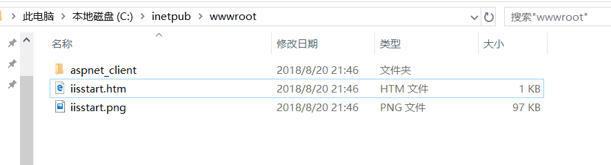

# Windows 上搭建 Web 服务器

> 我用的 win10

### 打开控制面板

选择并进入“程序”，双击“启用或关闭 Windows 服务”，在弹出的窗口中选择“Internet Information Services”下面所有地选项，点击确定后，开始更新服务。  

### 查看

更新完成后，打开浏览器，输入`http://localhost`或者`127.0.0.1`回车，如果此时出现 IIS7 欢迎界面，说明 Web 服务器已经搭建成功。  

### 网站设置

当 web 服务器搭建成功后，我们下一步所要做的就是把我们开发的网站安装到 Web 服务器的目录中。一般情况下，当 Web 服务器安装完成后，会创建路径`%系统根目录%inetpub/wwwroot`，将我们开发的网站 COPY 到该路径下。即可实现本地访问该网站。  

也可以更改根目录，搜索 IIS，点击网站，Default Web Site，基本设置修改物理路径（**默认站点名称不要改**）  
我这里改到了 hexo 的 public 相当于 hexo 部署在本地服务器`58.45.227.225`  

### 设置防火墙

让局域网当其它计算机也能访问本地网站资源。具体方法：打开控制面板，选择“系统和安全”，点击“允许程序通过 Windows 防火墙”，在弹出的对话框中勾选“万维网服务 HTTP”右侧的两个复选框，最后点击确定退出。  

在局域网中其它计算机上，打开浏览器就可以通过你电脑的 ip 地址访问了（手机也可以）  
本地 ip 可以通过 cmd 用 ipconfig 查看

---

> 作者: [Lruihao](https://github.com/Lruihao)  
> URL: https://lruihao.cn/posts/web-server-win/  

