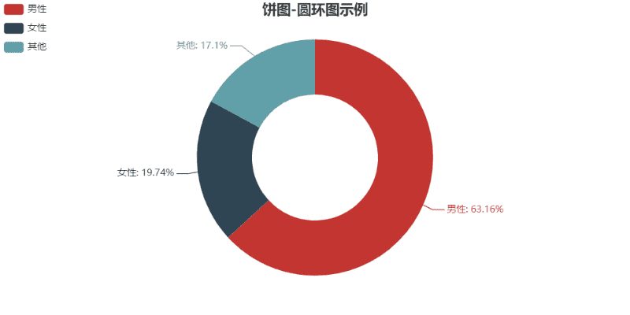
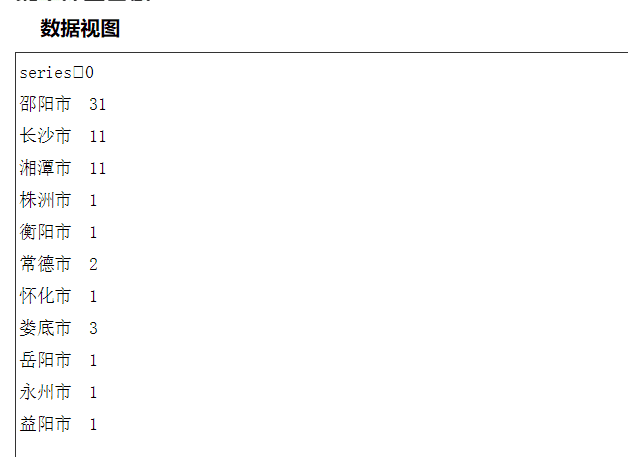

# python 玩微信：初探 wxpy


&gt; **_文中涉及的图片涉及个人隐私，仅做举例，请勿传播_**
&gt;
&gt; - 查看微信好友男女比例
&gt; - 查看好友地区分布
&gt; - 群性别统计

&lt;!--more--&gt;

## 前期准备

- [wxpy](https://github.com/youfou/wxpy)
- [pyecharts](https://github.com/pyecharts/pyecharts)（百度 echarts）

## 查看微信好友男女比例

```py 生成结果在源文件同目录在的 sex.html
from wxpy import *
from pyecharts import Pie

bot = Bot(cache_path = True)   #定义一个微信机器人
friends = bot.friends(update=False)   #获取更新好友列表
male = female = other = 0

for i in friends[1:]:     #[1:] 自己是第一个，排除掉
    sex = i.sex
    if sex == 1:
        male &#43;= 1
    elif sex == 2:
        female &#43;= 1
    else:
        other &#43;= 1
total = len(friends[1:])   #计算总数

#下面为分析
attr = [&#34;男性&#34;,&#34;女性&#34;,&#34;其他&#34;]
v1 = [float(male),float(female),float(other)]
pie = Pie(&#34;饼图 - 圆环图示例&#34;, title_pos=&#39;center&#39;)
pie.add(&#34;&#34;, attr, v1, radius=[40, 75], label_text_color=None, is_label_show=True,
        legend_orient=&#39;vertical&#39;, legend_pos=&#39;left&#39;)
pie.render(&#34;sex.html&#34;)
```



## 查看好友地区分布

```py 生成结果在源文件同目录在的 city.html
from wxpy import *
from pyecharts import Map

#因为获取的列表城市都没有带市字，而 pyecharts 需要带个市字
b = &#39;市&#39;
def s(x):
    return x&#43;b

#只提取湖南的
bot = Bot(cache_path = True)
friends = bot.friends(update=False).search(province = &#39;湖南&#39;)
citys = []
for f in friends :
    city = f.city
    citys.append(city)
r = map(s,citys)
cityss = list(r)

#为城市计数
a = {}
for i in cityss:
    a[i] = cityss.count(i)
a.pop(&#39;市&#39;)

#把字典进行有序拆分为 2 个列表
attrs = []
values = []
for value, attr in a.items():
    values.append(attr)
    attrs.append(value)
#开始绘图
map = Map(&#34;湖南地图示例&#34;, width=1200, height=600)
map.add(&#34;&#34;, attrs, values, maptype=&#39;湖南&#39;, is_visualmap=True, visual_text_color=&#39;#000&#39;)
map.render(&#34;city.html&#34;)
```



&gt; **以上参考简书 [陈思煜](https://www.jianshu.com/p/c0baf3c6db15)**

## 统计所有群男女数目

&gt; 统计结果会自动发送到所有群聊
&gt; 男女人数和不一定等于总数（有些人不显示性别）

```py @Sunbelife
#encoding=utf-8
from wxpy import *
import numpy

def removeAll(the_list, val):
    return [value for value in the_list if value != val]

def stats_text(target_group, group_name):
    print(group_name &#43; &#34;群共有：&#34; &#43; str(len(target_group)) &#43; &#34;人，其中：&#34;)
    all_stats_text = []
    all_dict = {}

    ## 乱序先整理一份省份 &#43; 地点的列表
    for user in target_group.members:
        trimed_data = user.province.replace(&#39; &#39;, &#39;&#39;) &#43; user.city.replace(&#39; &#39;, &#39;&#39;)
        if trimed_data != &#39;&#39;:
            all_stats_text.append(trimed_data)
    ## 计数
    for data in all_stats_text:
        if all_stats_text.count(data) != 0:
            all_dict[data] = all_stats_text.count(data)
            all_stats_text = removeAll(all_stats_text, data)
    final_dict = {}
    for i in sorted(all_dict.keys()):
        final_dict[i] = all_dict[i]
    return final_dict

def stats_sex(target_group):
    male = 0
    female = 0
    other = 0

    for user in target_group.members:
        if user.sex == 1:
            male = male &#43; 1
        if user.sex == 2:
            female = female &#43; 1
        else:
            other = other &#43; 1

    print(&#34;男的有：&#34; &#43; str(male) &#43; &#34;人&#34;)
    print(&#34;女的有：&#34; &#43; str(female) &#43; &#34;人&#34;)
    msg = &#34;男的有：&#34; &#43; str(male) &#43; &#34;人、n&#34; &#43; &#34;女的有：&#34; &#43; str(female) &#43; &#34;人、n&#34;
    return msg

bot = Bot()

target_group = bot.groups(update=True, contact_only=False)

for curr_group in target_group:
    ## 小于 10 人的群过滤掉
    if len(curr_group) &lt; 10:
        continue
    curr_group.update_group(members_details=True)
    print(curr_group.name &#43; &#34;一共有：&#34; &#43; str(len(curr_group)) &#43; &#34;人、n&#34;)
    msg = stats_sex(curr_group)
    curr_group.send(curr_group.name &#43; &#34;群，一共有：&#34; &#43; str(len(curr_group)) &#43; &#34;人、n&#34; &#43; msg)
```


---

> 作者: [Lruihao](https://github.com/Lruihao)  
> URL: https://lruihao.cn/posts/wxpy1/  

