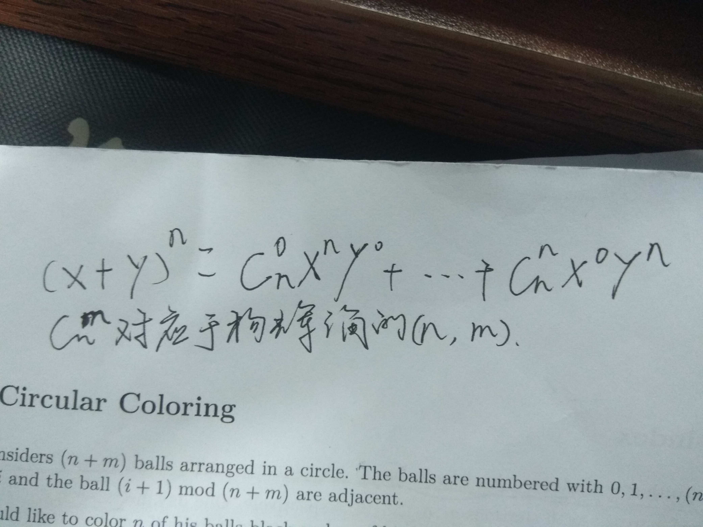

# 杨辉三角


[百度知道](https://zhidao.baidu.com/question/367384574464313844.html)
1

1 1

1 2 1

1 3 3 1

1 4 6 4 1

1 5 10 10 5 1

1 6 15 20 15 6 1

---

&lt;!--more--&gt;

1、每行数字左右对称，由 1 开始逐渐变大，然后变小，回到 1。
2、第 n 行的数字个数为 n 个。
3、第 n 行数字和为 2^(n－1)。
4、每个数字等于上一行的左右两个数字之和。可用此性质写出整个帕斯卡三角形。
5、将第 2n&#43;1 行第 1 个数，跟第 2n&#43;2 行第 3 个数、第 2n&#43;3 行第 5 个数……连成一线，这些数的和是第 2n 个斐波那契数。将第 2n 行第 2 个数，跟第 2n&#43;1 行第 4 个数、第 2n&#43;2 行第 6 个数……这些数之和是第 2n-1 个斐波那契数。
6、第 n 行的第 1 个数为 1，第二个数为 1×(n-1)，第三个数为 1×(n-1)×（n-2）/2，第四个数为 1×(n-1)×（n-2）/2×（n-3）/3…依此类推。

此数列中各行中的数字正好是二项式 a&#43;b 乘方后，展开始终各项的系数。如：

```plain
(a&#43;b)^1=a^1&#43;b^1
(a&#43;b)^2=a^2&#43;2ab&#43;b^2
(a&#43;b)^3=a^3&#43;3a^2b&#43;3ab^2&#43;b^3
……
(a&#43;b)^6=a^6&#43;6a^5b&#43;15a^4b^2&#43;20a^3b^3&#43;15a^2b^4&#43;6ab^5&#43;b^6（注意发现规律）
……
```

二项式展开式：


---

> 作者: [Lruihao](https://github.com/Lruihao)  
> URL: https://lruihao.cn/posts/%E6%9D%A8%E8%BE%89%E4%B8%89%E8%A7%92/  

