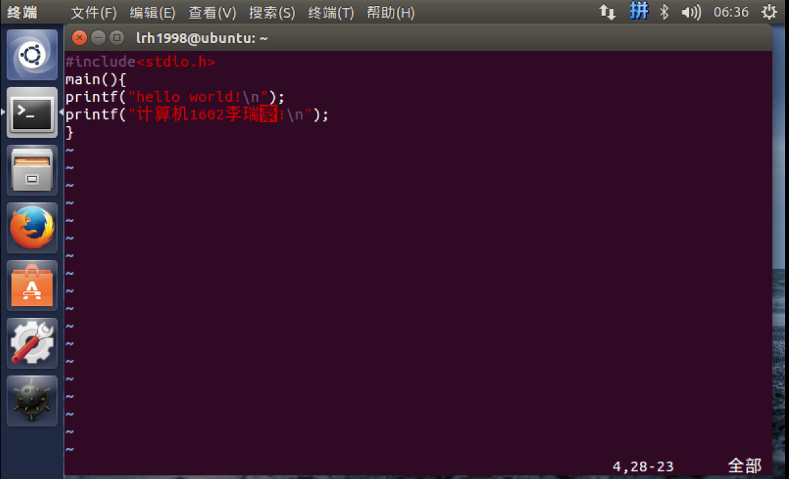
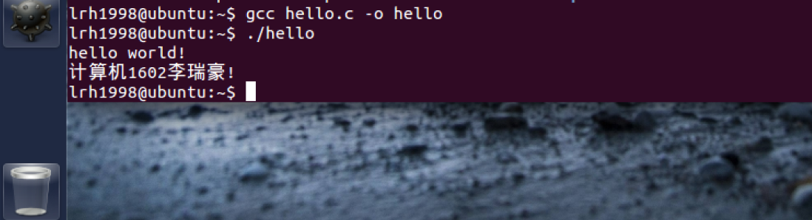

> 在Linux上编译c语言文件。

### 打开vim编辑器
(没有就用vi,或者先安装vim`sudo apt-get install vim`)
```
$ vim
```

### 编辑文件

打开文件编辑器之后编辑文件


首先按`Esc`再`:`进入末行命令
再保存为hello.c文件后退出
```
: w hello.c
: q
```

打开目录看看生成的文件
```
$ ls
```

### 编译生成可执行文件并执行
```
$ gcc hello.c -o hello
$ ./hello
```


若权限不够则加可执行权限`chmod +x hello`