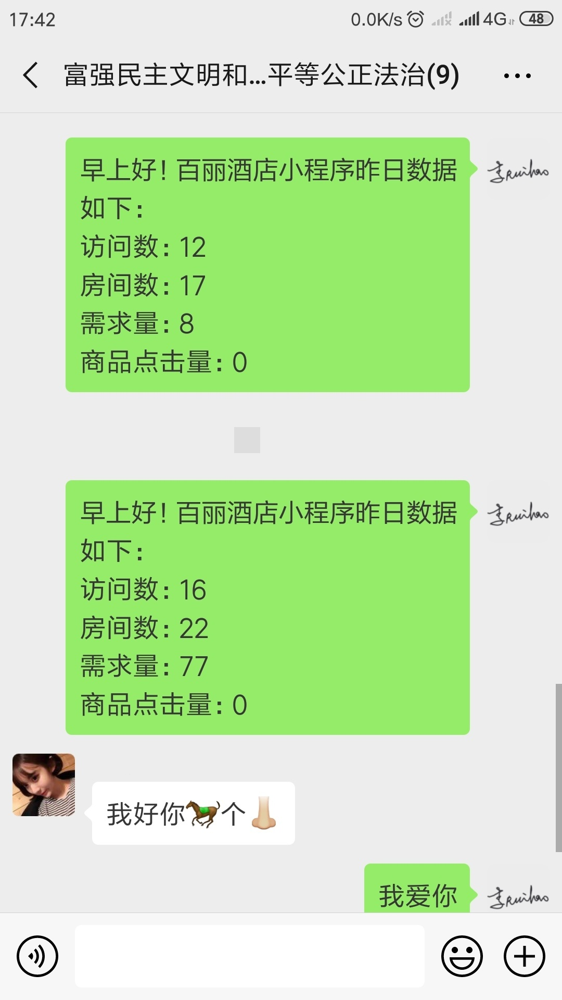


用python模拟post请求获取“麻小科技”示例酒店后台的数据，再打包发送至指定的微信群或者好友。
要求每天早上8点定时把每个酒店的数据发送至每个酒店的微信工作群。


<!--more-->
# 背景
> 麻小科技：
麻小科技全名深圳市麻小科技有限公司，成立于2017年1月。是我高一的时候参加`Peer夏令营`带我们一个玩的“老师”和他的朋友的创业公司，说老师有点奇怪，我们都是直接叫名字的，比如大家都叫我瑞豪，我也就叫他文捷哥，简称捷哥吧。他们公司主要的开发模式是，小程序前端+php后端，然后做的是酒店小程序，为每个酒店定制小程序。这些小程序可以贴在客房中给访客提供一些服务，大大节省了成本也提高了效率。
然后每个酒店小程序都有独立的后台，后台会记录一些点击需求的数据。现在他们有一个需求需要把每个酒店小程序后台的数据在每天早上9点发送至对应酒店的微信群。

# 实现代码
> 缓存登录信息，短时间类无需重复登录，仅第一次需要扫码登录（相当于微信网页版），后面的登录只需在手机上确认登录信息。

```py
#!/usr/bin/python
import requests
import json
import time
from wxpy import *

# 基本信息填写：
# 酒店id，酒店名称及群名列表数据，格式：["xxx","xxx","xxx"]
# 使用时请将以下三个列表一一对应
hotel=["xxxx","xxxx"] # 酒店后台数据接口二级域名，已匿名
hotel_name=["增城宾馆","百丽酒店"]
grouplist = ["麻小","富强民主文明和谐自由平等公正法治"]

# post请求发送的数据
postData = {
    # 'username':'test',
    # 'password':'123456',
}

def get_data():
	result = [] #结果列表
	i = 0 #计数器
	for each in hotel:
		url="http://"+each+".maxiaokeji.com/xxx/xxxxxxx/xxx" # 为保护隐私及权益，这里不提供接口
		r = requests.post(url,data=postData)
		# print(r.text)

		# 把结果转化为json字符串
		response=json.dumps(r.json(),indent=4,ensure_ascii=False) #sort_keys=True 

		# 把json转换为dict字典作为中间结果，再取出昨日数据
		midresult=json.loads(response)
		result.append("早上好！"+hotel_name[i]+"小程序昨日数据如下：\n访问数："+str(midresult["data"]["yesterday_data"]["type1"])+"\n房间数："+str(midresult["data"]["yesterday_data"]["type2"])+"\n需求量："+str(midresult["data"]["yesterday_data"]["type3"])+"\n商品点击量："+str(midresult["data"]["yesterday_data"]["type4"]))
		i+=1
	# print(result)
	return result

def wechat_send(bot,result):
	# my_friend = bot.friends().search('lrh')[0]
	# my_friend.send(result)
	i = 0 # 计数器
	for group in grouplist:
		my_group = bot.groups().search(group)[0] #依次搜索每一个群名称，每次一个
		my_group.send(result[i])	
		print(result[i])
		print("已发送至群："+group)
		i+=1

def main(bot):
	# 设置最大休眠时间，防止程序长时间占用系统资源
	while True:
		now_hour = time.strftime("%H", time.localtime())
		now_min = time.strftime("%M", time.localtime())
		# 设置每天8点发送
		if now_hour < "08":
			rest = 8 - int(now_hour)
			sleeptime = (rest-1)*3600 + (60-int(now_min))*60
			print("启动时北京时间为："+time.strftime("%H:%M", time.localtime()),"\t软件将在",rest-1,"小时",int((sleeptime-(rest-1)*3600)/60),"分钟后发送数据")
			time.sleep(sleeptime)
		elif now_hour > "08":
			rest = 8 - int(now_hour) + 24
			sleeptime = (rest-1)*3600 + (60-int(now_min))*60
			print("启动时北京时间为："+time.strftime("%H:%M", time.localtime()),"\t软件将在",rest-1,"小时",int((sleeptime-(rest-1)*3600)/60),"分钟后发送数据")
			time.sleep(sleeptime)
		elif now_hour == "08":
			print("软件明天开始将在每天8点发送数据！")
			result=get_data() # 获取数据
			wechat_send(bot,result) # 发送数据
			time.sleep(86400-int(now_min)*60)

if __name__=="__main__":
	bot = Bot(cache_path=True) # 初始化机器人，扫码登陆 
	main(bot); 
```

# 测试结果








# 程序打包

使用pyinstaller工具打包成可执行文件即可。（可执行文件不可跨平台运行，分平台打包）
> 目前该程序已经上线测试中...暂未反馈问题

# 收获


第一次参与实际公司的项目开发，虽然只是一个小的需求设计，但是我在这个过程中也学到了很多，比如通过实际一两周的编程对Python的熟悉度远远好过以前在实验室看的一个月视频。
还有就是在此次开发中，也感受到了实际项目开发的团队合作重要性，刚开始拿到这个需求，由于我对python和后台，以及数据接口这些基本的操作都不懂，就拿数据获取来说，我一开始一位要自己模拟登陆后台（已知密码），一顿操作、百度等等失败告终，后来涛哥给了一个数据接口，加上涛哥耐心指点，我才终于拿到了数据。
还有在多人合作的项目中，为保持代码的可读性，要尽量的多些注释，还有函数方法的命名尽量具备可读性。比如我代码中的`wechat_send()`，一开始的命名是`wxfs()`，经捷哥指正我才改过来的。

