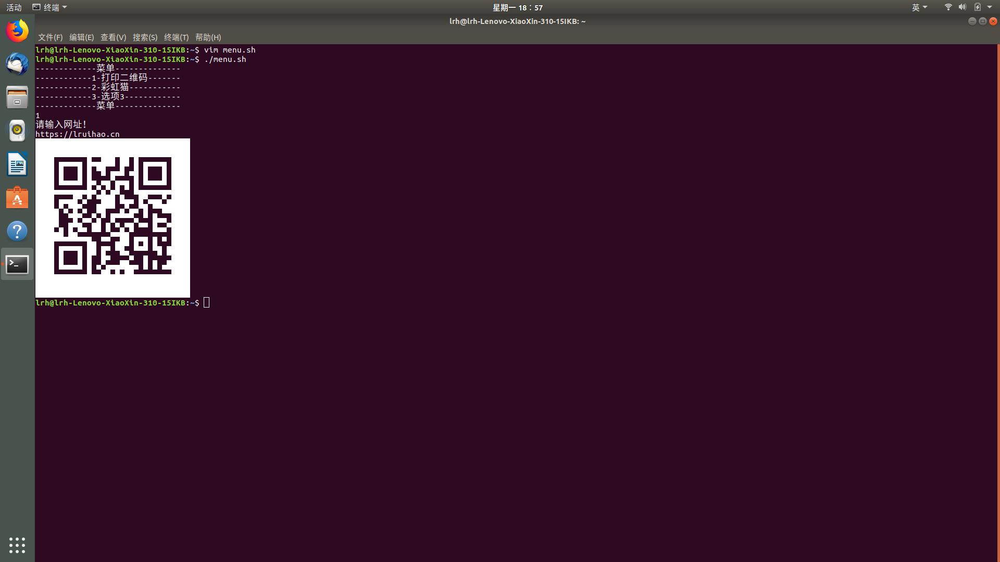
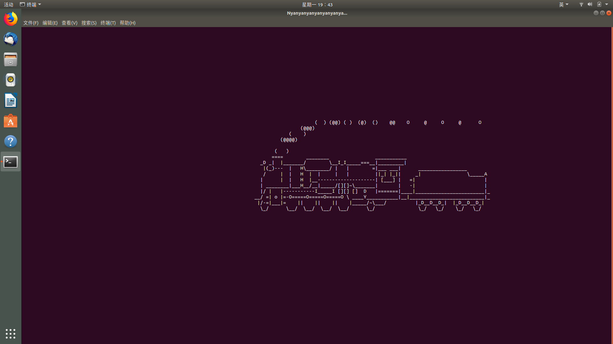
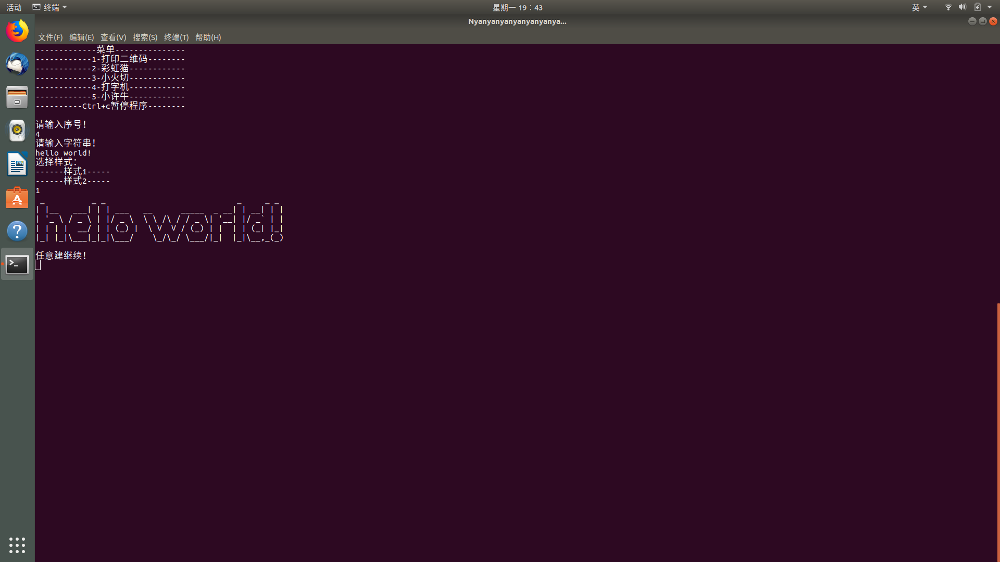
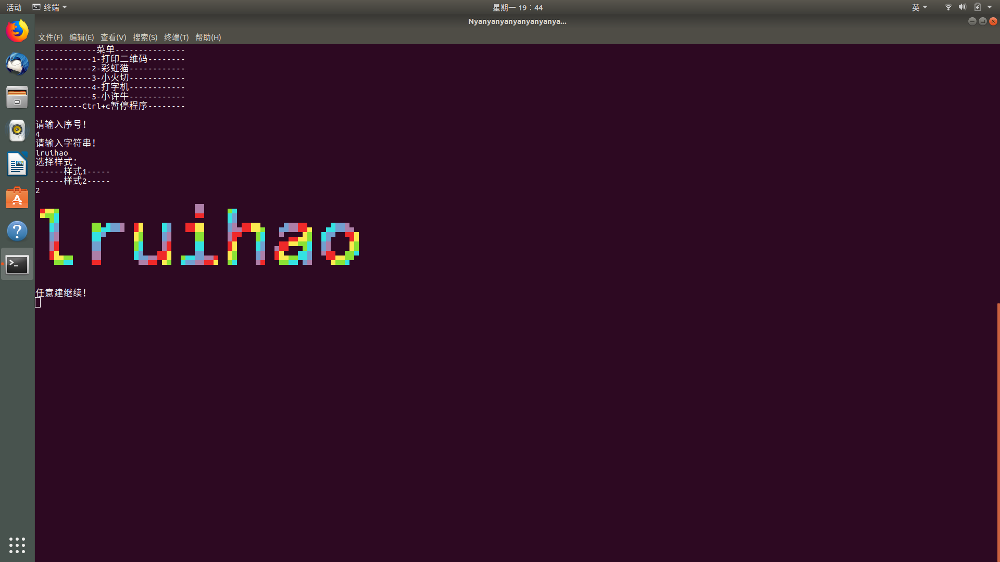
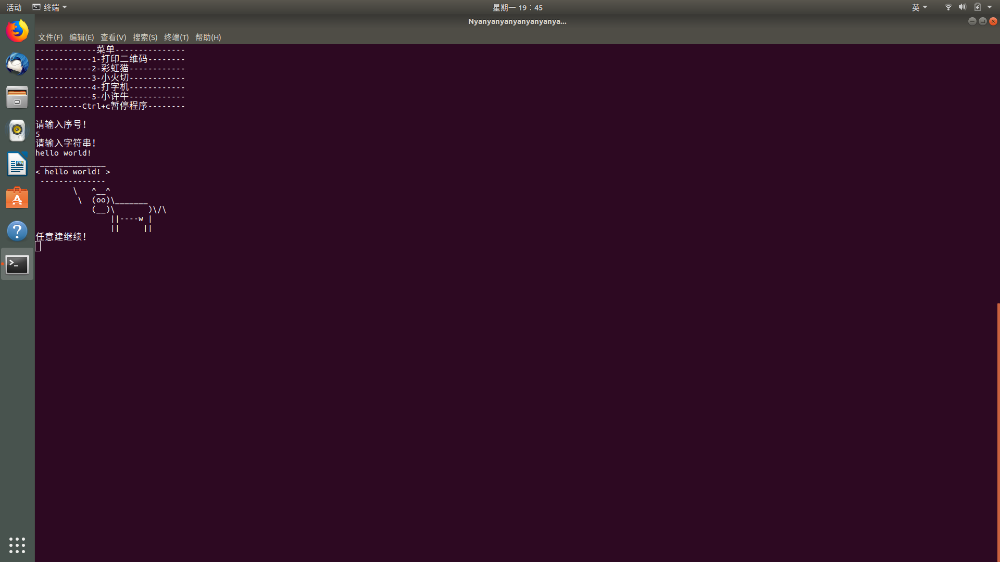

今天上机学了几个小命令
* read
* echo
* if

然后自己写了一个小脚本觉得还挺有趣的
<!--more-->

```sh
#!/bin/bash
#liruihao
#menu.sh
#sudo apt curl install nyancat sl figlet toilet cowsay 
echo "-------------菜-单--------------"
echo "------------1-打印二维码--------"
echo "------------2-彩虹猫------------"
echo "------------3-小火切------------"
echo "------------4-打字机------------"
echo "------------5-小许牛------------"
echo "----------Ctrl+c暂停程序--------"
echo ""
echo "请输入序号！"
read i
if test $i -eq 1
then
	echo "请输入网址！"
	read s1
       	echo $s1 |curl -F-=\<- qrenco.de
fi
if test $i -eq 2
then
	nyancat
fi
if test $i -eq 3
then
	sl
fi
if test $i -eq 4
then
	echo "请输入字符串！"
	read s2
	echo "选择样式："
	echo "------样式1-----"
	echo "------样式2-----"
	read j
	if test $j -eq 1
	then
		figlet $s2
	else
		toilet -f mono12 -F gay $s2
	fi
fi
if test $i -eq 5
then
	echo "请输入字符串！"
	read s3
	cowsay $s3
fi
echo "任意建继续！"
read x
clear
./menu.sh

```





