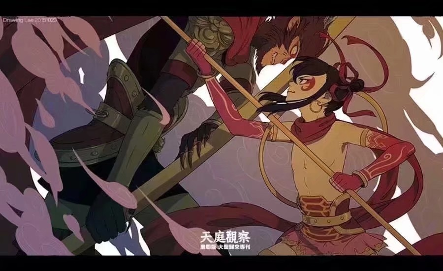

一直觉得中国古代神话

能称得上传奇的只有两个人物：

一是猴子 

一是哪吒

百世蕴灵育出只石猴 大闹天宫腾云驾雾

三年怀胎生了个哪吒 东海屠龙翻江倒海

可以说 除了这两人 没人再能当得起离经放纵四个字的

但称得上悲剧的 约摸也只有这两个

一个五行山下压五百年 揭了封印 戴上金箍无悲无喜 拜佛西天 唤孙悟空

一个削肉还母剔骨还父 塑了莲身 站上火轮无怨无恨 封神南门 号三太子

这尘世最擅长的事 大抵就是抹杀疏狂者的落拓 磨平豪纵者的傲骨 斩灭叛世者的孤妄

